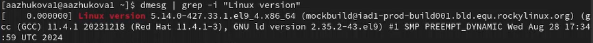
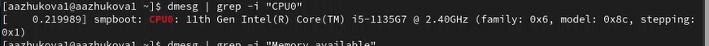

---
## Front matter
lang: ru-RU
title: Лабораторная работа №1
subtitle: 
author:
  - Жукова А.А
institute:
  - Российский университет дружбы народов, Москва, Россия
date: 14 сентября 2024

## i18n babel
babel-lang: russian
babel-otherlangs: english

## Formatting pdf
toc: false
toc-title: Содержание
slide_level: 2
aspectratio: 169
section-titles: true
theme: metropolis
header-includes:
 - \metroset{progressbar=frametitle,sectionpage=progressbar,numbering=fraction}
---

# Информация

## Докладчик

:::::::::::::: {.columns align=center}
::: {.column width="70%"}

  * Жукова Арина Александровна
  * Студент бакалавриата, 2 курс
  * группа: НПИбд-03-23
  * Российский университет дружбы народов
  * [1132239120@rudn.ru](mailto:1132239120@rudn.ru)

:::
::: {.column width="30%"}

:::
::::::::::::::

# Вводная часть

## Цели и задачи

Целью данной работы является приобретение практических навыков установки операционной системы на виртуальную машину, настройки минимально необходимых для дальнейшей работы сервисов.

# Результаты и анализ лабораторной работы

## Установка и настройка виртуальной машины

Создание и параметризация виртуальной машины: В начале работы я создаю новую виртуальную машину в VirtualBox, что подразумевает указание основных параметров, таких как имя, тип и версия операционной системы. Этот шаг важен, поскольку правильные настройки обеспечивают корректную работу виртуальной машины и соответствие требованиям операционной системы.

## Установка и настройка виртуальной машины

Настройка ресурсов: Я выделяю необходимые ресурсы, такие как оперативная память и процессоры. Зная, что у меня есть возможность выделить более 2 ГБ оперативки, я оптимизирую параметры для обеспечения стабильной работы системы.

Установка образа ОС: Запуск установщика с iso-образа играет ключевую роль, так как это именно тот момент, когда загружается сама операционная система.

## Установка и настройка виртуальной машины

Настройки языка и клавиатуры: Я корректирую настройки языка интерфейса и раскладки клавиатуры. Здесь важно отметить, что весь дальнейший опыт использования будет зависеть от правильности этих настроек, особенно если я планирую использовать систему с различными языками.

Выбор программного обеспечения: Установив окружение "Server with GUI" и дополнение "Development Tools", я обеспечиваю функциональность, необходимую для работы с приложениями и разработкой.

## Установка и настройка виртуальной машины

Сетевые настройки: Включение сетевого соединения и задание имени узла критически важно для сетевых операций и доступа к системе. Правильное имя узла помогает идентифицировать виртуальную машину в сети.

Особенности установки паролей: Я уделяю внимание установке паролей для root и локального пользователя. Это обеспечивает безопасность системы и защищает данные от несанкционированного доступа.

Установка дополнений Guest Additions: Установка дополнений повысит производительность виртуальной машины и позволяет использовать такие функции, как общий буфер обмена и автоподстройка экрана.

## Домашнее задание

Получение системной информации: Я хочу извлечь важные сведения о системе, такие как версия ядра, объем оперативной памяти и тип гипервизора. Эти данные важны для понимания производительности и особенностей среды, в которой я работаю.

# Вывод

В целом, процесс установки и настройки виртуальной машины представлен структурированным и логичным образом. Я обратила внимание на критически важные аспекты, такие как уровень безопасности, оптимизация ресурсов и настройка сетевых параметров. Каждый этап выполнен с учетом возможных последствий, что может повлиять на дальнейшую работу в системе. Использование системного анализа для извлечения информации о загрузке системы предоставляет необходимую основу для эффективного администрирования и решения потенциальных проблем.
