---
## Front matter
title: "Лабораторная работа № 1"
subtitle: "Установка и конфигурация операционной системы на виртуальную машину"
author: "Жукова Арина Александровна"

## Generic otions
lang: ru-RU
toc-title: "Содержание"

## Bibliography
bibliography: bib/cite.bib
csl: pandoc/csl/gost-r-7-0-5-2008-numeric.csl

## Pdf output format
toc: true # Table of contents
toc-depth: 2
lof: true # List of figures
lot: true # List of tables
fontsize: 12pt
linestretch: 1.5
papersize: a4
documentclass: scrreprt
## I18n polyglossia
polyglossia-lang:
  name: russian
  options:
	- spelling=modern
	- babelshorthands=true
polyglossia-otherlangs:
  name: english
## I18n babel
babel-lang: russian
babel-otherlangs: english
## Fonts
mainfont: IBM Plex Serif
romanfont: IBM Plex Serif
sansfont: IBM Plex Sans
monofont: IBM Plex Mono
mathfont: STIX Two Math
mainfontoptions: Ligatures=Common,Ligatures=TeX,Scale=0.94
romanfontoptions: Ligatures=Common,Ligatures=TeX,Scale=0.94
sansfontoptions: Ligatures=Common,Ligatures=TeX,Scale=MatchLowercase,Scale=0.94
monofontoptions: Scale=MatchLowercase,Scale=0.94,FakeStretch=0.9
mathfontoptions:
## Biblatex
biblatex: true
biblio-style: "gost-numeric"
biblatexoptions:
  - parentracker=true
  - backend=biber
  - hyperref=auto
  - language=auto
  - autolang=other*
  - citestyle=gost-numeric
## Pandoc-crossref LaTeX customization
figureTitle: "Рис."
tableTitle: "Таблица"
listingTitle: "Листинг"
lofTitle: "Список иллюстраций"
lotTitle: "Список таблиц"
lolTitle: "Листинги"
## Misc options
indent: true
header-includes:
  - \usepackage{indentfirst}
  - \usepackage{float} # keep figures where there are in the text
  - \floatplacement{figure}{H} # keep figures where there are in the text
---

# Цель работы

Целью данной работы является приобретение практических навыков установки операционной системы на виртуальную машину, настройки минимально необходимых для дальнейшей работы сервисов

# Выполнение лабораторной работы

## Установка и настройка виртуальной машины

1. **Создание новой виртуальной машины**: Я открываю VirtualBox и выбираю "Машина" -> "Создать". 

2. **Указание параметров виртуальной машины**: Вводя имя виртуальной машины, я включаю свой логин в дисплейном классе. Выбираю тип операционной системы — Linux и версию — RedHat (64-bit). Затем указываю путь к iso-образу устанавливаемого дистрибутива и отмечаю опцию "Пропустить автоматическую установку".

3. **Настройка ресурсов виртуальной машины**: Указываю размер основной памяти — 2048 МБ (или больше, если это позволяет мой компьютер) и выбираю количество процессоров (например, 1 или 2).

4. **Задание размера виртуального жёсткого диска**: Я устанавливаю размер виртуального жёсткого диска — 40 ГБ  (рис. [-@fig:001]).

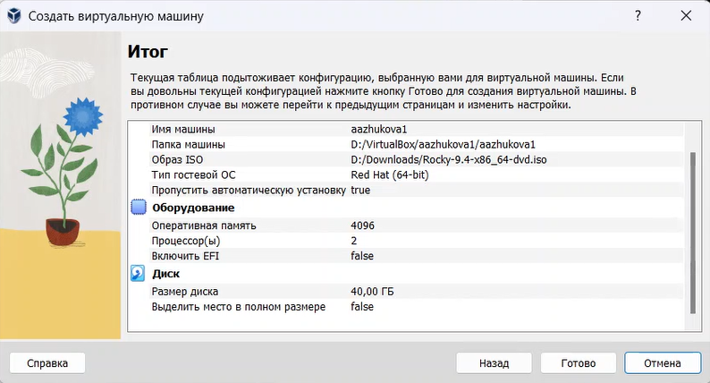{#fig:001 width=70%}

5. **Запуск виртуальной машины**: Запускаю виртуальную машину и в меню переключаюсь на строку "Install Rocky Linux версия", нажимаю Enter для начала установки образа ОС.

6. **Выбор языка интерфейса**: В окне "Добро пожаловать в Rocky Linux..." я выбираю English в качестве языка интерфейса и перехожу к настройкам установки (рис. [-@fig:002]).

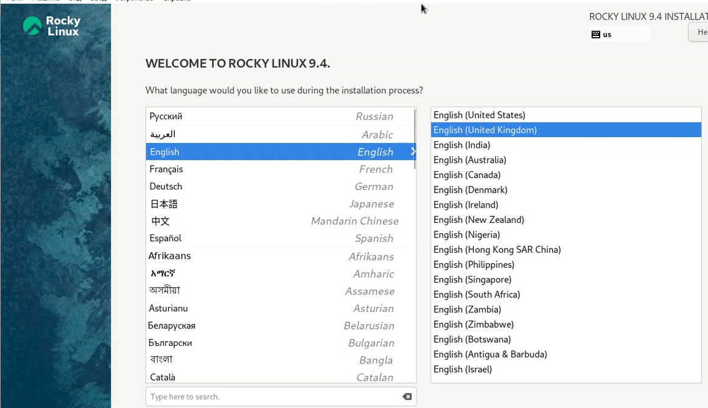{#fig:002 width=70%}

7. **Настройки установки**: Я корректирую часовой пояс и раскладку клавиатуры, добавляя русский язык, но в качестве языка по умолчанию устанавливаю английский. Задаю комбинацию клавиш для переключения между раскладками клавиатуры, например, Alt + Shift, и поддерживаю русский язык в ОС.

8. **Выбор программного обеспечения**: В разделе выбора программ я указываю базовое окружение Server with GUI и дополнение Development Tools.

9. **Отключение KDUMP**: Я отключаю KDUMP и оставляю место установки ОС без изменений.

10. **Настройка сетевого соединения**: Включаю сетевое соединение и в качестве имени узла указываю user.localdomain, заменяя "user" на своё имя пользователя согласно соглашению об именовании (рис. [-@fig:003]).

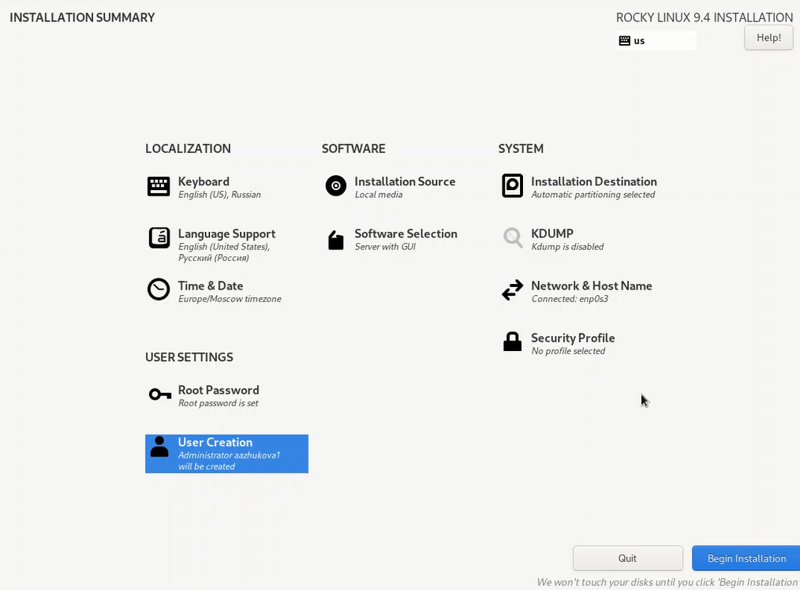{#fig:003 width=70%}

11. **Установка пароля для root**: Я устанавливаю пароль для учетной записи root и разрешаю ввод пароля при использовании SSH (рис. [-@fig:004]).

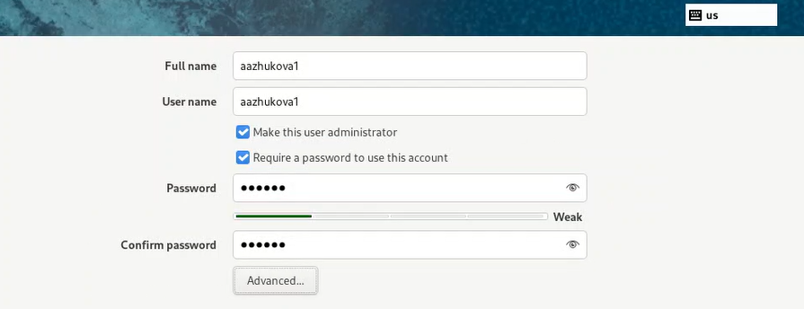{#fig:004 width=70%}

12. **Создание локального пользователя**: Затем я задаю локального пользователя с правами администратора и устанавливаю для него пароль. Если сведения о создании локального пользователя не видны, я перемещаюсь к этим настройкам с помощью клавиш Tab и Enter после задания пароля для root.

13. **Начало установки**: После задания необходимых параметров я нажимаю на "Begin Installation" для начала установки образа системы.

14. **Перезагрузка виртуальной машины**: После завершения установки я корректно перезагружаю виртуальную машину.

15. **Вход в систему**: Я вхожу в ОС под заданной учётной записью, после чего в меню Устройства подключаю образ диска дополнений гостевой ОС. При необходимости я ввожу пароль пользователя root.

16. **Установка дополнений**: После загрузки дополнений я нажимаю Return или Enter и корректно перезагружаю виртуальную машину (рис. [-@fig:005]).

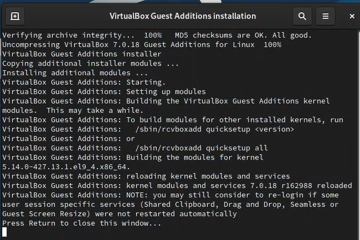{#fig:005 width=70%}

17. **Корректная перезагрузка**: После завершения установки дополнений я перезагружаю операционную систему на виртуальной машине.

## Домашнее задание

1. **Загрузка графического окружения**: Я жду загрузки графического окружения и открываю терминал. Выполняю команду для анализа последовательности загрузки системы:
   ```bash
   dmesg | less
   ```
   Также могу использовать поиск с помощью grep, например:
   ```bash
   dmesg | grep -i "то, что ищем"
   ```

2. **Получение информации**:
   - Версия ядра Linux (Linux version) (рис. [-@fig:011]).

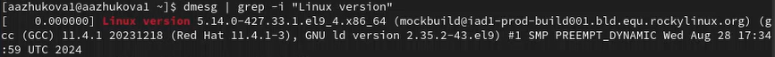{#fig:011 width=70%}

   - Частота процессора (Detected Mhz processor) (рис. [-@fig:012]).

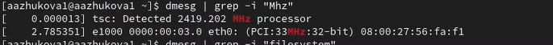{#fig:012 width=70%}

   - Модель процессора (CPU0) (рис. [-@fig:013]).

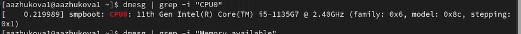{#fig:013 width=70%}

   - Объем доступной оперативной памяти (Memory available) (рис. [-@fig:014]).

{#fig:014 width=70%}

   - Тип обнаруженного гипервизора (Hypervisor detected) (рис. [-@fig:015]).

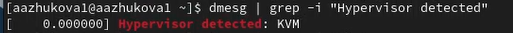{#fig:015 width=70%}

   - Тип файловой системы корневого раздела (рис. [-@fig:016]).

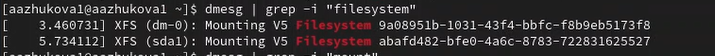{#fig:016 width=70%}

   - Последовательность монтирования файловых систем (рис. [-@fig:017]).

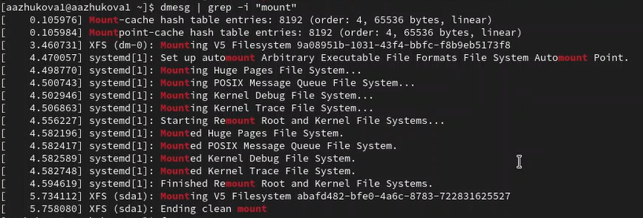{#fig:017 width=70%}

# Контрольные вопросы

1. Для получения справки по команде используется команда "man", например "man ls".

Для перемещения по файловой системе используется команда "cd", например "cd Documents".

Для просмотра содержимого каталога используется команда "ls", например "ls -l".

Для определения объёма каталога используется команда "du", например "du -sh".

Для создания каталогов используется команда "mkdir", например "mkdir Folder".

Для удаления каталогов или файлов используется команда "rm", например "rm file.txt".

Для задания определённых прав на файл или каталог используется команда "chmod", например "chmod 755 file.txt".

Для просмотра истории команд используется команда "history".

2. Учётная запись пользователя содержит информацию о имени пользователя, домашнем каталоге, идентификаторе пользователя (UID), группе пользователя (GID) и другие настройки. Команды для просмотра информации о пользователе: "id" - показывает идентификаторы пользователя и группы, "whoami" - показывает имя текущего пользователя, "finger" - показывает информацию о пользователе.

3. Файловая система - это способ организации и хранения файлов на диске. Примеры файловых систем: ext4 - используется в Linux, NTFS - используется в Windows, HFS+ - используется в macOS. Каждая файловая система имеет свои особенности и ограничения.

4. Для просмотра подмонтированных файловых систем можно использовать команду "df -h". Она покажет список всех файловых систем в системе и объём свободного места на каждой из них.

5. Для удаления зависшего процесса можно использовать команду "kill". Сначала нужно найти ID процесса с помощью команды "ps -aux", затем выполнить команду "kill -9 PID" для принудительного завершения процесса.

# Выводы

В ходе выполнения данной работы были приобретенены практических навыков установки операционной системы на виртуальную машину, настройки минимально необходимых для дальнейшей работы сервисов

# Список литературы{.unnumbered}

1. Купер М. Искусство программирования на языке сценариев командной оболочки. —
2004. — URL: https://www.opennet.ru/docs/RUS/bash_scripting_guide/.
2. Newham C. Learning the bash Shell: Unix Shell Programming. — O’Reilly Media, 2005. —
(In a Nutshell).
3. Робачевский А., Немнюгин С., Стесик О. Операционная система UNIX. — 2-е изд. —
БХВ-Петербург, 2010.
4. Колисниченко Д. Н. Самоучитель системного администратора Linux. — СПб. : БХВПетербург, 2011. — (Системный администратор).
5. Dash P. Getting Started with Oracle VM VirtualBox. — Packt Publishing Ltd, 2013.
6. Colvin H. VirtualBox: An Ultimate Guide Book on Virtualization with VirtualBox. — CreateSpace Independent Publishing Platform, 2015.
7. Таненбаум Э., Бос Х. Современные операционные системы. — 4-е изд. — СПб. : Питер,
2015. — (Классика Computer Science).
8. GNU Bash Manual. — 2016. — URL: https : / / www . gnu . org / software / bash /
manual/.
9. Robbins A. Bash Pocket Reference. — O’Reilly Media, 2016.
10. Vugt S. van. Red Hat RHCSA/RHCE 7 cert guide : Red Hat Enterprise Linux 7 (EX200 and
EX300). — Pearson IT Certification, 2016. — (Certification Guide).
11. Zarrelli G. Mastering Bash. — Packt Publishing, 2017.
12. Unix и Linux: руководство системного администратора / Э. Немет, Г. Снайдер, Т.
Хейн, Б. Уэйли, Д. Макни. — 5-е изд. — СПб. : ООО «Диалектика», 2020.

::: {#refs}
:::
