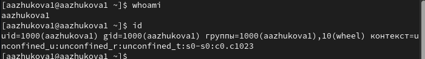
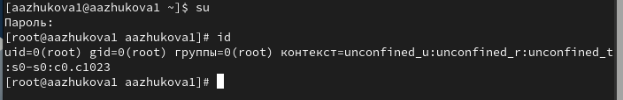
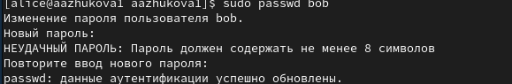
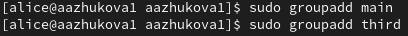
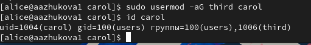

---
## Front matter
lang: ru-RU
title: Лабораторная работа №2
subtitle: 
author:
  - Жукова А.А
institute:
  - Российский университет дружбы народов, Москва, Россия
date: 14 сентября 2024

## i18n babel
babel-lang: russian
babel-otherlangs: english

## Formatting pdf
toc: false
toc-title: Содержание
slide_level: 2
aspectratio: 169
section-titles: true
theme: metropolis
header-includes:
 - \metroset{progressbar=frametitle,sectionpage=progressbar,numbering=fraction}
---

# Информация

## Докладчик

:::::::::::::: {.columns align=center}
::: {.column width="70%"}

  * Жукова Арина Александровна
  * Студент бакалавриата, 2 курс
  * группа: НПИбд-03-23
  * Российский университет дружбы народов
  * [1132239120@rudn.ru](mailto:1132239120@rudn.ru)

:::
::: {.column width="30%"}

:::
::::::::::::::

# Вводная часть

## Цели и задачи

- Получить представление о работе с учётными записями пользователей и группами
пользователей в операционной системе типа Linux.

## Задание

•	Требуется ознакомиться с справочным описанием man по командам ls, whoami, id, su, passwd, vi, visudo , useradd, usermod, userdel, groupadd, groupdel.

•	Выполнить действия по переключению между учётными записями пользователей, по управлению учётными записями пользователей.

•	Выполнить действия по созданию пользователей и управлению их учётными записями.

•	Выполнить действия по работе с группами пользователей

# Результаты и анализ лабораторной работы

## Переключение учётных записей пользователя

Для определения используемой учетной записи воспользуемся командой `whoami`
Подробная информация о пользователе `id [имя_пользователя]`

переключение между пользователями - команда `su [имя_пользователя]`

## Создание учетных записей пользователей

Создаём пользователя при помощи команды `sudo -i useradd [имя_пользователя]`
`-G [имя_группы]` - в какую группу добавляем

Установление пароля `sudo passwd [имя_пользователя]`

## Работа с группами

Создание группы `sudo groupadd [имя_группы]`

Добавление пользователя в группу `sudo usermod -aG [имя_группы] [имя_пользователя]`

