---
## Front matter
title: "Отчёт по лабораторной работе №2"
subtitle: "Дисциплина: Основы администрирования операционных систем"
author: "Жукова Арина Александровна"

## Generic otions
lang: ru-RU
toc-title: "Содержание"

## Bibliography
bibliography: bib/cite.bib
csl: pandoc/csl/gost-r-7-0-5-2008-numeric.csl

## Pdf output format
toc: true # Table of contents
toc-depth: 2
lof: true # List of figures
lot: true # List of tables
fontsize: 12pt
linestretch: 1.5
papersize: a4
documentclass: scrreprt
## I18n polyglossia
polyglossia-lang:
  name: russian
  options:
	- spelling=modern
	- babelshorthands=true
polyglossia-otherlangs:
  name: english
## I18n babel
babel-lang: russian
babel-otherlangs: english
## Fonts
mainfont: IBM Plex Serif
romanfont: IBM Plex Serif
sansfont: IBM Plex Sans
monofont: IBM Plex Mono
mathfont: STIX Two Math
mainfontoptions: Ligatures=Common,Ligatures=TeX,Scale=0.94
romanfontoptions: Ligatures=Common,Ligatures=TeX,Scale=0.94
sansfontoptions: Ligatures=Common,Ligatures=TeX,Scale=MatchLowercase,Scale=0.94
monofontoptions: Scale=MatchLowercase,Scale=0.94,FakeStretch=0.9
mathfontoptions:
## Biblatex
biblatex: true
biblio-style: "gost-numeric"
biblatexoptions:
  - parentracker=true
  - backend=biber
  - hyperref=auto
  - language=auto
  - autolang=other*
  - citestyle=gost-numeric
## Pandoc-crossref LaTeX customization
figureTitle: "Рис."
tableTitle: "Таблица"
listingTitle: "Листинг"
lofTitle: "Список иллюстраций"
lotTitle: "Список таблиц"
lolTitle: "Листинги"
## Misc options
indent: true
header-includes:
  - \usepackage{indentfirst}
  - \usepackage{float} # keep figures where there are in the text
  - \floatplacement{figure}{H} # keep figures where there are in the text
---

# Цель работы

Получить представление о работе с учётными записями пользователей и группами пользователей в операционной системе типа Linux.

# Задание

1. Прочитать справочное описание man по командам ls, whoami, id, groups, su, sudo, passwd, vi, visudo, useradd, usermod, userdel, groupadd, groupdel.
2. Выполнить действия по переключению между учётными записями пользователей, по управлению учётными записями пользователей.
3. Выполните действия по созданию пользователей и управлению их учётными записями.
4. Выполните действия по работе с группами пользователей.

# Выполнение лабораторной работы

## Переключение учётных записей пользователей

1. Вошла в систему как обычный пользователь и открыла терминал. при помощи команды whoami определила какую учётную запись пользователя использую. Выведла на экран более подробную информацию, используя команду id (рис. [-@fig:001]).

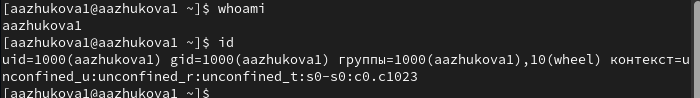{#fig:001 width=100%}

(UID – id пользователя равный 1000, GID – id группы равный 1000, группы в которых состоит пользователь именная aazhukova1 и wheel (10))

2. Использую команду su для переключения к учётной записи root. При запросе пароля ввожу пароль пользователя root. Узнаю подробную информацию о пользователе root (рис. [-@fig:002]).

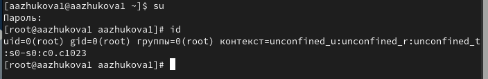{#fig:002 width=100%}

(UID – id пользователя равный 0 GID – id группы равный 0, состоит только в группе root).

3. Возвращаемся к своему пользователю при помощи команды su, просматриваем в безопасном режиме файл /etc/sudoers, используя `sudo -i visudo` (рис. [-@fig:003]).

{#fig:003 width=100%}

`visudo`  - это специальная утилита для редактирования файла `/etc/sudoers`. Она проверяет правильность синтаксиса файла при сохранении, что предотвращает  возможные ошибки конфигурации,  которые могут привести к неработоспособности системы.

4. Проверям наличие строки `%wheel ALL=(ALL) ALL` в открытом файле (рис. [-@fig:004]).

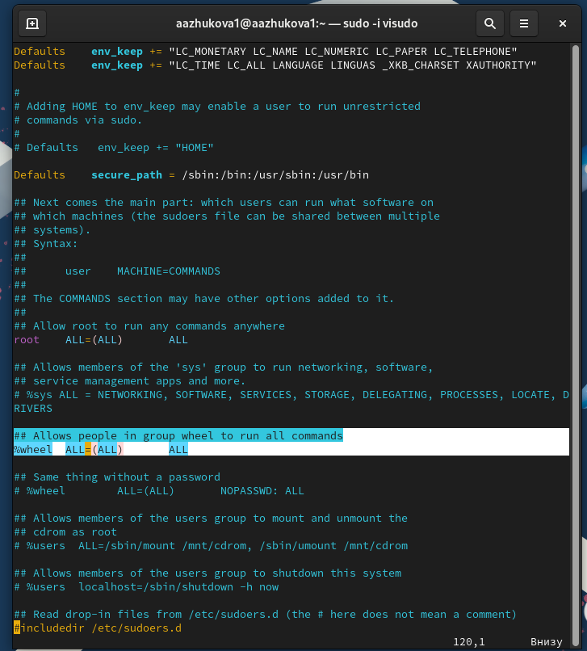{#fig:004 width=100%}

Строка  `%wheel ALL=(ALL) ALL`  означает, что всем пользователям из группы `wheel`  предоставлены  полные права  `sudo`  (возможность запускать команды от имени root).  Группа `wheel`  предназначена для пользователей, которым требуется повышенные права доступа.

5. Создаю пользователя alice, входящего в группу wheel, при помощи команды  `sudo -i useradd -G wheel alice`. Проверяю, что пользователь alice добавлен в группу wheel, введя id alice (Рис. [-@fig:005]).

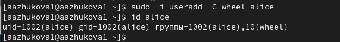{#fig:005 width=100%}

6. Задаю пароль для пользователя alice, набрав `sudo -i passwd alice` (Рис. [-@fig:036]).

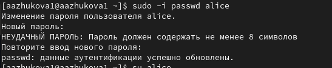{#fig:036 width=100%}

Пароль требуется ввести дважды.

7. Переключаюсь на учётную запись пользователя alice и создаю пользователя bob (Рис. [-@fig:007]).

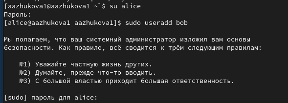{#fig:007 width=100%}

8. Установливаю пароль для пользователя bob (Рис. [-@fig:008]).

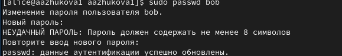{#fig:008 width=100%}

9. Пользователь bob входит в группу `bob` (Рис. [-@fig:009]).

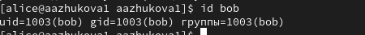{#fig:009 width=100%}

## Создание учётных записей пользователей

1. Переключаюсь в терминале на учётную запись пользователя root (рис. [-@fig:011]).

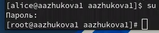{#fig:011 width=100%}

2. Открываем файл конфигурации /etc/login.defs для редактирования, используя mcedit. Находим параметр `CREATE_HOME` и проверяем, что он установлен в значение yes. Установливаем параметр `USERGROUPS_ENAB` в значение no (рис. [-@fig:012]).

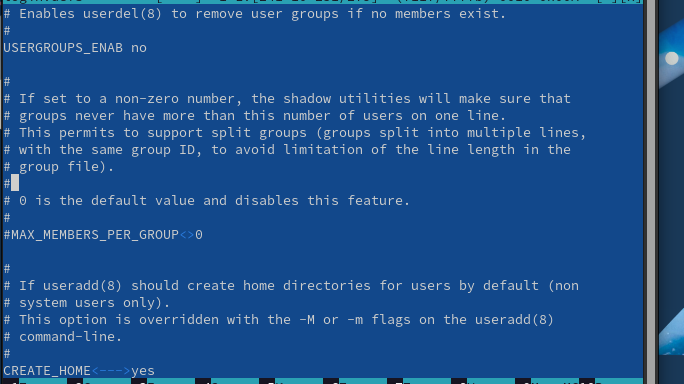{#fig:012 width=100%}

Это позволит не добавлять нового пользователя в группу с тем же именем, что и пользователь, а использовать группу users.

3. Перехожу в каталог /etc/skel и создаю каталоги Pictures и Documents, проверяю создание (рис. [-@fig:013]).

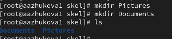{#fig:013 width=100%}

Это позволит добавить эти каталоги по умолчанию во все домашние каталоги пользователей.

4. Изменяем содержимое файла .bashrc, добавив строку `export EDITOR=/usr/bin/mceditor` (Эта запись означает, что редактор mceditor будет установлен по умолчанию для инструментов, которые нуждаются в изменении текстовых файлов) (рис. [-@fig:014]).

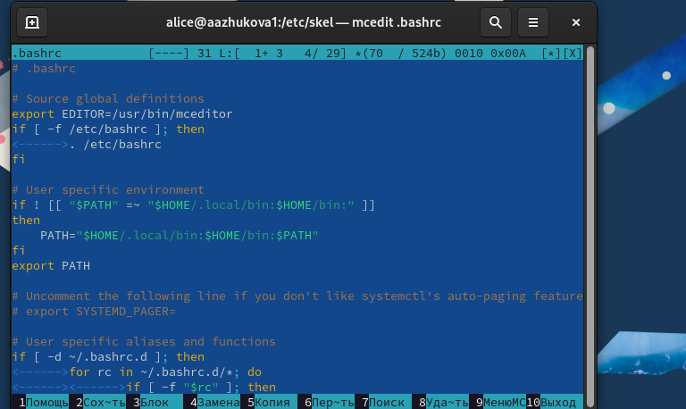{#fig:014 width=100%}

5. Переключаюсь в терминале на учётную запись пользователя alice, создаю пользователя carol, установливаю пароль для пользователя и просматриваю информацию о пользователе carol (рис. [-@fig:015]).

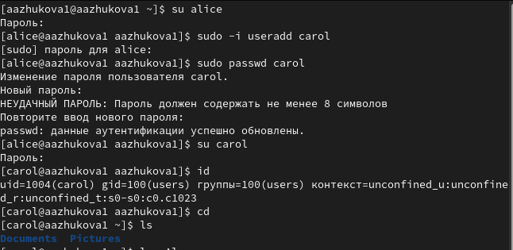{#fig:015 width=100%}

Первоначально пользователь carol входит в группу users. Каталоги Pictures и Documents были созданы в домашнем каталоге пользователя.

6. Переключитесь в терминале на учётную запись пользователя alice, изменяем свойства пароля пользователя carol следующим образом `sudo passwd -n 30 -w 3 -x 90 carol` (срок действия пароля истекает через 90 дней (-x 90). За три дня до истечения срока действия пользователь получит предупреждение (-w 3). Пароль должен использоваться как минимум 30 дней (-n 30) до того, как его можно будет изменить.) (рис. [-@fig:016]).

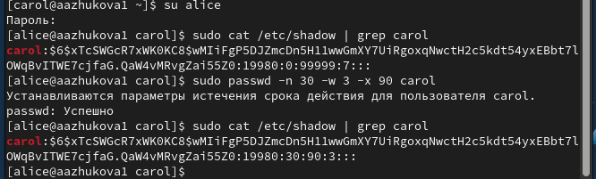{#fig:016 width=100%}

Изначальные свойства:  срок действия пароля истекает через 99999 дней. За семь дней до истечения срока действия пользователь получит предупреждение. Пароль должен использоваться как минимум 0 дней до того, как его можно будет изменить.

7. Проверяем, что идентификатор alice существует во всех трёх файлах и идентификатор carol существует не во всех трёх файлах (рис. [-@fig:017]).

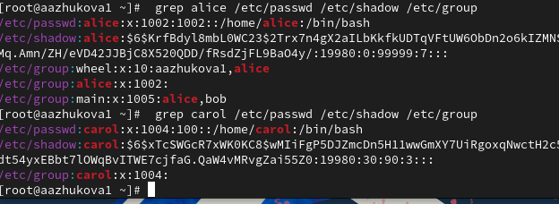{#fig:017 width=100%}

## Работа с группами

1. Находясь под учётной записью пользователя alice, создаю группы main и third. Использую usermod для добавления пользователей alice и bob в группу main, а carol — в группу third  (рис. [-@fig:021]).

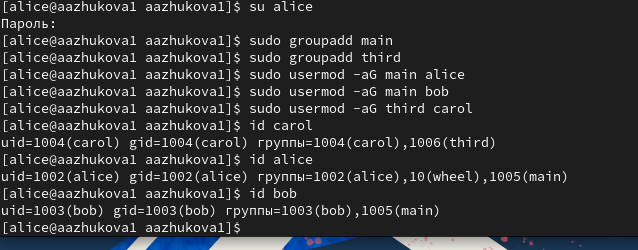{#fig:021 width=100%}

2. При добавлении carol в группу third была обнаружена ошибка при создании пользователя carol (рис. [-@fig:022]).

{#fig:022 width=100%}

Пользователю carol назначена основная группа с идентификатором gid = 100 (users). Вторичная группа third.
Пользователь alice входит в группы: alice, wheel и main. Пользователь bob - bob и main.

# Контрольные вопросы

1. Команды для получения информации о пользователе:
  * id [имя_пользователя] - для получения информации о UID, GID, группах, к которым принадлежит пользователь. 
  * groups [имя_пользователя] - для получения списка групп, к которым принадлежит пользователь. 

2. UID пользователя root: 0. 
  * id root - команда для получения UID пользователя.

3. Различие между командами su и sudo:
  * su - команда для переключения на другого пользователя, обычно требует ввода пароля целевого пользователя.
  * sudo - команда для запуска команды с правами root, требует ввода пароля текущего пользователя. 

4. Конфигурационный файл sudo: /etc/sudoers

5. Команда для безопасного изменения конфигурации sudo: visudo

6. Группа для доступа ко всем командам администрирования: wheel

7. Файлы/каталоги для настройки параметров пользователей:
  * /etc/passwd - содержит информацию о пользователях.
  * /etc/shadow - содержит информацию о паролях пользователей.
  * /etc/group - содержит информацию о группах.

8. Информация о первичной и дополнительных группах пользователей в Linux:
  * /etc/passwd - содержит информацию о первичной группе пользователя (GID).
  * /etc/group - содержит информацию о дополнительных группах пользователя.

9. Команды для изменения пароля пользователя:
  * passwd [имя_пользователя] - для изменения пароля пользователя.
  * passwd -n [дни] -w [дни] -x [дни] [имя_пользователя] - для изменения свойств пароля:
    * -n - минимальный срок действия пароля перед изменением.
    * -w - число дней до истечения срока действия пароля, когда пользователь получит предупреждение.
    * -x - максимальный срок действия пароля. 

10. Команда для изменения информации в /etc/group:
  * sudo gpasswd -a [имя_пользователя] [имя_группы] - для добавления пользователя в группу.
  * sudo gpasswd -d [имя_пользователя] [имя_группы] - для удаления пользователя из группы.
  * sudo gpasswd -M [имя_группы] [имя_пользователя1] [имя_пользователя2] ... - для изменения списка пользователей в группе.

# Выводы

В ходе работы были получены навыки работы с командами для управления пользователями и группами в Linux.  Были освоены  практические методы  создания, модификации и удаления пользователей и групп.  Также  был изучен  механизм  работы с  файлом  `/etc/sudoers`  и  с  файлом  `/etc/login.defs`. 

# Список литературы{.unnumbered}

1. Робачевский А., Немнюгин С., Стесик О. Операционная система UNIX. — 2-е изд. —
БХВ-Петербург, 2010.
2. Колисниченко Д. Н. Самоучитель системного администратора Linux. — СПб. : БХВ-
Петербург, 2011. — (Системный администратор).
3. Таненбаум Э., Бос Х. Современные операционные системы. — 4-е изд. — СПб. : Питер,
2015. — (Классика Computer Science).
4. Neil N. J. Learning CentOS: A Beginners Guide to Learning Linux. — CreateSpace Inde-
pendent Publishing Platform, 2016.
5. Unix и Linux: руководство системного администратора / Э. Немет, Г. Снайдер, Т.
Хейн, Б. Уэйли, Д. Макни. — 5-е изд. — СПб. : ООО «Диалектика», 2020.

::: {#refs}
:::
