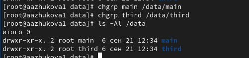
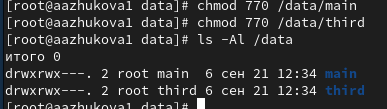
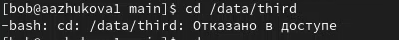
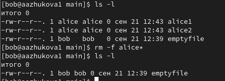
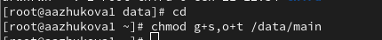
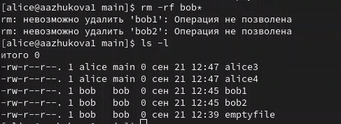
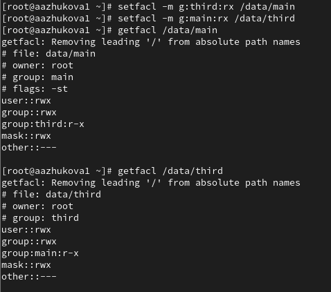
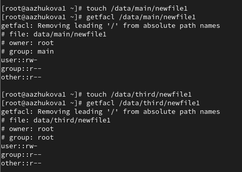
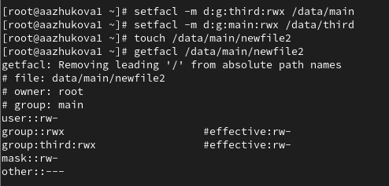
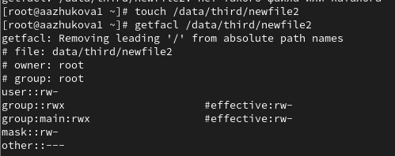

---
## Front matter
lang: ru-RU
title: Лабораторная работа №3. Настройка прав доступа
subtitle: 
author:
  - Жукова А.А
institute:
  - Российский университет дружбы народов, Москва, Россия
date: 14 сентября 2024

## i18n babel
babel-lang: russian
babel-otherlangs: english

## Formatting pdf
toc: false
toc-title: Содержание
slide_level: 2
aspectratio: 169
section-titles: true
theme: metropolis
header-includes:
 - \metroset{progressbar=frametitle,sectionpage=progressbar,numbering=fraction}
---

# Информация

## Докладчик

:::::::::::::: {.columns align=center}
::: {.column width="70%"}

  * Жукова Арина Александровна
  * Студент бакалавриата, 2 курс
  * группа: НПИбд-03-23
  * Российский университет дружбы народов
  * [1132239120@rudn.ru](mailto:1132239120@rudn.ru)

:::
::: {.column width="30%"}

:::
::::::::::::::

# Вводная часть

## Цель работы

Получение навыков настройки базовых и специальных прав доступа для групп пользователей в операционной системе типа Linux.

## Задание

1. Прочитайте справочное описание man по командам chgrp, chmod, getfacl, setfacl.
2. Выполните действия по управлению базовыми разрешениями для групп пользователей
3. Выполните действия по управлению специальными разрешениями для групп пользователей
4. Выполните действия по управлению расширенными разрешениями с использованием списков ACL для групп пользователей 

# Результаты и анализ лабораторной работы

## Управление базовыми разрешениями

Изменяем владельцев этих каталогов с root на main и third

## Управление базовыми разрешениями

Устанавливаем разрешения, позволяющие владельцам каталогов записывать файлы в эти каталоги и запрещающие доступ к содержимому каталогов всем другим пользователям и группам

Так как пользователь bob не является владельцем каталога third, нам не удалось перейти в этот каталог и создать в нём новый файл.

## Управление специальными разрешениями

Удаляем файлы, принадлежащие пользователю alice, при помощи команды `rm -f alice*`, проверяем, что файлы удалены 

## Управление специальными разрешениями

В терминале под пользователем root устанавливаем для каталога main бит идентификатора группы, а также stiky-бит для разделяемого (общего) каталога группы, при помощи команды `chmod g+s,o+t /data/main` 

## Управление специальными разрешениями

В терминале под пользователем alice удаляем файлы, принадлежащие пользователю bob командой `rm -rf bob*` 

## Управление расширенными разрешениями с использованием списков ACL

Устанавливаем права в каталоге main для группы third и права для группы main в каталоге third. Используем команду getfacl, чтобы убедиться в правильности установки разрешений

## Управление расширенными разрешениями с использованием списков ACL

Создаём новый файл с именем newfile1 в каталоге main, используем `getfacl /data/main/newfile1` для проверки текущих назначений полномочий

## Управление расширенными разрешениями с использованием списков ACL

Установливаем ACL по умолчанию для каталога main командой и для каталога third 

## Управление расширенными разрешениями с использованием списков ACL

Для проверки полномочий группы third в каталоге third войдём в другом терминале под учётной записью пользователю carol. Проверяем операции с файлами, пробуя удалить файлы newfile1, newfile2 и проверяем, возможно ли осуществить запись в файл 

# Выводы

В ходе выполнения лабораторной работы были получены навыки настройки базовых и специальных прав доступа для групп пользователей в операционной системе типа Linux.

