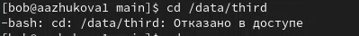

---
## Front matter
title: "Лабораторная работа №3. Настройка прав доступа"
subtitle: "Дисциплина: Основы администрирования операционных систем"
author: "Жукова Арина Александровна"

## Generic otions
lang: ru-RU
toc-title: "Содержание"

## Bibliography
bibliography: bib/cite.bib
csl: pandoc/csl/gost-r-7-0-5-2008-numeric.csl

## Pdf output format
toc: true # Table of contents
toc-depth: 2
lof: true # List of figures
lot: true # List of tables
fontsize: 12pt
linestretch: 1.5
papersize: a4
documentclass: scrreprt
## I18n polyglossia
polyglossia-lang:
  name: russian
  options:
	- spelling=modern
	- babelshorthands=true
polyglossia-otherlangs:
  name: english
## I18n babel
babel-lang: russian
babel-otherlangs: english
## Fonts
mainfont: IBM Plex Serif
romanfont: IBM Plex Serif
sansfont: IBM Plex Sans
monofont: IBM Plex Mono
mathfont: STIX Two Math
mainfontoptions: Ligatures=Common,Ligatures=TeX,Scale=0.94
romanfontoptions: Ligatures=Common,Ligatures=TeX,Scale=0.94
sansfontoptions: Ligatures=Common,Ligatures=TeX,Scale=MatchLowercase,Scale=0.94
monofontoptions: Scale=MatchLowercase,Scale=0.94,FakeStretch=0.9
mathfontoptions:
## Biblatex
biblatex: true
biblio-style: "gost-numeric"
biblatexoptions:
  - parentracker=true
  - backend=biber
  - hyperref=auto
  - language=auto
  - autolang=other*
  - citestyle=gost-numeric
## Pandoc-crossref LaTeX customization
figureTitle: "Рис."
tableTitle: "Таблица"
listingTitle: "Листинг"
lofTitle: "Список иллюстраций"
lotTitle: "Список таблиц"
lolTitle: "Листинги"
## Misc options
indent: true
header-includes:
  - \usepackage{indentfirst}
  - \usepackage{float} # keep figures where there are in the text
  - \floatplacement{figure}{H} # keep figures where there are in the text
---

# Цель работы

Получение навыков настройки базовых и специальных прав доступа для групп пользователей в операционной системе типа Linux.

# Задание

1. Прочитайте справочное описание man по командам chgrp, chmod, getfacl, setfacl.
2. Выполните действия по управлению базовыми разрешениями для групп пользователей (раздел 3.3.1).
3. Выполните действия по управлению специальными разрешениями для групп пользователей (раздел 3.3.2).
4. Выполните действия по управлению расширенными разрешениями с использованием списков ACL для групп пользователей (раздел 3.3.3).

# Выполнение лабораторной работы

## Управление базовыми разрешениями

1. Открываем терминал с учётной записью root. В корневом каталоге создаём каталоги /data/main и /data/third при помощи командв `mkdir -p /data/main /data/third` (рис. [-@fig:001]).

{#fig:001 width=100%}

2. Просматриваем, кто является владельцем созданных каталогов, используем команду `ls -Al /data` (рис. [-@fig:002]).

{#fig:002 width=100%}

3. Изменяем владельцев этих каталогов с root на main и third, проверяем, кто теперь является владельцем этих каталогов (рис. [-@fig:003]).

{#fig:003 width=100%}

4. Устанавливаем разрешения, позволяющие владельцам каталогов записывать файлы в эти
каталоги и запрещающие доступ к содержимому каталогов всем другим пользователям
и группам. Проверяем установленные права доступа (рис. [-@fig:004]).

{#fig:004 width=100%}

5. Переходим под учётную запись пользователя bob, переходим в каталог main, создаём файл emptyfile (рис. [-@fig:005]).

{#fig:005 width=100%}

Проверяем созданный файл (рис. [-@fig:006]).

{#fig:006 width=100%}

Так как пользователь bob является владельцем каталога main, нам удалось перейти в этот
каталог и создать в нём новый файл. 

6. Под пользователем bob пробуем перейти в каталог /data/third и создать файл emptyfile в этом каталоге (рис. [-@fig:007]).

{#fig:007 width=100%}

Так как пользователь bob не является владельцем каталога third, нам не удалось перейти
в этот каталог и создать в нём новый файл.

## Управление специальными разрешениями

1. Открываем новый терминал под пользователем alice, переходим в каталог main. Создаём два файла, владельцем которых является alice, проверяем создание файлов (рис. [-@fig:011]).

{#fig:011 width=100%}

2. В другом терминале переходим под учётную запись пользователя bob, перейдите в каталог /data/main, в этом каталоге вводим `ls -l` (рис. [-@fig:012]).

{#fig:012 width=100%}

Удаляем файлы, принадлежащие пользователю alice, при помощи команды `rm -f alice*`, проверяем, что файлы удалены (рис. [-@fig:013]).

{#fig:013 width=100%}

3. Создание двух файлов, которые принадлежат пользователю bob (рис. [-@fig:014]).

{#fig:014 width=100%}

4. В терминале под пользователем root устанавливаем для каталога main бит идентификатора группы, а также stiky-бит для разделяемого (общего) каталога группы, при помощи команды `chmod g+s,o+t /data/main` (рис. [-@fig:015]).

{#fig:015 width=100%}

5. В терминале под пользователем alice создаём в каталоге main файлы alice3 и alice4, проверяем права доступа и владельцев файлов (рис. [-@fig:016]).

{#fig:016 width=100%}

Два созданных файла принадлежат группе main, которая является группой-владельцем каталога /data/main.

6. В терминале под пользователем alice удаляем файлы, принадлежащие пользователю bob командой `rm -rf bob*` (рис. [-@fig:017]).

{#fig:017 width=100%}

sticky-bit предотвратил удаление этих файлов пользователем alice, поскольку этот пользователь не является владельцем этих файлов. 

## Управление расширенными разрешениями с использованием списков ACL

1. Открываем терминал с учётной записью root. Устанавливае права на чтение и выполнение в каталоге main для группы third и права на чтение и выполнение для группы main в каталоге third. Используем команду getfacl, чтобы убедиться в правильности установки разрешений (рис. [-@fig:021]).

{#fig:021 width=70%}

2. Создаём новый файл с именем newfile1 в каталоге main, используем `getfacl /data/main/newfile1` для проверки текущих назначений полномочий, а также выполняем аналогичные действия для каталога /data/third (рис. [-@fig:022]).

{#fig:022 width=70%}

Каталог main: у пользователя есть права только на чтение и запись, у группы и других только чтение.
Каталог third: у пользователя есть права только на чтение и запись, у группы и других только чтение.

3. Установливаем ACL по умолчанию для каталога main командой `setfacl -m d:g:third:rwx /data/main` и для каталога third `setfacl -m d:g:main:rwx /data/third`. Проверяем работу настроек, создав новый файл и используя команду `getfacl /data/main/newfile2` для проверки текущих назначений полномочий (рис. [-@fig:023]).

{#fig:023 width=100%}

Выполняем аналогичные действия для каталога third (рис. [-@fig:024]).

{#fig:024 width=100%}

4. Для проверки полномочий группы third в каталоге third войдём в другом терминале под учётной записью пользователю carol. Проверяем операции с файлами, пробуя удалить файлы newfile1, newfile2 и проверяем, возможно ли осуществить запись в файл `echo "Hello, world" >> /data/main/newfile1` и `echo "Hello, world" >> /data/main/newfile2` (рис. [-@fig:025]).

{#fig:025 width=100%}

Система не даёт удалить оба файлы, также мы проверили возможность осуществления записи в файл: в newfile1 запсать не получилось, а вот в newfile2 всё получилось.

# Ответы на контрольные вопросы

1. Чтобы установить владельца группы для файла: `chown :[group_name] [file_name]`
Пример: `chown :developers report.txt`

2. Чтобы найти все файлы, принадлежащие конкретному пользователю: `find / -user [user_name]`
пример: `find / -user carol`

3. Чтобы применить разрешения на чтение, запись и выполнение для всех файлов в каталоге /data для пользователей и владельцев групп, не устанавливая никаких прав для других: `chmod g+rw,u+rwx /data/*`
Эта команда устанавливает разрешения rwx (чтение, запись, выполнение) для владельца и rw (чтение, запись) для группы для всех файлов в каталоге /data.

4. Чтобы добавить разрешение на выполнение для файла, который необходимо сделать исполняемым: `chmod +x [file_name]`
Пример: `chmod +x script.sh`

5. Чтобы убедиться, что групповые разрешения для всех новых файлов, создаваемых в каталоге, будут присвоены владельцу группы этого каталога: `umask 002`. Эта команда устанавливает значение umask равным 002, что означает, что групповые разрешения на запись будут отключены для всех новых файлов, создаваемых в каталоге.

6. Чтобы пользователи могли удалять только те файлы, владельцами которых они являются, или которые находятся в каталоге, владельцами которого они являются: `setfacl -m u::rwx,d::rwx [file_name]`
Эта команда устанавливает ACL для файла, предоставляя пользователю права на чтение, запись и выполнение для файла, если он является владельцем, или если он является владельцем каталога, в котором находится файл.

7. Чтобы добавить ACL, который предоставляет членам группы права доступа на чтение для всех существующих файлов в текущем каталоге: `setfacl -m g:[group_name]:r *`
Эта команда устанавливает ACL для всех файлов в текущем каталоге, предоставляя членам группы [group_name] права на чтение.

8. Чтобы гарантировать, что члены группы получат разрешения на чтение для всех файлов в текущем каталоге и во всех его подкаталогах, а также для всех файлов, которые будут созданы в этом каталоге в будущем: `setfacl -m -d g:[group_name]:r *`
Эта команда устанавливает ACL для всех файлов в текущем каталоге и во всех его подкаталогах, предоставляя членам группы [group_name] права на чтение. Параметр -d устанавливает ACL по умолчанию для всех файлов, созданных в этом каталоге в будущем.

9. Чтобы «другие» пользователи не получали никаких разрешений на новые файлы, установите значение umask равным 077:   `umask 077`
Эта команда устанавливает значение umask равным 077, что означает, что все разрешения для «других» пользователей будут отключены для всех новых файлов, создаваемых в каталоге.

10. Чтобы гарантировать, что никто не сможет удалить файл myfile случайно, нужно установить атрибут "только для чтения" (read-only) для этого файла: `chmod -w myfile`

* chmod — команда для изменения разрешений файлов.
* -w — опция, удаляющая разрешение на запись для файла.
* myfile — имя файла, для которого нужно установить атрибут "только для чтения".

# Выводы

В ходе выполнения лабораторной работы были получены навыкы настройки
базовых и специальных прав доступа для групп пользователей в операционной
системе типа Linux.

# Список литературы{.unnumbered}

1. Робачевский А., Немнюгин С., Стесик О. Операционная система UNIX. — 2-е изд. —
БХВ-Петербург, 2010.
2. Колисниченко Д. Н. Самоучитель системного администратора Linux. — СПб. : БХВПетербург, 2011. — (Системный администратор).
3. Таненбаум Э., Бос Х. Современные операционные системы. — 4-е изд. — СПб. : Питер,
2015. — (Классика Computer Science).
4. Neil N. J. Learning CentOS: A Beginners Guide to Learning Linux. — CreateSpace Independent Publishing Platform, 2016.
5. Unix и Linux: руководство системного администратора / Э. Немет, Г. Снайдер, Т.
Хейн, Б. Уэйли, Д. Макни. — 5-е изд. — СПб. : ООО «Диалектика», 2020

::: {#refs}
:::
