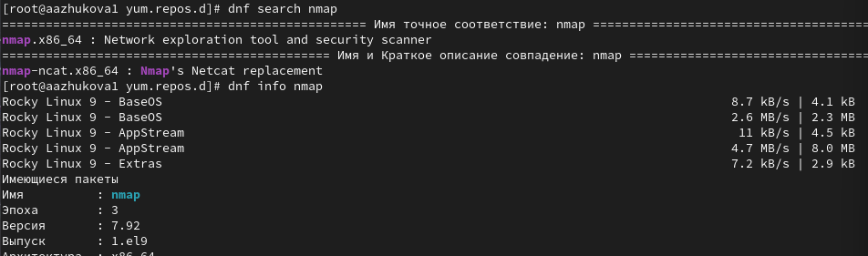
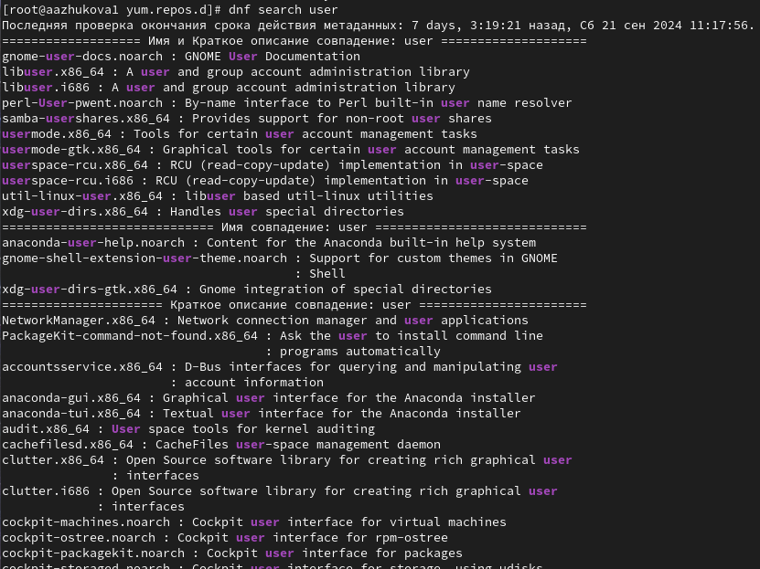
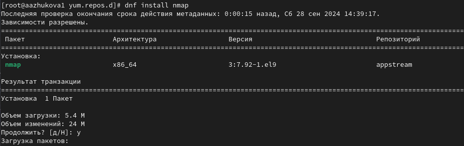
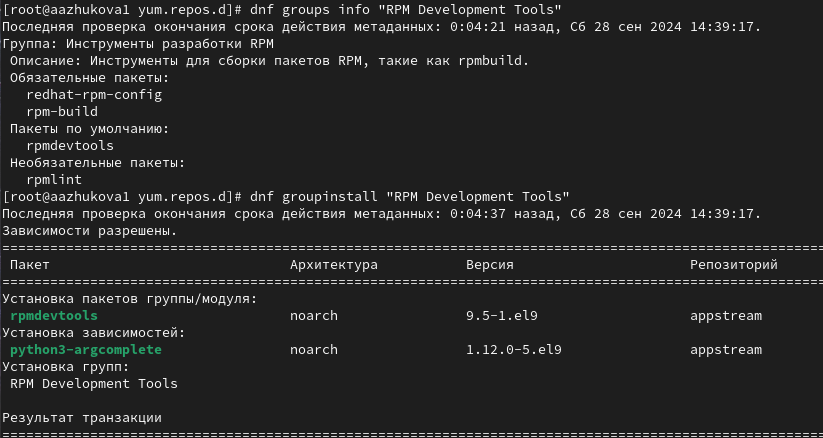
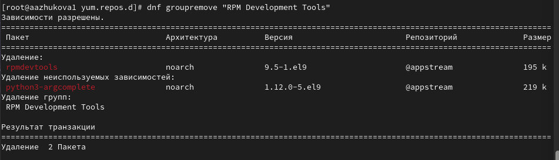
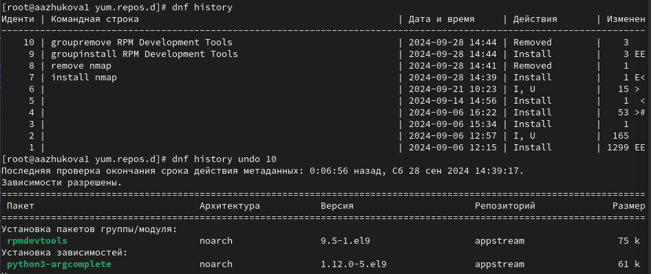
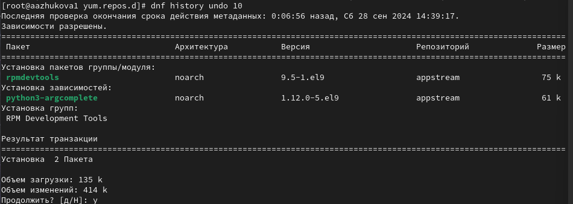
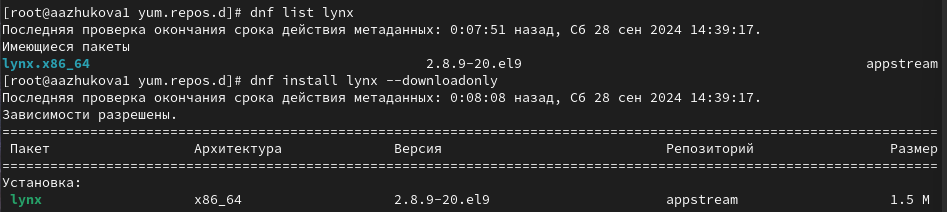
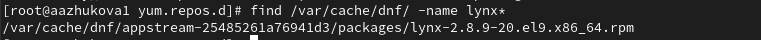
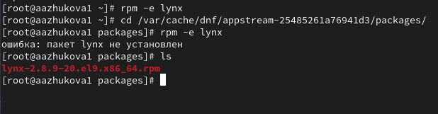

---
## Front matter
lang: ru-RU
title: Лабораторная работа №4. Работа с программными пакетами
subtitle: 
author:
  - Жукова А.А
institute:
  - Российский университет дружбы народов, Москва, Россия
date: 14 сентября 2024

## i18n babel
babel-lang: russian
babel-otherlangs: english

## Formatting pdf
toc: false
toc-title: Содержание
slide_level: 2
aspectratio: 169
section-titles: true
theme: metropolis
header-includes:
 - \metroset{progressbar=frametitle,sectionpage=progressbar,numbering=fraction}
---

# Информация

## Докладчик

:::::::::::::: {.columns align=center}
::: {.column width="70%"}

  * Жукова Арина Александровна
  * Студент бакалавриата, 2 курс
  * группа: НПИбд-03-23
  * Российский университет дружбы народов
  * [1132239120@rudn.ru](mailto:1132239120@rudn.ru)

:::
::: {.column width="30%"}

:::
::::::::::::::

# Вводная часть

## Цель работы

Лабораторная работа направлена на получение практических навыков работы с репозиториями программного обеспечения и менеджерами пакетов в Linux-системах.

## Задание

1. Изучите, как и в каких файлах подключаются репозитории для установки программного обеспечения; изучите основные возможности (поиск, установка, обновление, удаление пакета, работа с историей действий) команды dnf (см. раздел 4.4.1).
2. Изучите и повторите процесс установки/удаления определённого пакета с использованием возможностей dnf (см. раздел 4.4.1).
3. Изучите и повторите процесс установки/удаления определённого пакета с использованием возможностей rpm (см. раздел 4.4.2).

# Результаты и анализ лабораторной работы

## Работа с репозиториями

**Изучение репозиториев:** при помощи команды `dnf info "имя_репозитория"` мы можем найти и изучить информацию о репозиториях

## Работа с репозиториями

**Поиск пакетов:**  Использовали `dnf search` для поиска пакетов по ключевым словам в названии или описании
   

 
## Работа с репозиториями

**Установка и удаление пакетов:** Были изучены команды `dnf install`, `dnf remove` для установки и удаления пакетов, а также команды `dnf install [имя_пакета]\*`  и `dnf remove [имя_пакета]\*` для работы с группой пакетов, начинающихся с заданного имени

## Работа с репозиториями

**Работа с группами пакетов:**  получаем список групп пакетов, ищем информацию о конкретной группе `dnf groups info` и установить группу пакетов `dnf groupinstall`

## Работа с репозиториями

Удаляем группу пакетов при помощи `dnf groupremove`

## Работа с репозиториями

**Просмотр истории действий:**  Изучены команды `dnf history` и `dnf history undo` для просмотра и отмены действий с пакетами.

## Работа с репозиториями

## Использование rpm

**Скачивание, поиск и установка rpm-пакетов:**  скачиваем `rpm`-пакеты из репозитория, их поиске на диске и установке с помощью команды `rpm -Uhv`.

## Использование rpm

**Получение информации о пакете:**  Изучены команды `rpm -qf`, `rpm -qi`, `rpm -ql`, `rpm -qd`,  `rpm -qc` для получения информации о  расположении файлов,  содержании, документации, конфигурационных файлах и скриптах установки пакета.

**Работа со скриптами установки:** Префикс скрипта: Скрипты обычно имеют префикс pre (пре-скрипт, выполняемый перед установкой), post (пост-скрипт, выполняемый после установки), preun (пре-скрипт для удаления, выполняемый перед удалением), postun (пост-скрипт для удаления, выполняемый после удаления).
preinstall scriptlet:  создаёт пользователей, чтобы rpm мог устанавливать файлы, принадлежащие этому пользователю.
postinstall scriptlet: первоначальная установка.
preuninstall scriptlet: удаление пакета, без обновления
postuninstall scriptlet: Обновление пакета, без удаления

## Использование rpm

**Удаление rpm-пакетов:**  Изучена команда `rpm -e` для удаления пакета

# Выводы

В ходе выполнения лабораторной работы были получены навыки работы с репозиториями и менеджерами пакетов. Было изучено использование команд dnf и rpm для установки, удаления, поиска и управления пакетами. Также был получен опыт работы с группами пакетов, просмотра истории действий с пакетами и использования скриптов установки.

