---
## Front matter
title: "Лабораторная работа №4. Работа с программными пакетами"
subtitle: "Дисциплина: Основы администрирования операционных систем"
author: "Жукова Арина Александровна"

## Generic otions
lang: ru-RU
toc-title: "Содержание"

## Bibliography
bibliography: bib/cite.bib
csl: pandoc/csl/gost-r-7-0-5-2008-numeric.csl

## Pdf output format
toc: true # Table of contents
toc-depth: 2
lof: true # List of figures
lot: true # List of tables
fontsize: 12pt
linestretch: 1.5
papersize: a4
documentclass: scrreprt
## I18n polyglossia
polyglossia-lang:
  name: russian
  options:
	- spelling=modern
	- babelshorthands=true
polyglossia-otherlangs:
  name: english
## I18n babel
babel-lang: russian
babel-otherlangs: english
## Fonts
mainfont: IBM Plex Serif
romanfont: IBM Plex Serif
sansfont: IBM Plex Sans
monofont: IBM Plex Mono
mathfont: STIX Two Math
mainfontoptions: Ligatures=Common,Ligatures=TeX,Scale=0.94
romanfontoptions: Ligatures=Common,Ligatures=TeX,Scale=0.94
sansfontoptions: Ligatures=Common,Ligatures=TeX,Scale=MatchLowercase,Scale=0.94
monofontoptions: Scale=MatchLowercase,Scale=0.94,FakeStretch=0.9
mathfontoptions:
## Biblatex
biblatex: true
biblio-style: "gost-numeric"
biblatexoptions:
  - parentracker=true
  - backend=biber
  - hyperref=auto
  - language=auto
  - autolang=other*
  - citestyle=gost-numeric
## Pandoc-crossref LaTeX customization
figureTitle: "Рис."
tableTitle: "Таблица"
listingTitle: "Листинг"
lofTitle: "Список иллюстраций"
lotTitle: "Список таблиц"
lolTitle: "Листинги"
## Misc options
indent: true
header-includes:
  - \usepackage{indentfirst}
  - \usepackage{float} # keep figures where there are in the text
  - \floatplacement{figure}{H} # keep figures where there are in the text
---

# Цель работы

Получить навыки работы с репозиториями и менеджерами пакетов.

# Задание

1. Изучите, как и в каких файлах подключаются репозитории для установки программного обеспечения; изучите основные возможности (поиск, установка, обновление, удаление пакета, работа с историей действий) команды dnf (см. раздел 4.4.1).
2. Изучите и повторите процесс установки/удаления определённого пакета с использованием возможностей dnf (см. раздел 4.4.1).
3. Изучите и повторите процесс установки/удаления определённого пакета с использованием возможностей rpm (см. раздел 4.4.2).

# Выполнение лабораторной работы

## Работа с репозиториями

1. В консоли переходим в режим работы суперпользователя. Переходим в каталог /etc/yum.repos.d и просматриваем содержимое (рис. [-@fig:001]).

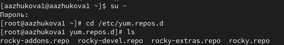{#fig:001 width=100%}

2. Выводим на экран список репозиториев (рис. [-@fig:002]).

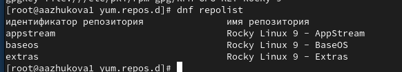{#fig:002 width=100%}

3. Выводим на экран список пакетов, в названии или описании которых есть слово user (рис. [-@fig:003]).

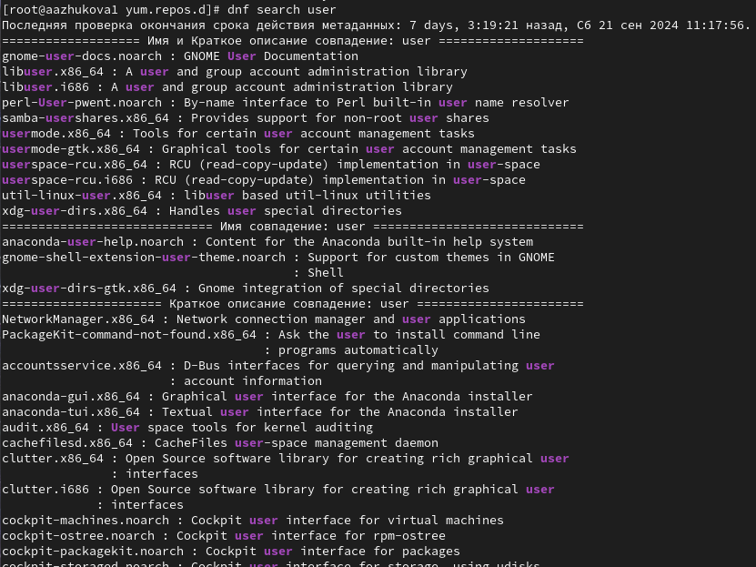{#fig:003 width=70%}

4. Установливаем nmap, предварительно изучив информацию по имеющимся пакетам:

dnf search nmap, dnf info nmap (рис. [-@fig:0041])
dnf install nmap (рис. [-@fig:0042])

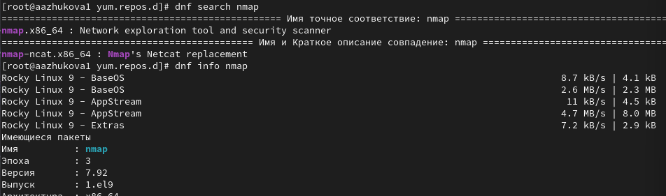{#fig:0041 width=70%}

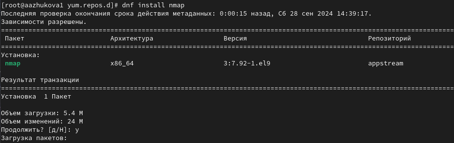{#fig:0042 width=70%}

• dnf install nmap - устанавливает пакет nmap.

• dnf install nmap\* - устанавливает все пакеты, начинающиеся с "nmap".

5. Удаляем nmap (рис. [-@fig:005])

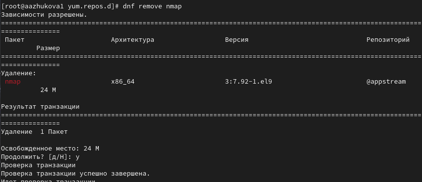{#fig:005 width=70%}

6. Получаем список имеющихся групп пакетов, затем установливаем группу пакетов RPM Development Tools (рис. [-@fig:0061]-[-@fig:0063])

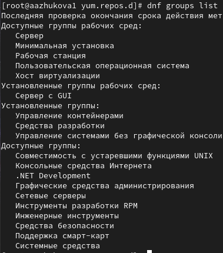{#fig:0061 width=70%}

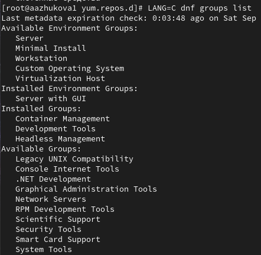{#fig:0062 width=70%}

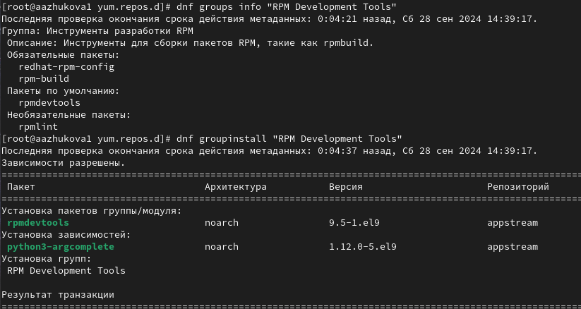{#fig:0063 width=70%}

Удаляем группу пакетов RPM Development Tools (рис. [-@fig:0064])

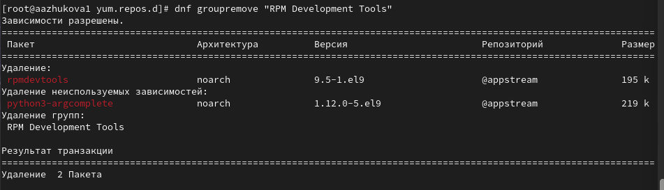{#fig:0064 width=70%}

7. Посмотриваем историю использования команды dnf (рис. [-@fig:007])

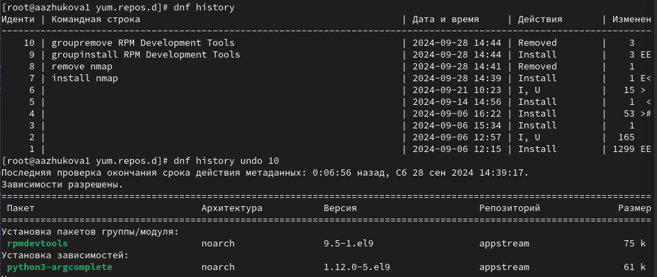{#fig:007 width=70%}

Отменяем последнее, десятое по счёту, действие(рис. [-@fig:0071])

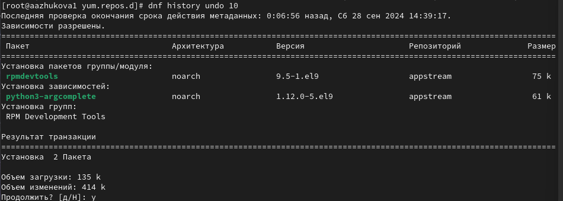{#fig:0071 width=70%}

##  Использование rpm

### Установка rpm-пакета lynx

1. Скачиваем rpm-пакет lynx (рис. [-@fig:011])

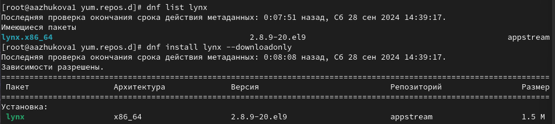{#fig:011 width=70%}

2. Найдём каталог, в который был помещён пакет после загрузки, перейдем в найденный каталог и установим пакет (рис. [-@fig:012])

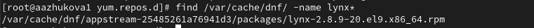{#fig:012 width=70%}

3. Определяем расположение исполняемого файла, определяем принадлежность к пакету lynx и получение доп. информации о содержимом пакета (рис. [-@fig:013])

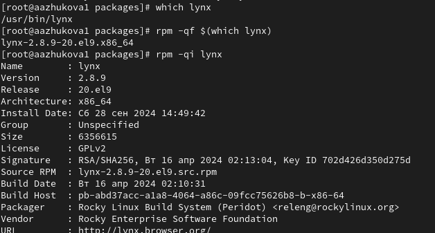{#fig:013 width=70%}

4. Получаем список всех файлов в пакете, используя (рис. [-@fig:014])

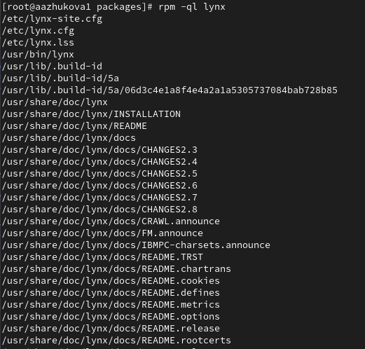{#fig:014 width=70%}

Выводим перечень файлов с документацией пакета (рис. [-@fig:0141])

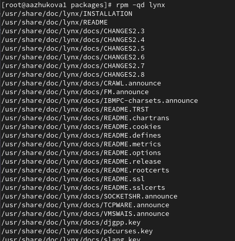{#fig:0141 width=70%}

Просматриваем файлы документации (рис. [-@fig:0142])

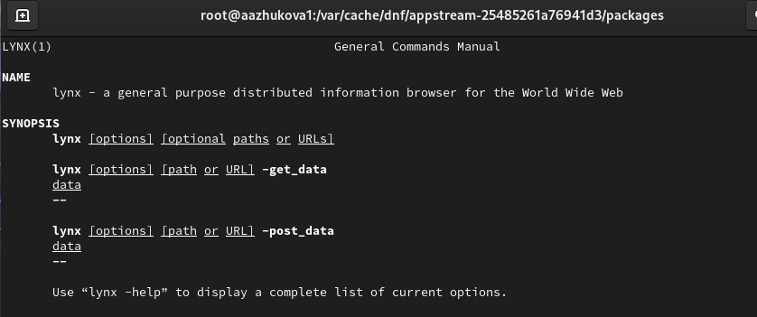{#fig:0142 width=60%}

5. Выводим на экран перечень и месторасположение конфигурационных файлов пакета (рис. [-@fig:015])

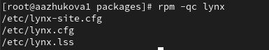{#fig:015 width=100%}

6. Выводим на экран расположение и содержание скриптов, выполняемых при установке пакета (рис. [-@fig:016])

{#fig:016 width=70%}

Скриптов обнаружено не было.

7. В отдельном терминале под своей учётной записью запускаем текстовый браузер lynx, чтобы проверить корректность установки пакета (рис. [-@fig:017])

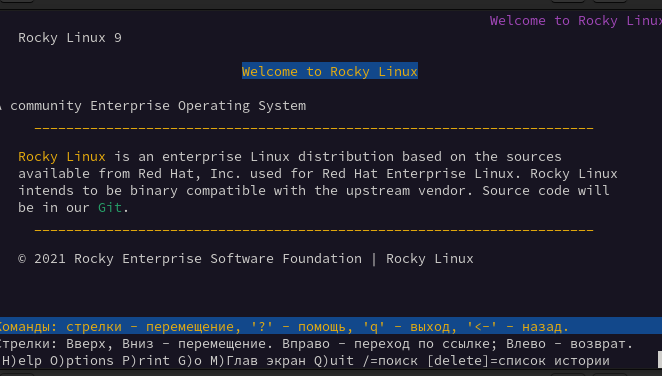{#fig:017 width=70%}

8. Возвращаемся в терминал с учётной записью root и удаляем пакет (рис. [-@fig:018])

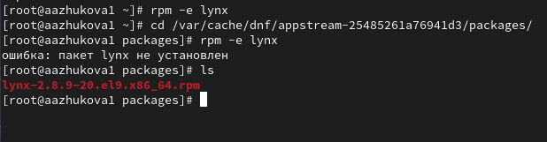{#fig:018 width=70%}

### Установка rpm-пакета dnsmasq

1. Установливаем пакет dnsmasq (рис. [-@fig:021])

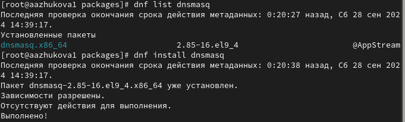{#fig:021 width=70%}

Определяем расположение исполняемого файла (рис. [-@fig:0211])

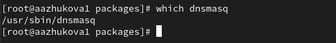{#fig:0211 width=70%}

2. Определяем по имени файла, к какому пакету принадлежит dnsmasq и получаем дополнительную информацию о содержимом пакета (рис. [-@fig:022])

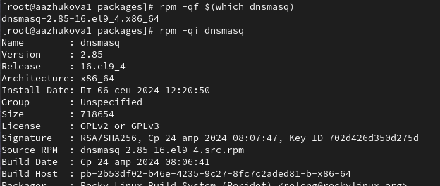{#fig:022 width=70%}

3. Получаем список всех файлов в пакете (рис. [-@fig:023])

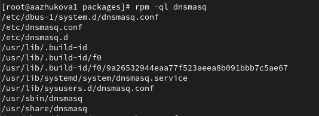{#fig:023 width=70%}

Выводим перечень файлов с документацией пакета (рис. [-@fig:0231])

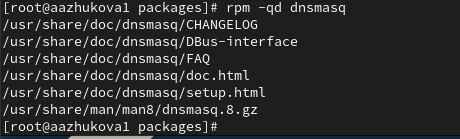{#fig:0231 width=70%}

Просматриваем файлы документации (рис. [-@fig:0232])

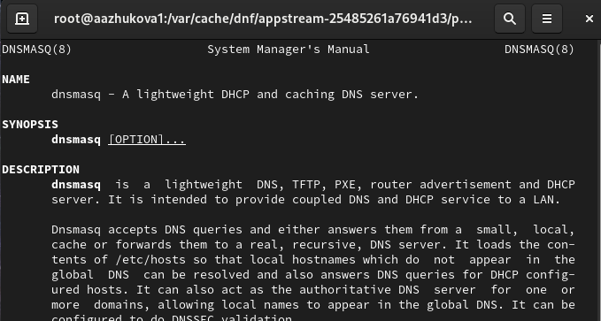{#fig:0232 width=70%}

4. Выводим на экран перечень и месторасположение конфигурационных файлов пакета (рис. [-@fig:024])

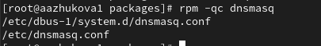{#fig:024 width=70%}

5. Выводим на экран расположение и содержание скриптов, выполняемых при установке пакета (рис. [-@fig:025])

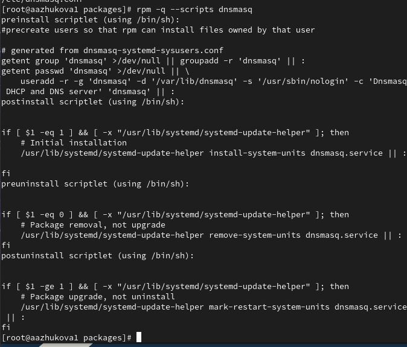{#fig:025 width=70%}

Префикс скрипта: Скрипты обычно имеют префикс pre (пре-скрипт, выполняемый перед установкой), post (пост-скрипт, выполняемый после установки), preun (пре-скрипт для удаления, выполняемый перед удалением), postun (пост-скрипт для удаления, выполняемый после удаления).

preinstall scriptlet:  создаёт пользователей, чтобы rpm мог устанавливать файлы, принадлежащие этому пользователю.

postinstall scriptlet: первоначальная установка.

preuninstall scriptlet: удаление пакета, без обновления

postuninstall scriptlet: Обновление пакета, без удаления

6. Возвращаемся в терминал с учётной записью root и удаляем пакет (рис. [-@fig:026])

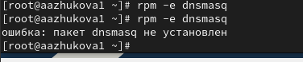{#fig:026 width=70%}

## Контрольные вопросы

1. `rpm -qf /usr/sbin/useradd` - Эта команда показывает имя пакета, содержащего файл /usr/sbin/useradd.

2. `dnf group info "Security Tools"` - Эта команда показывает информацию о группе dnf "Security Tools", включая список пакетов, входящих в нее.

3. `rpm -ivh имя_файла.rpm` - Эта команда устанавливает rpm-пакет, загруженный из интернета. 
  - -i - устанавливает пакет.
  - -v - выводит более подробную информацию о процессе установки.
  - -h - показывает индикатор выполнения процесса.

4. `rpm -qp --scripts имя_файла.rpm` - Эта команда показывает содержимое сценариев, включенных в rpm-пакет. Вы можете проанализировать сценарии на предмет вредоносного кода.

5. `rpm -qp --doc имя_файла.rpm` - Эта команда выводит документацию, включенную в rpm-пакет.

6. `rpm -qf имя_файла` - Эта команда выводит имя пакета, которому принадлежит файл имя_файла. 

# Выводы

В ходе выполнения лабораторной работы были получены навыки работы с репозиториями и менеджерами пакетов. Было изучено использование команд dnf и rpm для установки, удаления, поиска и управления пакетами. Также был получен опыт работы с группами пакетов, просмотра истории действий с пакетами и использования скриптов установки.

# Список литературы{.unnumbered}

1. Neil N. J. Learning CentOS: A Beginners Guide to Learning Linux. — CreateSpace Independent Publishing Platform, 2016.
2. Vugt S. van. Red Hat RHCSA/RHCE 7 cert guide : Red Hat Enterprise Linux 7 (EX200 and EX300). — Pearson IT Certification, 2016. — (Certification Guide).
3. Goyal S. K. Precise Guide to Centos 7: Beginners guide and quick reference. — Independently published, 2017.
4. Unix и Linux: руководство системного администратора / Э. Немет, Г. Снайдер, Т.Хейн, Б. Уэйли, Д. Макни. — 5-е изд. — СПб. : ООО «Диалектика», 2020.

::: {#refs}
:::
