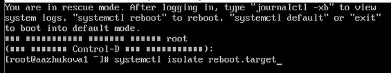

---
## Front matter
lang: ru-RU
title: Лабораторная работа №5.
subtitle: Управление системными службами
author:
  - Жукова А.А
institute:
  - Российский университет дружбы народов, Москва, Россия
date: 4 октября 2024

## i18n babel
babel-lang: russian
babel-otherlangs: english

## Formatting pdf
toc: false
toc-title: Содержание
slide_level: 2
aspectratio: 169
section-titles: true
theme: metropolis
header-includes:
 - \metroset{progressbar=frametitle,sectionpage=progressbar,numbering=fraction}
---

# Информация

## Докладчик

:::::::::::::: {.columns align=center}
::: {.column width="70%"}

  * Жукова Арина Александровна
  * Студент бакалавриата, 2 курс
  * группа: НПИбд-03-23
  * Российский университет дружбы народов
  * [1132239120@rudn.ru](mailto:1132239120@rudn.ru)

:::
::: {.column width="30%"}

:::
::::::::::::::

# Вводная часть

## Цель работы

Лабораторная работа направлена на получение навыков управления системными службами операционной системы посредством systemd.

## Задание

1. Выполните основные операции по запуску (останову), определению статуса, добавлению (удалению) в автозапуск и пр. службы Very Secure FTP (раздел 5.4.1).
2. Продемонстрируйте навыки по разрешению конфликтов юнитов для служб firewalld и iptables (раздел 5.4.2).
3. Продемонстрируйте навыки работы с изолированными целями (разделы 5.4.3, 5.4.4).

# Результаты и анализ лабораторной работы

## Управление сервисами

**Управление сервисами:** Остановка сервера, его запуск и блокировка для предотвращения конфликтов.

## Управление сервисами

**Символические ссылки:** Показано, как работает система символических ссылок в /etc/systemd/system/multi-user.target.wants, которая определяет, какие сервисы запускаются при загрузке системы, а также добавление в автозапуск.

**Зависимости:** Изучается, как вывести список зависимостей сервиса (что необходимо для его работы) и список сервисов, которые от него зависят.

## Конфликты юнитов

**Вывод конфликтов** 

## Изолируемые цели

**Изолированные цели:** Показаны специальные цели в systemd, которые могут быть изолированы. 

## Изолируемые цели
 
**Переход в режим восстановления:** systemctl isolate rescue.target  запускает цель rescue.target, переводя систему в режим восстановления.  Требуется пароль администратора (root).

**Перезагрузка системы:** systemctl isolate reboot.target  запускает цель reboot.target, перезагружая систему.

## Цель по умолчанию

**Просмотр текущей цели:** показывает какая цель установлена по умолчанию.

**Установка новой цели:** systemctl set-default [имя_цели] устанавливает новую цель по умолчанию.

# Выводы

В ходе выполнения лабораторной работы были получены навыки управления системными службами операционной системы посредством systemd.

