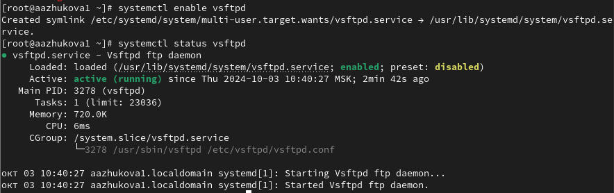

---
## Front matter
title: "Лабораторная работа №5. Управление системными службами"
subtitle: "Дисциплина: Администрирование операционных систем"
author: "Жукова Арина Александровна"

## Generic otions
lang: ru-RU
toc-title: "Содержание"

## Bibliography
bibliography: bib/cite.bib
csl: pandoc/csl/gost-r-7-0-5-2008-numeric.csl

## Pdf output format
toc: true # Table of contents
toc-depth: 2
lof: true # List of figures
lot: true # List of tables
fontsize: 12pt
linestretch: 1.5
papersize: a4
documentclass: scrreprt
## I18n polyglossia
polyglossia-lang:
  name: russian
  options:
	- spelling=modern
	- babelshorthands=true
polyglossia-otherlangs:
  name: english
## I18n babel
babel-lang: russian
babel-otherlangs: english
## Fonts
mainfont: IBM Plex Serif
romanfont: IBM Plex Serif
sansfont: IBM Plex Sans
monofont: IBM Plex Mono
mathfont: STIX Two Math
mainfontoptions: Ligatures=Common,Ligatures=TeX,Scale=0.94
romanfontoptions: Ligatures=Common,Ligatures=TeX,Scale=0.94
sansfontoptions: Ligatures=Common,Ligatures=TeX,Scale=MatchLowercase,Scale=0.94
monofontoptions: Scale=MatchLowercase,Scale=0.94,FakeStretch=0.9
mathfontoptions:
## Biblatex
biblatex: true
biblio-style: "gost-numeric"
biblatexoptions:
  - parentracker=true
  - backend=biber
  - hyperref=auto
  - language=auto
  - autolang=other*
  - citestyle=gost-numeric
## Pandoc-crossref LaTeX customization
figureTitle: "Рис."
tableTitle: "Таблица"
listingTitle: "Листинг"
lofTitle: "Список иллюстраций"
lotTitle: "Список таблиц"
lolTitle: "Листинги"
## Misc options
indent: true
header-includes:
  - \usepackage{indentfirst}
  - \usepackage{float} # keep figures where there are in the text
  - \floatplacement{figure}{H} # keep figures where there are in the text
---

# Цель работы

Получить навыки управления системными службами операционной системы посредством systemd.

# Задание

1. Выполните основные операции по запуску (останову), определению статуса, добавлению (удалению) в автозапуск и пр. службы Very Secure FTP (раздел 5.4.1).
2. Продемонстрируйте навыки по разрешению конфликтов юнитов для служб firewalld и iptables (раздел 5.4.2).
3. Продемонстрируйте навыки работы с изолированными целями (разделы 5.4.3, 5.4.4).

# Выполнение лабораторной работы

## Управление сервисами

1. Получаем полномочия администратора. Проверяем статус службы Very Secure FTP при помощи `systemctl status vsftpd`
Вывод команды показывает, юнит vsftpd не установлен. Устанавливаем службу Very Secure FTP при помощи команды `dnf -y install vsftpd` (рис. [-@fig:001]).

{#fig:001 width=70%}

2. Запускаем службу Very Secure FTP (`systemctl start vsftpd`). Проверяем статус службы Very Secure FTP (рис. [-@fig:002]).

{#fig:002 width=70%}

    Вывод показывает, что служба в настоящее время работает, но не будет активирована при перезапуске операционной системы.

3. Добавляем службу Very Secure FTP в автозапуск при загрузке операционной системы, используя команду systemctl enable, проверяем статус службы (рис. [-@fig:003]).

{#fig:003 width=70%}

Удаляем службу из автозапуска, используя команду systemctl disable, и снова проверяем её статус (рис. [-@fig:0031]).

{#fig:0031 width=70%}

4. Выводим на экран символические ссылки, ответственные за запуск различных сервисов (рис. [-@fig:004]).

{#fig:004 width=70%}

Ссылки на vsftpd.service не существует.

5. Снова добавляем службу Very Secure FTP в автозапуск, выводим на экран символические ссылки, ответственные за запуск сервисов, проверяем статус службы (рис. [-@fig:005]).

{#fig:005 width=70%}

Вывод команды показывает, что создана символическая ссылка для файла /usr/lib/systemd/system/vsftpd.service в каталоге /etc/systemd/system/multi-user.target.wants. Для файла юнита состояние изменено с disabled на enabled.

6. Выводим на экран список зависимостей юнита `systemctl list-dependencies vsftpd` (рис. [-@fig:006]).

{#fig:006 width=70%}

7. Выводим на экран список юнитов, которые зависят от данного юнита `systemctl list-dependencies vsftpd --reverse` (рис. [-@fig:007]).

{#fig:007 width=70%}

## Конфликты юнитов

1. Получаем полномочия администратора. Устанавливаем iptables (рис. [-@fig:021]).

{#fig:021 width=70%}

2. Проверяем статус firewalld и iptables (рис. [-@fig:022]).

{#fig:022 width=70%}

3. Пытаемся запустить firewalld и iptables и видим, что при запуске одной службы вторая дезактивируется или не запускается, вводим `cat /usr/lib/systemd/system/firewalld.service` (рис. [-@fig:023]).

{#fig:023 width=70%}

4. Выгружаем службу iptables, загружаем службу firewalld, заблокируем запуск iptables, проверяем создание символической ссылки на /dev/null для /etc/systemd/system/iptables.servicе (рис. [-@fig:024]).

{#fig:024 width=70%}

5. Пытаемся запустить iptables (рис. [-@fig:025]).

{#fig:025 width=70%}

Появляется сообщение об ошибке, указывающее, что служба замаскирована и по этой причине не может быть запущена.

6. Пытаемся добавить iptables в автозапуск (рис. [-@fig:026]).

{#fig:026 width=70%}

Сервис неактивен, а статус загрузки замаскированный.

## Изолируемые цели

1. Получаем полномочия администратора. Переходим в каталог systemd и находим список всех целей, которые можно изолировать (рис. [-@fig:031]).

{#fig:031 width=70%}

2. Переключаем операционную систему в режим восстановления (рис. [-@fig:032]).

{#fig:032 width=70%}

При этом необходимо ввести пароль root на консоли сервера для входа в систему.

3. Перезапускаем операционную систему (рис. [-@fig:036]).

{#fig:036 width=70%}

## Цель по умолчанию

1. Получаем полномочия администратора. Выводим на экран цель, установленную по умолчанию (рис. [-@fig:040]).

{#fig:040 width=70%}

  
2. Для установки цели по умолчанию используется команда systemctl set-default. Ставим по умолчанию запуск в текстовом режиме и перезагружаем машину (рис. [-@fig:042]).

{#fig:042 width=70%}

Система загрузилась в текстовом режиме. Получите полномочия администратора. Для запуска по умолчанию графического режима вводим `systemctl set-default graphical.target`. Вновь перезагружаем систему командой reboot (рис. [-@fig:043]).

{#fig:043 width=70%}

Проверяем, что система загрузилась в графическом режиме (рис. [-@fig:044]).

{#fig:044 width=70%}

# Контрольные вопросы

1. Юнит (unit) - описание единицы программного обеспечения, которую systemd может управлять (сервис, устройство, точка монтирования). 
   Примеры: vsftpd.service, network-online.target, swap.swap.

2. Проверка автоматического запуска: `systemctl disable [имя_цели]`.

3. Список загруженных сервисов: `systemctl --type=service`.

4. Создание потребности: `systemctl enable [имя_сервиса]`.

5. Переключение на rescue.target: `systemctl isolate rescue.target`.

6. Причина невозможности изоляции: Цель, вероятно, не предназначена для изоляции (нет AllowIsolate=yes) или уже находится в изоляции.

7. Проверка зависимостей: `systemctl list-dependencies [имя_сервиса] --reverse`.

# Выводы

Мы получили навыки управления системными службами операционной системы посредством systemd.

# Список литературы{.unnumbered}

1. Поттеринг Л. Systemd для администраторов: цикл статей. — 2010. — URL: http:
//wiki.opennet.ru/Systemd.
2. Neil N. J. Learning CentOS: A Beginners Guide to Learning Linux. — CreateSpace Independent Publishing Platform, 2016.
3. Systemd. — 2022. — URL: https://wiki.archlinux.org/title/Systemd.

::: {#refs}
:::
