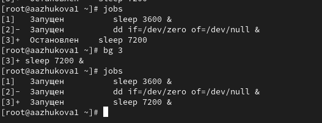
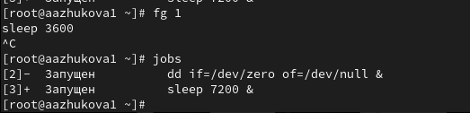
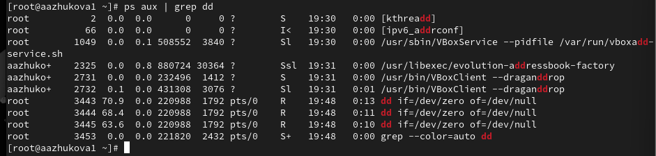
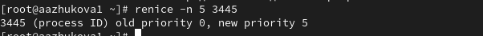
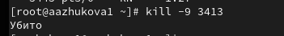
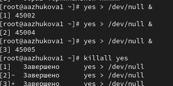
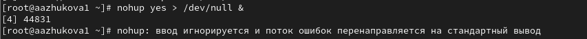

---
## Front matter
lang: ru-RU
title: Лабораторная работа №6.
subtitle: Управление процессами
author:
  - Жукова А.А
institute:
  - Российский университет дружбы народов, Москва, Россия
date: 4 октября 2024

## i18n babel
babel-lang: russian
babel-otherlangs: english

## Formatting pdf
toc: false
toc-title: Содержание
slide_level: 2
aspectratio: 169
section-titles: true
theme: metropolis
header-includes:
 - \metroset{progressbar=frametitle,sectionpage=progressbar,numbering=fraction}
---

# Информация

## Докладчик

:::::::::::::: {.columns align=center}
::: {.column width="70%"}

  * Жукова Арина Александровна
  * Студент бакалавриата, 2 курс
  * группа: НПИбд-03-23
  * Российский университет дружбы народов
  * [1132239120@rudn.ru](mailto:1132239120@rudn.ru)

:::
::: {.column width="30%"}

:::
::::::::::::::

# Вводная часть

## Цель работы

Лабораторная работа направлена на получение навыков управления процессами операционной системы.

## Задание

1. Продемонстрируйте навыки управления заданиями операционной системы (см. раздел 6.4.1).
2. Продемонстрируйте навыки управления процессами операционной системы (см. раздел 6.4.2).
3. Выполните задания для самостоятельной работы (см. раздел 6.5)

# Результаты и анализ лабораторной работы

## Управление заданиями

**Команда jobs** выводит порядковый номер задания в виде числа в квадратных скобках. После номера указывается состояние процесса: stopped (остановлен), running (выполняется) или suspended (приостановлен). В конце строки указывается команда, которая исполняется данным процессом

## Управление заданиями

**Режим работы программ** При запуске процесса путём запуска программы из командной строки, то он запускается на переднем плане, можно запустить процесс в фоновом режиме, чтобы он не был связан с терминалом при помощи символ &. В оболочке bash две встроенные команды служат для перевода процессов на передний план (команда fg) или возврата их в фоновый режим (команда bg). В качестве аргумента этим командам передаются номера заданий.

## Управление процессами

**Поиск строк** Команда `ps aux | grep dd` показывает все строки, в которых есть буквы dd. Запущенные процессы dd идут последними.

## Управление процессами

**Приоритеты** Значение приоритета лежит в пределах от +20 (наименьший приоритет — процесс выполняется только тогда, когда ничто другое не занимает процессор) до −20 (наивысший приоритет). Команда `renice [-n] priority [[-p] PID] [[-g] grp] [[-u] user]` служит для изменения значения nice для уже выполняющихся процессов.

## Управление процессами

**Удаление процессов** Для удаления процессов используем команду `kill -9 <pid>` (заменив на значение PID оболочки). 

Завершение работы одновременно, используя команду killall.

## Самостоятельная работа

**Запуск программы в фоне** Для запуска программы в фоновом режиме, которая должна выполняться и после вашего выхода из оболочки, то её нужно запускать с помощью утилиты nohup: `nohup команда &`

# Выводы

В ходе выполнения лабораторной работы были получены навыки управления процессами операционной системы.

