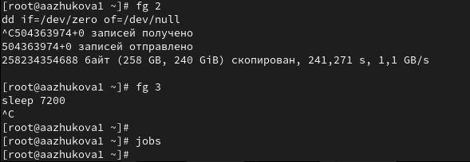

---
## Front matter
title: "Лабораторная работа №6. Управление процессами"
subtitle: "Дисциплина: Администрирование операционных систем"
author: "Жукова Арина Александровна"

## Generic otions
lang: ru-RU
toc-title: "Содержание"

## Bibliography
bibliography: bib/cite.bib
csl: pandoc/csl/gost-r-7-0-5-2008-numeric.csl

## Pdf output format
toc: true # Table of contents
toc-depth: 2
lof: true # List of figures
lot: true # List of tables
fontsize: 12pt
linestretch: 1.5
papersize: a4
documentclass: scrreprt
## I18n polyglossia
polyglossia-lang:
  name: russian
  options:
	- spelling=modern
	- babelshorthands=true
polyglossia-otherlangs:
  name: english
## I18n babel
babel-lang: russian
babel-otherlangs: english
## Fonts
mainfont: IBM Plex Serif
romanfont: IBM Plex Serif
sansfont: IBM Plex Sans
monofont: IBM Plex Mono
mathfont: STIX Two Math
mainfontoptions: Ligatures=Common,Ligatures=TeX,Scale=0.94
romanfontoptions: Ligatures=Common,Ligatures=TeX,Scale=0.94
sansfontoptions: Ligatures=Common,Ligatures=TeX,Scale=MatchLowercase,Scale=0.94
monofontoptions: Scale=MatchLowercase,Scale=0.94,FakeStretch=0.9
mathfontoptions:
## Biblatex
biblatex: true
biblio-style: "gost-numeric"
biblatexoptions:
  - parentracker=true
  - backend=biber
  - hyperref=auto
  - language=auto
  - autolang=other*
  - citestyle=gost-numeric
## Pandoc-crossref LaTeX customization
figureTitle: "Рис."
tableTitle: "Таблица"
listingTitle: "Листинг"
lofTitle: "Список иллюстраций"
lotTitle: "Список таблиц"
lolTitle: "Листинги"
## Misc options
indent: true
header-includes:
  - \usepackage{indentfirst}
  - \usepackage{float} # keep figures where there are in the text
  - \floatplacement{figure}{H} # keep figures where there are in the text
---

# Цель работы

Получить навыки управления процессами операционной системы.

# Задание

1. Продемонстрируйте навыки управления заданиями операционной системы (см. раздел 6.4.1).
2. Продемонстрируйте навыки управления процессами операционной системы (см. раздел 6.4.2).
3. Выполните задания для самостоятельной работы (см. раздел 6.5)

# Выполнение лабораторной работы

## Управление заданиями

1. Получаю полномочия администратора. Ввожу следующие команды: `sleep 3600 & dd if=/dev/zero of=/dev/null & sleep 7200` (рис. [-@fig:001]).

{#fig:001 width=70%}

Поскольку я запустила последнюю команду без & после неё, у меня есть 2 часа, прежде чем я снова получу контроль над оболочкой. Ввожу Ctrl + z, чтобы остановить процесс.

2. Ввожу jobs. Вижу три задания, которые я только что запустила. Первые два имеют состояние Running, а последнее задание в настоящее время находится в состоянии Stopped. Для продолжения выполнения задания 3 в фоновом режиме ввожу `bg 3`. С помощью команды `jobs` смотрю изменения в статусе заданий (рис. [-@fig:002]).

{#fig:002 width=70%}

3. Для перемещения задания 1 на передний план ввожу `fg 1`. Ввожу `Ctrl + c`, чтобы отменить задание 1. С помощью команды jobs смотрю изменения в статусе заданий (рис. [-@fig:003]).

{#fig:003 width=70%}

4. Проделываю то же самое для отмены заданий 2 и 3 (рис. [-@fig:004]).

{#fig:004 width=70%}

5. Открываю второй терминал и под учётной записью своего пользователя ввожу в нём: `dd if=/dev/zero of=/dev/null &`. Ввожу exit, чтобы закрыть второй терминал (рис. [-@fig:005]).

{#fig:005 width=70%}

6. На другом терминале под учётной записью своего пользователя запускаю `top`. Вижу, что задание dd всё ещё запущено. Для выхода из top использую q (рис. [-@fig:006]).

{#fig:006 width=70%}

Вновь запускаю top и в нём использую k, чтобы убить задание dd. После этого выхожу из top.

## Управление процессами

1. Получаю полномочия администратора. Ввожу следующую команду 3 раза `dd if=/dev/zero of=/dev/null & ` (рис. [-@fig:011]).

{#fig:011 width=70%}

2. Ввожу `ps aux | grep dd`. Это команда показывает все строки, в которых есть буквы dd. Запущенные процессы dd идут последними (рис. [-@fig:012]).

{#fig:012 width=70%}

3. Использую PID одного из процессов dd, чтобы изменить приоритет. Использую `renice -n 5`(рис. [-@fig:013]).

{#fig:013 width=70%}

4. Ввожу `ps fax | grep -B5 dd`. Параметр -B5 показывает соответствующие запросу строки, включая пять строк до этого. Поскольку ps fax показывает иерархию отношений между процессами, я также увижу оболочку, из которой были запущены все процессы dd, и её PID (рис. [-@fig:014]).

{#fig:014 width=70%}

5. Нахожу PID корневой оболочки, из которой были запущены процессы dd, и ввожу `kill -9` (заменив на значение PID оболочки). Вижу, что моя корневая оболочка закрылась, а вместе с ней и все процессы dd. (рис. [-@fig:015]).

{#fig:015 width=70%}

# Самостоятельная работа

## Задание 1

1. Запускаю команду `dd if=/dev/zero of=/dev/null` трижды как фоновое задание. Увеличиваю приоритет одной из этих команд, используя значение приоритета −5. Изменяю приоритет того же процесса ещё раз, но использую на этот раз значение −15. Завершаю все процессы dd, которые я запустила (рис. [-@fig:021]).

{#fig:021 width=70%}

## Задание 2

1. Запускаю программу yes в фоновом режиме с подавлением потока вывода `yes > /dev/null &`. Запускаю программу yes на переднем плане с подавлением потока вывода, приостанавливаю выполнение программы. Заново запускаю программу yes с теми же параметрами, затем завершаю её выполнение. Запускаю программу yes на переднем плане без подавления потока вывода `yes > /dev/null`. Приостанавливаю выполнение программы. Заново запускаю программу yes с теми же параметрами, затем завершаю её выполнение.Проверяю состояния заданий, воспользовавшись командой jobs. Перевожу процесс, который у меня выполняется в фоновом режиме, на передний план, затем останавливаю его (fg 1, после чего Ctrl+c). Перевожу третий процесс с подавлением потока вывода в фоновый режим.Проверяю состояния заданий, воспользовавшись командой jobs. Обращаю внимание, что процесс стал выполняющимся (Running) в фоновом режиме (рис. [-@fig:031]).

{#fig:031 width=70%}

2. Запускаю процесс в фоновом режиме таким образом, чтобы он продолжил свою работу даже после отключения от терминала (рис. [-@fig:032]).

{#fig:032 width=70%}

3. Закрываю окно и заново запускаю консоль. Убеждаюсь, что процесс продолжил свою работу (рис. [-@fig:033]).

{#fig:033 width=70%}

4. Получаю информацию о запущенных в операционной системе процессах с помощью утилиты top (рис. [-@fig:034]).

{#fig:034 width=70%}

5. Запускаю ещё три программы yes в фоновом режиме с подавлением потока вывода. Убиваю два процесса: для одного использую его PID, а для другого — его идентификатор конкретного задания. Пробую послать сигнал 1 (SIGHUP) процессу, запущенному с помощью nohup, и обычному процессу (рис. [-@fig:035]).

{#fig:035 width=70%}

6. Запускаю ещё несколько программ yes в фоновом режиме с подавлением потока вывода. Завершаю их работу одновременно, используя команду killall (рис. [-@fig:037]).

{#fig:037 width=70%}

7. Запускаю программу yes в фоновом режиме с подавлением потока вывода. Используя утилиту nice, запускаю программу yes с теми же параметрами и с приоритетом, большим на 5. Сравниваю абсолютные и относительные приоритеты у этих двух процессов. Используя утилиту renice, изменяю приоритет у одного из потоков yes таким образом, чтобы у обоих потоков приоритеты были равны (рис. [-@fig:038]).

{#fig:038 width=70%}

# Контрольные вопросы

1. Команда jobs выводит список всех текущих заданий оболочки. Она показывает статус каждого задания (работает, остановлен, в фоновом режиме). 

2. Чтобы остановить текущее задание оболочки и продолжить его выполнение в фоновом режиме, можно использовать комбинацию клавиш Ctrl + Z (в большинстве оболочек). После этого введите команду bg и нажмите Enter, чтобы перевести задание в фоновый режим.

3. Для отмены текущего задания оболочки используйте комбинацию клавиш Ctrl + C.

4. В этом случае нужно воспользоваться командой kill. Для этого необходимо знать PID (идентификатор процесса) отменяемого задания. 

• Чтобы найти PID, используйте команду ps aux (или ps -ef).
• Затем выполните команду kill -9 <PID>, чтобы немедленно остановить процесс. 
• Важно!  Используйте kill -9 только в крайнем случае, так как этот сигнал не дает процессу возможности завершиться корректно и может привести к потере данных.

5. Команда pstree отображает дерево процессов, показывая связи между родительскими и дочерними процессами.

6. Команда renice используется для изменения приоритета процесса. Чтобы повысить приоритет процесса с PID 1234, выполните команду `renice -n -5 1234`

7. Проще всего остановить все процессы dd, используя команду pkill с соответствующим шаблоном. Например: `pkill dd`

8. Чтобы остановить команду с именем mycommand, используйте команду pkill: `pkill mycommand`

9. В top для убийства процесса используйте сигнал (signal). Чтобы убить процесс, введите номер PID процесса, который хотите убить, и нажмите k. Затем введите 9 (сигнал KILL) и нажмите Enter. 

10. Запуск команды с высоким приоритетом может негативно повлиять на производительность других процессов. 

• Для планирования задач используйте cron. Cron позволяет выполнять команды в заданное время и с определенной периодичностью, что позволяет избежать перегрузки системы.
• Использование команды nice позволит понизить приоритет запускаемого процесса. Например: `nice -n 10 mycommand`
    
    Это уменьшит нагрузку на систему, освободив ресурсы для других процессов.
• Важно!  Используйте высоки приоритет только в случае крайней необходимости.

# Выводы

Мы получили навыки управления процессами операционной системы.

# Список литературы{.unnumbered}

1. Робачевский А., Немнюгин С., Стесик О. Операционная система UNIX. — 2-е изд. —
БХВ-Петербург, 2010.
2. Колисниченко Д. Н. Самоучитель системного администратора Linux. — СПб. : БХВПетербург, 2011. — (Системный администратор).
3. Таненбаум Э., Бос Х. Современные операционные системы. — 4-е изд. — СПб. : Питер,
2015. — (Классика Computer Science).
4. Neil N. J. Learning CentOS: A Beginners Guide to Learning Linux. — CreateSpace Independent Publishing Platform, 2016.
5. Unix и Linux: руководство системного администратора / Э. Немет, Г. Снайдер, Т.
Хейн, Б. Уэйли, Д. Макни. — 5-е изд. — СПб. : ООО «Диалектика», 2020.

::: {#refs}
:::
