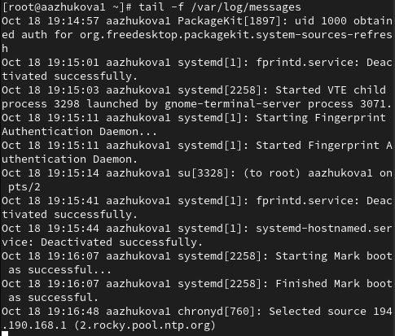
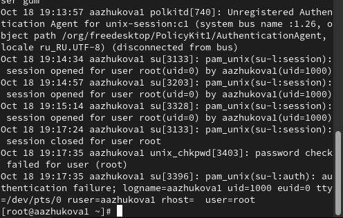
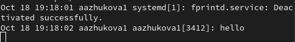
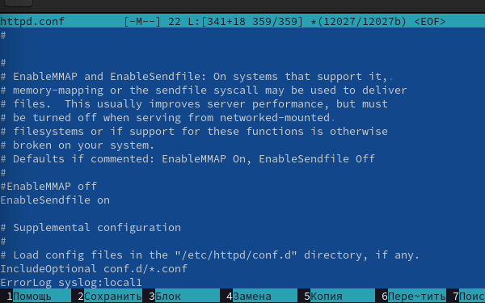
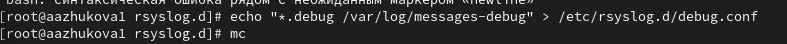
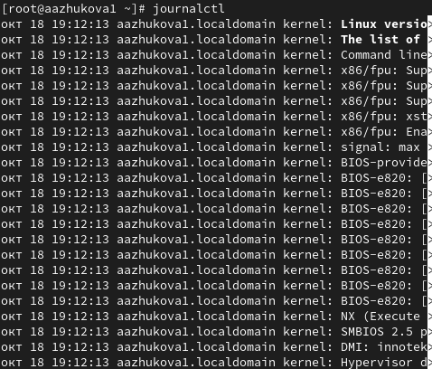
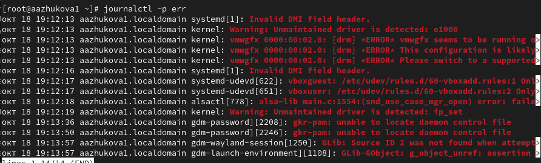
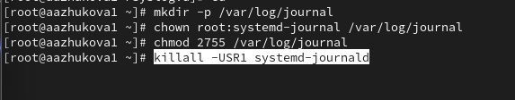

---
## Front matter
lang: ru-RU
title: Лабораторная работа №7.
subtitle: Управление журналами событий в системе
author:
  - Жукова А.А
institute:
  - Российский университет дружбы народов, Москва, Россия
date: 19 октября 2024

## i18n babel
babel-lang: russian
babel-otherlangs: english

## Formatting pdf
toc: false
toc-title: Содержание
slide_level: 2
aspectratio: 169
section-titles: true
theme: metropolis
header-includes:
 - \metroset{progressbar=frametitle,sectionpage=progressbar,numbering=fraction}
---

# Информация

## Докладчик

:::::::::::::: {.columns align=center}
::: {.column width="70%"}

  * Жукова Арина Александровна
  * Студент бакалавриата, 2 курс
  * группа: НПИбд-03-23
  * Российский университет дружбы народов
  * [1132239120@rudn.ru](mailto:1132239120@rudn.ru)

:::
::: {.column width="30%"}

:::
::::::::::::::

# Вводная часть

## Цель работы

Лабораторная работа направлена на получение навыков работы с журналами мониторинга различных событий в системе.

## Задание

1. Продемонстрируйте навыки работы с журналом мониторинга событий в реальном времени.
2. Продемонстрируйте навыки создания и настройки отдельного файла конфигурации мониторинга отслеживания событий веб-службы.
3. Продемонстрируйте навыки работы с journalctl.
4. Продемонстрируйте навыки работы с journald.

# Результаты и анализ лабораторной работы

## Основные файлы журналов

– /var/log/messages — общий файл журнала, в который записывается большинство
сообщений системы (наиболее часто используемый файл журнала);
– /var/log/dmesg — журнал сообщений ядра системы;
– /var/log/secure — журнал сообщений, связанных с аутентификацией в системе;
– /var/log/boot.log — журнал сообщений, связанных с запуском системы;
– /var/log/audit/audit.log — журнал сообщений аудита (например, в него записываются сообщения SELinux);
– /var/log/maillog — журналы сообщений, связанных с почтовой службой;
– /var/log/samba — журналы сообщений службы samba (samba по умолчанию не управляется через rsyslogd);
– /var/log/sssd — журналы сообщений службы sssd;
– /var/log/cups — журналы службы печати cups;
– /var/log/httpd/ — каталог с журналами веб-службы Apache (Apache записывает
сообщения в эти файлы напрямую, а не через rsyslog).

## Мониторинг журнала системных событий в реальном времени

• **Команда tail -f**:  Мониторинг файла /var/log/messages в реальном времени, пример: `tail -f /var/log/messages` 

## Мониторинг журнала системных событий в реальном времени

• **tail -n 20 /var/log/secure**: Вывод последних 20 строк из файла /var/log/secure

## Мониторинг журнала системных событий в реальном времени

• **logger hello**: Запись сообщения "hello" в системный журнал

### Изменение правил rsyslog.conf:

• **ErrorLog syslog:local1**: Добавление строки в конфигурационный файл Apache, чтобы сообщения об ошибках записывались в системный журнал.

## Изменение правил rsyslog.conf:

• echo "*.debug /var/log/messages-debug" > /etc/rsyslog.d/debug.conf: Запись правила в файл debug.conf для отправки отладочной информации в файл /var/log/messages-debug

## Использование journalctl

• **journalctl**: Просмотр журнала системных событий

## Использование journalctl

• **journalctl --since "2023-10-26"**: Просмотр журнала с определенной даты

## Использование journalctl

• journalctl -p err: Фильтрация журнала по имени службы и уровню важности 

## Постоянный журнал journald

По умолчанию журнал journald хранит сообщения в оперативной памяти системы и записи доступны в каталоге /run/log/journal только до перезагрузки системы. Для того чтобы сделать журнал journald постоянным необходимо создать каталог для хранения записей журнала, скорректируйте права доступа для каталога /var/log/journal, чтобы journald смог
записывать в него информацию, перезагрузить систему.

# Выводы

В ходе выполнения лабораторной работы были получены навыки работы с журналами мониторинга различных событий в системе.

