---
## Front matter
title: "Лабораторная работа № 7. Управление журналами событий в системе"
subtitle: "Дисциплина: основы администрирования операционных систем"
author: "Жукова Арина Александровна"

## Generic otions
lang: ru-RU
toc-title: "Содержание"

## Bibliography
bibliography: bib/cite.bib
csl: pandoc/csl/gost-r-7-0-5-2008-numeric.csl

## Pdf output format
toc: true # Table of contents
toc-depth: 2
lof: true # List of figures
lot: true # List of tables
fontsize: 12pt
linestretch: 1.5
papersize: a4
documentclass: scrreprt
## I18n polyglossia
polyglossia-lang:
  name: russian
  options:
	- spelling=modern
	- babelshorthands=true
polyglossia-otherlangs:
  name: english
## I18n babel
babel-lang: russian
babel-otherlangs: english
## Fonts
mainfont: IBM Plex Serif
romanfont: IBM Plex Serif
sansfont: IBM Plex Sans
monofont: IBM Plex Mono
mathfont: STIX Two Math
mainfontoptions: Ligatures=Common,Ligatures=TeX,Scale=0.94
romanfontoptions: Ligatures=Common,Ligatures=TeX,Scale=0.94
sansfontoptions: Ligatures=Common,Ligatures=TeX,Scale=MatchLowercase,Scale=0.94
monofontoptions: Scale=MatchLowercase,Scale=0.94,FakeStretch=0.9
mathfontoptions:
## Biblatex
biblatex: true
biblio-style: "gost-numeric"
biblatexoptions:
  - parentracker=true
  - backend=biber
  - hyperref=auto
  - language=auto
  - autolang=other*
  - citestyle=gost-numeric
## Pandoc-crossref LaTeX customization
figureTitle: "Рис."
tableTitle: "Таблица"
listingTitle: "Листинг"
lofTitle: "Список иллюстраций"
lotTitle: "Список таблиц"
lolTitle: "Листинги"
## Misc options
indent: true
header-includes:
  - \usepackage{indentfirst}
  - \usepackage{float} # keep figures where there are in the text
  - \floatplacement{figure}{H} # keep figures where there are in the text
---

# Цель работы

Получить навыки работы с журналами мониторинга различных событий в системе.

# Задание

1. Продемонстрируйте навыки работы с журналом мониторинга событий в реальном времени (см. раздел 7.4.1).
2. Продемонстрируйте навыки создания и настройки отдельного файла конфигурации мониторинга отслеживания событий веб-службы (см. раздел 7.4.2).
3. Продемонстрируйте навыки работы с journalctl (см. раздел 7.4.3).
4. Продемонстрируйте навыки работы с journald (см. раздел 7.4.4).

# Теоретическое введение

## Основные файлы журналов

В системах на базе Unix/Linux важное место при администрировании занимает отслеживание системных событий (и в частности возникновение возможных ошибок в процессе настройки каких-то служб) через ведение log-файлов процессов системы. Журналирование системных событий заключается в фиксировании с помощью сокета syslog в лог-файлах сообщений об ошибках и сообщений о состоянии работы практически всех процессов системы. Обычно лог-файлы располагаются в каталоге /var/log:
– /var/log/messages — общий файл журнала, в который записывается большинство сообщений системы (наиболее часто используемый файл журнала);
– /var/log/dmesg — журнал сообщений ядра системы;
– /var/log/secure — журнал сообщений, связанных с аутентификацией в системе;
– /var/log/boot.log — журнал сообщений, связанных с запуском системы;
– /var/log/audit/audit.log — журнал сообщений аудита (например, в него записываются сообщения SELinux);
– /var/log/maillog — журналы сообщений, связанных с почтовой службой;
– /var/log/samba — журналы сообщений службы samba (samba по умолчанию не управляется через rsyslogd);
– /var/log/sssd — журналы сообщений службы sssd;
– /var/log/cups — журналы службы печати cups;
– /var/log/httpd/ — каталог с журналами веб-службы Apache (Apache записывает
сообщения в эти файлы напрямую, а не через rsyslog).

## Категории rsyslogd

Сообщения в rsyslogd относятся к той или иной категории. Категории сообщений и их
приоритетность обеспечивают иерархичность системы хранения журналов сообщений
системы и скорость реагирования на возникновение критичных для её работы событий.
Выделяют следующие категории:
– auth/authpriv — сообщения, связанные с аутентификацией;
– cron — сообщения, генерируемые службой crond;
– daemon — сообщения от неспецифицированных демонов;
– kern — сообщения ядра;
– lpr — сообщения, созданные через устаревшую систему печати lpd;
– mail — сообщения, связанные с электронной почтой;
– mark — специальный объект, который можно использовать для записи маркера;
– news — сообщения, созданные системой новостей NNTP;
– security — то же, что и auth/authpriv (не нужно использовать);
– syslog — сообщения, созданные системой syslog;
– user — сообщения, сгенерированные в пространстве пользователя;
– uucp — сообщения, созданные устаревшей системой UUCP;
– local0-7 — сообщения, генерируемые службами, которые настроены любым из локальных объектов.

## Приоритеты rsyslogd

По важности (уровню опасности) сообщения разделяются по приоритетам:
– debug — отладочные сообщения (уровень опасности 7);
– info — информационные сообщения о нормальной работе (уровень опасности 6);
– notice— используется для информационных сообщений об элементах, которые могут стать проблемой позже (уровень опасности 5);
– warning/warn — что-то происходит, но пока нет реальной ошибки (уровень опасности 4);
– err/error — некритическая ошибка (уровень опасности 3);
– crit — критическая ошибка (уровень опасности 2);
– alert — используется, когда доступность службы под угрозой (уровень опасности 1);
– emerg/panic— сообщение генерируется, когда служба не доступна (уровень опасности 0).

# Выполнение лабораторной работы

## Мониторинг журнала системных событий в реальном времени

1. Запустила три вкладки терминала и в каждом из них получила полномочия администратора (рис. [-@fig:001]).

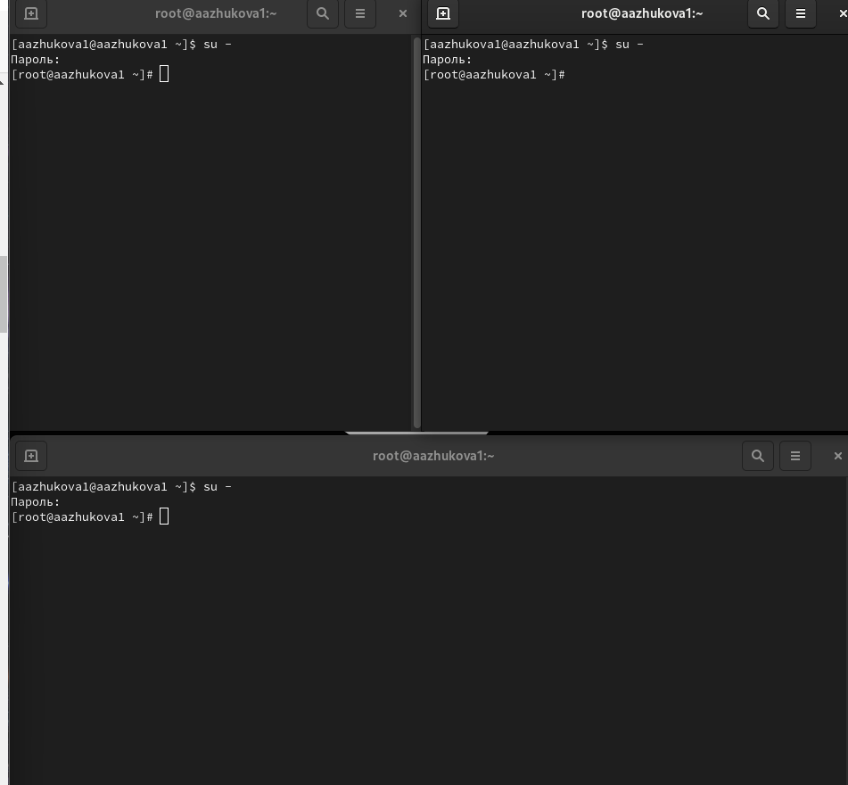{#fig:001 width=70%}

2. На второй вкладке терминала запустила мониторинг системных событий в реальном времени (рис. [-@fig:002]).

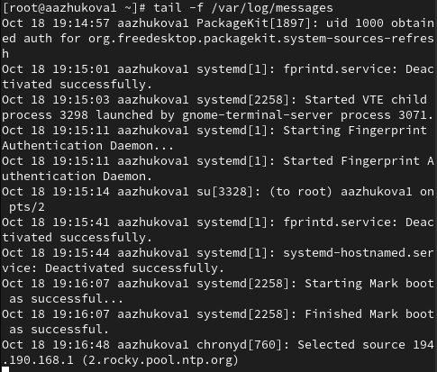{#fig:002 width=70%}

3. В третьей вкладке терминала вернулась к учётной записи своего пользователя (достаточно нажать Ctrl + d) и попыталась получить полномочия администратора, но ввела неправильный пароль. Обратила внимание, что во второй вкладке терминала с мониторингом событий или ничего не отобразится, или появится сообщение «FAILED SU (to root) username». Отображаемые на экране сообщения также фиксировались в файле /var/log/messages (рис. [-@fig:003]).

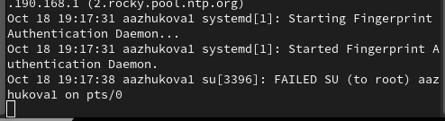{#fig:003 width=70%}

4. В третьей вкладке терминала из оболочки пользователя ввела `logger hello`. Во второй вкладке терминала с мониторингом увидела сообщение, которое также было зафиксировано в файле /var/log/messages (рис. [-@fig:004]).

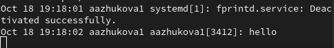{#fig:004 width=70%}

5. Во второй вкладке терминала с мониторингом остановила трассировку файла сообщений мониторинга реального времени, используя Ctrl + c. Затем запустила мониторинг сообщений безопасности (последние 20 строк соответствующего файла логов) при помощи `tail -n 20 /var/log/secure`. Увидела сообщения, которые ранее были зафиксированы во время ошибки авторизации при вводе команды su (рис. [-@fig:005]).

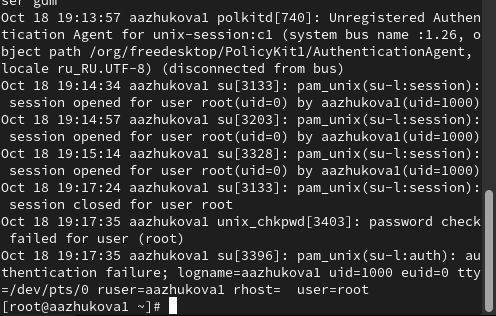{#fig:005 width=70%}

## Изменение правил rsyslog.conf

1. В первой вкладке терминала установила Apache (рис. [-@fig:011]).

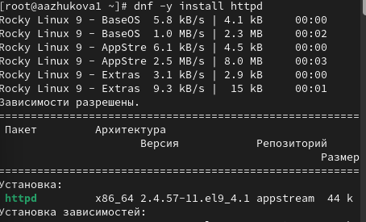{#fig:011 width=70%}

2. После окончания процесса установки запустила веб-службу (рис. [-@fig:012]).

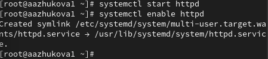{#fig:012 width=70%}

3. Во второй вкладке терминала посмотрела журнал сообщений об ошибках веб-службы. Чтобы закрыть трассировку файла журнала, использовала Ctrl + c (рис. [-@fig:013]).

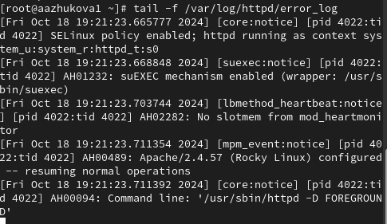{#fig:013 width=70%}

4. В третьей вкладке терминала получила полномочия администратора и в файле конфигурации /etc/httpd/conf/httpd.conf в конце добавила следующую строку: `ErrorLog syslog:local1` (рис. [-@fig:014]).

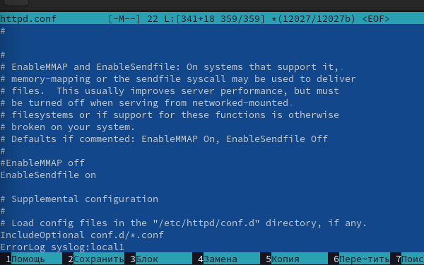{#fig:014 width=70%}

5. В каталоге /etc/rsyslog.d создала файл мониторинга событий веб-службы (рис. [-@fig:015]).

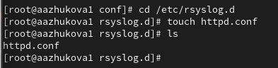{#fig:015 width=70%}

6. Открыв его на редактирование, прописала в нём `local1.* -/var/log/httpd-error.log`(рис. [-@fig:016]).

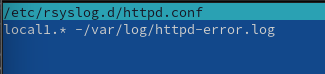{#fig:016 width=70%}

Эта строка позволила отправлять все сообщения, получаемые для объекта local1 (который теперь использовался службой httpd), в файл /var/log/httpd-error.log.

7. Перешла в первую вкладку терминала и перезагрузила конфигурацию rsyslogd и веб-службу (рис. [-@fig:017]).

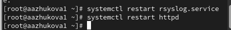{#fig:017 width=70%}

Все сообщения об ошибках веб-службы теперь были записаны в файл /var/log/httpd-error.log, что можно наблюдать или в режиме реального времени, используя команду tail с соответствующими параметрами, или непосредственно просматривая указанный файл.

8. В третьей вкладке терминала создала отдельный файл конфигурации для мониторинга отладочной информации. В этом же терминале ввела `echo "*.debug /var/log/messages-debug" > /etc/rsyslog.d/debug.conf` (рис. [-@fig:018] - [-@fig:0120]).

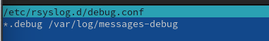{#fig:018 width=70%}

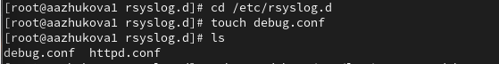{#fig:019 width=70%}

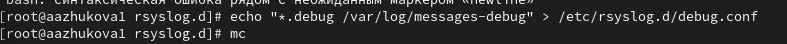{#fig:0120 width=70%}

9. В первой вкладке терминала снова перезапустила rsyslogd. Во второй вкладке терминала запустила мониторинг отладочной информации. В третьей вкладке терминала ввела: `logger -p daemon.debug "Daemon Debug Message"` (рис. [-@fig:0121]).

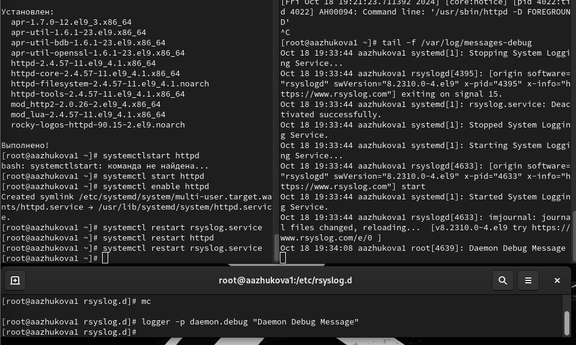{#fig:0121 width=70%}

В терминале с мониторингом посмотрела сообщение отладки. Чтобы закрыть трассировку файла журнала, использовала Ctrl + c.

## Использование journalctl

1. Во второй вкладке терминала посмотрела содержимое журнала с событиями с момента
последнего запуска системы. Для пролистывания журнала использовала или Enter (построчный просмотр), или пробел (постраничный просмотр). Для выхода из просмотра использовала q (рис. [-@fig:021]).

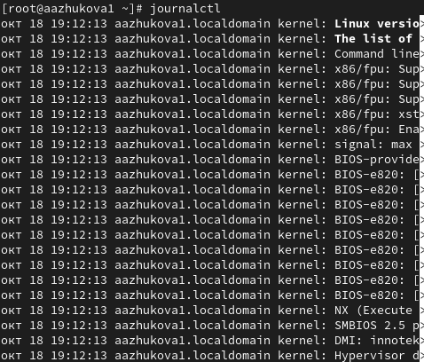{#fig:021 width=70%}

2. Просмотр содержимого журнала без использования пейджера (рис. [-@fig:022]).

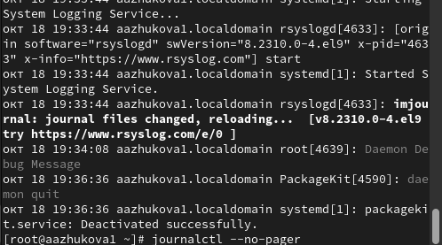{#fig:022 width=70%}

3. Режим просмотра журнала в реальном времени `journalctl -f` (рис. [-@fig:023]).

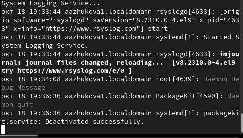{#fig:023 width=70%}

Использовала Ctrl + c для прерывания просмотра.

4. Просмотрела события для UID0 (рис. [-@fig:024]).

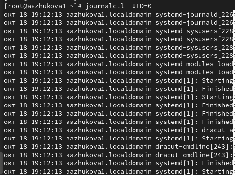{#fig:024 width=70%}

5. Для отображения последних 20 строк журнала ввела `journalctl -n 20` (рис. [-@fig:025]).

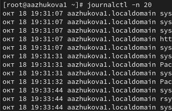{#fig:025 width=70%}

6. Для просмотра только сообщений об ошибках ввела `journalctl -p err` (рис. [-@fig:026]).

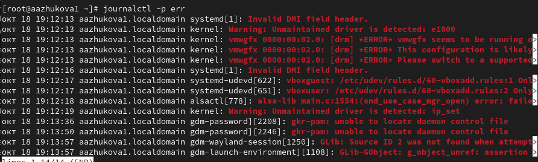{#fig:026 width=70%}

7. Для просмотра всех сообщений со вчерашнего дня ввела `journalctl --since yesterday` (рис. [-@fig:027]).

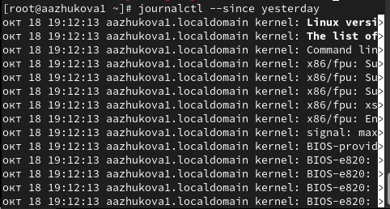{#fig:027 width=70%}

8. Для просмотра всех сообщения с ошибкой приоритета, которые были зафиксированы со вчерашнего дня, использовала `journalctl --since yesterday -p err` (рис. [-@fig:028]).

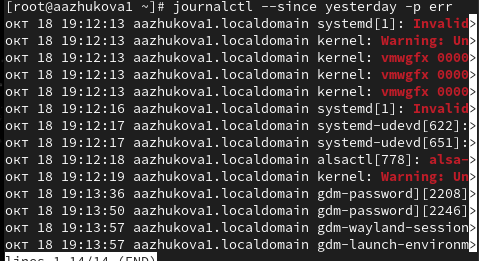{#fig:028 width=70%}

9. Если нужна детальная информация, использовала `journalctl -o verbose` (рис. [-@fig:029]).

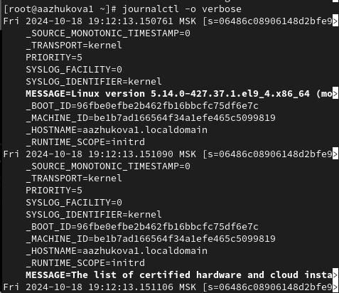{#fig:029 width=70%}

10. Для просмотра дополнительной информации о модуле sshd ввела `journalctl_SYSTEMD_UNIT=sshd.service` (рис. [-@fig:0230]).

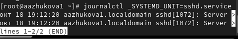{#fig:0230 width=70%}

## Постоянный журнал journald

1. Запустила терминал и получила полномочия администратора. Создала каталог для хранения записей журнала. Скорректировала права доступа для каталога /var/log/journal, чтобы journald смог записывать в него информацию. Для принятия изменений необходимо либо перезагрузить систему (перезапустить службу systemd-journald недостаточно), либо использовать команду `killall -USR1 systemd-journald` (рис. [-@fig:031]).

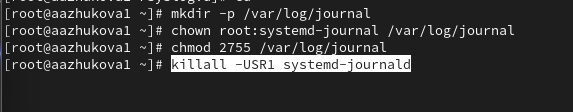{#fig:031 width=70%}

2. Журнал systemd теперь постоянный. Для вывод сообщения журнала с момента последней перезагрузки использовала `journalctl -b` (рис. [-@fig:032]).

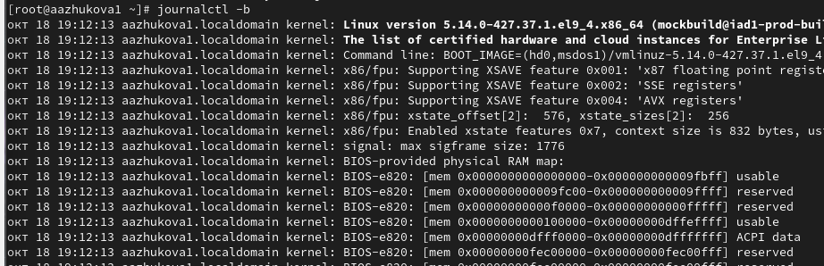{#fig:032 width=70%}

# Ответы на контрольные вопросы

1. Какой файл используется для настройки rsyslogd?
  - rsyslog.conf

2. В каком файле журнала rsyslogd содержатся сообщения, связанные с аутентификацией?
  - auth.log

3. Если вы ничего не настроите, то сколько времени потребуется для ротации файлов журналов?
  - По умолчанию файлы журналов будут ротироваться каждые неделю.

4. Какую строку следует добавить в конфигурацию для записи всех сообщений с приоритетом info в файл /var/log/messages.info?
  - *.info /var/log/messages.info

5. Какая команда позволяет вам видеть сообщения журнала в режиме реального времени?
  - journalctl -f

6. Какая команда позволяет вам видеть все сообщения журнала, которые были написаны для PID 1 между 9:00 и 15:00?
  - journalctl --since '2023-10-26 09:00:00' --until '2023-10-26 15:00:00' _PID=1 (замените дату на актуальную)

7. Какая команда позволяет вам видеть сообщения journald после последней перезагрузки системы?
  - journalctl -b

8. Какая процедура позволяет сделать журнал journald постоянным?
  - 1. Запустите терминал с правами администратора.
  - 2. Создайте каталог для хранения записей журнала: mkdir -p /var/log/journal
  - 3. Установите права доступа для каталога: chown root:systemd-journal /var/log/journal и chmod 2755 /var/log/journal
  - 4. Перезагрузите систему или используйте killall -USR1 systemd-journald.

# Выводы

Я получила навыки работы с журналами мониторинга различных событий в системе.

# Список литературы{.unnumbered}

1. Поттеринг Л. Systemd для администраторов: цикл статей. — 2010. — URL: http:
//wiki.opennet.ru/Systemd.
2. Емельянов А. Управление логгированием в systemd. — 2015. — URL: https://blog.
selectel.ru/upravlenie-loggirovaniem-v-systemd/.
3. Neil N. J. Learning CentOS: A Beginners Guide to Learning Linux. — CreateSpace Independent Publishing Platform, 2016.
4. Goyal S. K. Precise Guide to Centos 7: Beginners guide and quick reference. — Independently published, 2017.
5. Unix и Linux: руководство системного администратора / Э. Немет, Г. Снайдер, Т.
Хейн, Б. Уэйли, Д. Макни. — 5-е изд. — СПб. : ООО «Диалектика», 2020.

::: {#refs}
:::
