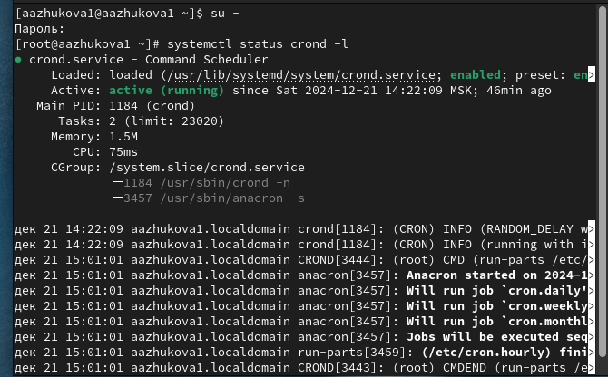
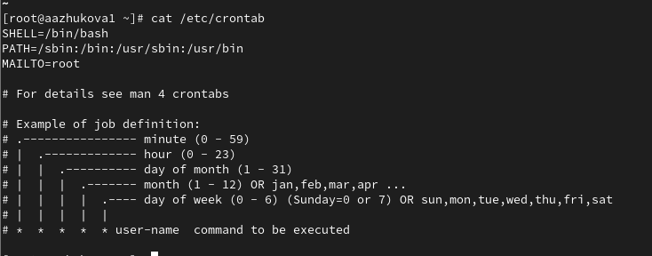
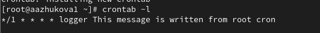
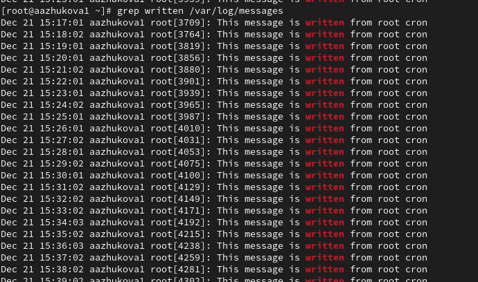
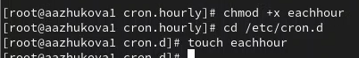
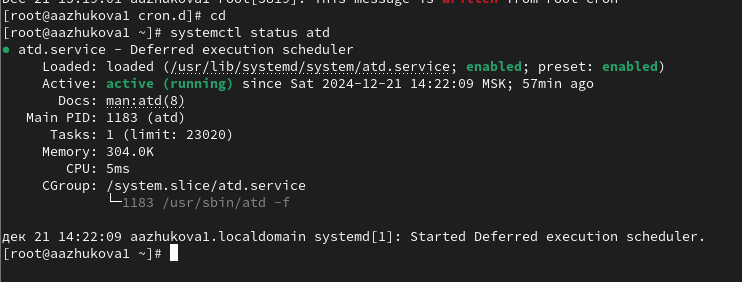
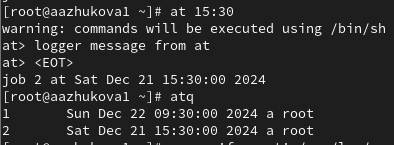

---
## Front matter
lang: ru-RU
title: Лабораторная работа №8.
subtitle: Планировщики событий
author:
  - Жукова А.А
institute:
  - Российский университет дружбы народов, Москва, Россия
date: 21 декабря 2024

## i18n babel
babel-lang: russian
babel-otherlangs: english

## Formatting pdf
toc: false
toc-title: Содержание
slide_level: 2
aspectratio: 169
section-titles: true
theme: metropolis
header-includes:
 - \metroset{progressbar=frametitle,sectionpage=progressbar,numbering=fraction}
---

# Информация

## Докладчик

:::::::::::::: {.columns align=center}
::: {.column width="70%"}

  * Жукова Арина Александровна
  * Студент бакалавриата, 2 курс
  * группа: НПИбд-03-23
  * Российский университет дружбы народов
  * [1132239120@rudn.ru](mailto:1132239120@rudn.ru)

:::
::: {.column width="30%"}

:::
::::::::::::::

# Вводная часть

## Цель работы

Лабораторная работа направлена на получение навыков работы с планировщиками событий cron и at.

## Задание

1. Выполните задания по планированию задач с помощью crond.
2. Выполните задания по планированию задач с помощью atd.

# Результаты и анализ лабораторной работы

## Планирование задач с помощью cron

1. Проверка статуса crond: Команда systemctl status crond -l показывает, активен ли демон обслуживания cron, который отвечает за выполнение заданий по расписанию.

## Планирование задач с помощью cron

2. `cat /etc/crontab`. Просмотр файла конфигурации: Файл /etc/crontab содержит глобальные задания cron и определяет, какие команды будут запускаться и с какой периодичностью.

## Планирование задач с помощью cron

3. Просмотр текущего расписания: crontab -l показывает задания, которые запланированы для текущего пользователя. 

## Планирование задач с помощью cron

4. Редактирование crontab: Команда crontab -e открывает редактор для редактирования пользовательского расписания задач. Введение строки */1 * * * * logger This message is written from root cron задаёт выполнение команды logger каждую минуту.
Пояснение синтаксиса записи в crontab:

*/1 каждая 1 минута,

`*` любой час,

`*` любой день месяца,

`*` любой месяц,

`*` любой день недели.

## Планирование задач с помощью cron

Просмотр журнала: Команда grep written /var/log/messages позволит увидеть записи, созданные командой logger, что подтверждает выполнение задания cron.

## Планирование задач с помощью cron

Изменение записи: Обновленная команда 0 */1 * * 1-5 logger This message is written from root cron теперь будет выполняться каждый час, начиная с нуля, только с понедельника по пятницу.
Пояснение синтаксиса записи:

0 в начале часа,

*/1 любой час,

`*` любой день месяца,

`*` любой месяц,

1-5 с понедельника по пятницу.

## Планирование задач с помощью cron

Установка прав на исполнение: Команда chmod +x eachhour позволяет скрипту быть выполненным.

## Планирование задач с помощью cron

Создание файла в /etc/cron.d: Файл с записью 11 * * * * root logger This message is written from /etc/cron.d будет выполнять команду каждый день в 11 минут после часа, если cron будет работать под правами root.
Пояснение синтаксиса:

11 выполняется на 11-й минуте,

`*` любой час,

`*` любой день месяца,

`*` любой месяц,

`*` любой день недели.

## Планирование заданий с помощью at

Проверка статуса atd: Команда systemctl status atd показывает состояние демона, который обрабатывает задания, заданные с помощью at.

## Планирование заданий с помощью at

Запланировать выполнение задания: Используйте команду at 9:30, чтобы задать команду logger message from at для запуска в указанное время. Закрытие оболочки с помощью Ctrl + d завершает процесс записи задания.

## Планирование заданий с помощью at

Проверка запланированных заданий: atq позволяет увидеть список ожидающих заданий.

# Выводы

Являясь инструментами для управления задачами, cron и at имеют свои области применения. cron идеален для регулярных повторяющихся задач, тогда как at используется для одноразовых задач. Оба инструмента важны для обеспечения автоматизации процессов на сервере и их правильное использование повышает эффективность администрирования систем.

