---
## Front matter
title: "Лабораторная работа № 8"
subtitle: "Планировщики событий"
author: "Жукова Арина Александровна"

## Generic otions
lang: ru-RU
toc-title: "Содержание"

## Bibliography
bibliography: bib/cite.bib
csl: pandoc/csl/gost-r-7-0-5-2008-numeric.csl

## Pdf output format
toc: true # Table of contents
toc-depth: 2
lof: true # List of figures
lot: true # List of tables
fontsize: 12pt
linestretch: 1.5
papersize: a4
documentclass: scrreprt
## I18n polyglossia
polyglossia-lang:
  name: russian
  options:
	- spelling=modern
	- babelshorthands=true
polyglossia-otherlangs:
  name: english
## I18n babel
babel-lang: russian
babel-otherlangs: english
## Fonts
mainfont: IBM Plex Serif
romanfont: IBM Plex Serif
sansfont: IBM Plex Sans
monofont: IBM Plex Mono
mathfont: STIX Two Math
mainfontoptions: Ligatures=Common,Ligatures=TeX,Scale=0.94
romanfontoptions: Ligatures=Common,Ligatures=TeX,Scale=0.94
sansfontoptions: Ligatures=Common,Ligatures=TeX,Scale=MatchLowercase,Scale=0.94
monofontoptions: Scale=MatchLowercase,Scale=0.94,FakeStretch=0.9
mathfontoptions:
## Biblatex
biblatex: true
biblio-style: "gost-numeric"
biblatexoptions:
  - parentracker=true
  - backend=biber
  - hyperref=auto
  - language=auto
  - autolang=other*
  - citestyle=gost-numeric
## Pandoc-crossref LaTeX customization
figureTitle: "Рис."
tableTitle: "Таблица"
listingTitle: "Листинг"
lofTitle: "Список иллюстраций"
lotTitle: "Список таблиц"
lolTitle: "Листинги"
## Misc options
indent: true
header-includes:
  - \usepackage{indentfirst}
  - \usepackage{float} # keep figures where there are in the text
  - \floatplacement{figure}{H} # keep figures where there are in the text
---

# Цель работы

Получение навыков работы с планировщиками событий cron и at.

# Задание

1. Выполните задания по планированию задач с помощью crond (см. раздел 8.4.1).
2. Выполните задания по планированию задач с помощью atd (см. раздел 8.4.2).

# Выполнение лабораторной работы

Описываются проведённые действия, в качестве иллюстрации даётся ссылка на иллюстрацию 

## Планирование задач с помощью cron

1. Я запускаю терминал и получаю полномочия администратора, проверяю статус демона crond, выполнив команду:
`systemctl status crond -l` (рис. [-@fig:001]).

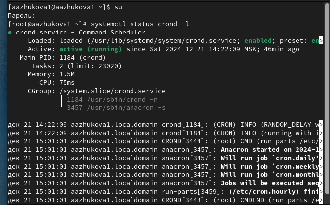{#fig:001 width=70%}

2. Просматриваю содержимое файла конфигурации /etc/crontab, выполнив команду: `cat /etc/crontab` (рис. [-@fig:002]).

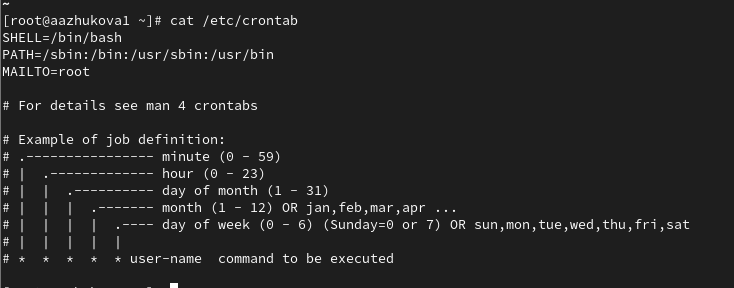{#fig:002 width=70%}

3. Просматриваю список заданий в расписании, выполнив команду: `crontab -l`. На этом этапе ничего не отобразится, так как расписание ещё не задано (рис. [-@fig:003]).

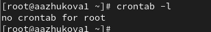{#fig:003 width=70%}

4. Открываю файл расписания на редактирование, выполнив команду: `crontab -e`. Добавляю следующую строку в файл расписания (запись сообщения в системный журнал): `*/1 * * * * logger This message is written from root cron`. Снова смотрю список заданий в расписании, выполнив команду: `crontab -l` (рис. [-@fig:004]).

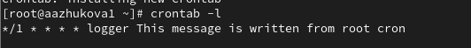{#fig:004 width=70%}

Запись */1 * * * * logger This message is written from root cron разбивается на пять полей, которые определяют расписание выполнения задачи:

*/1 — каждую минуту (знак * означает "любой значение", а */1 используется для указания интервала выполнения).
* — каждый час.
* — каждый день месяца.
* — каждый месяц.
* — каждый день недели.

5. Не выключая систему, через некоторое время (2–3 минуты) я просматриваю журнал системных событий, выполнив команду: grep written /var/log/messages (рис. [-@fig:005]).

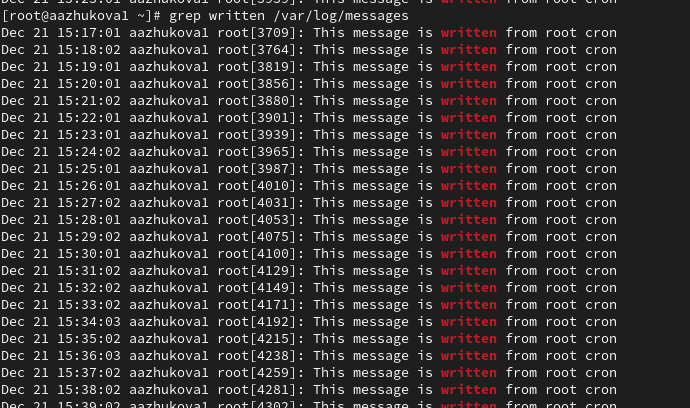{#fig:005 width=70%}

6. Я перехожу в каталог /etc/cron.hourly и создаю в нём файл сценария с именем eachhour (рис. [-@fig:006]).

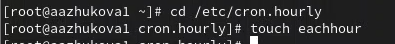{#fig:006 width=70%}

7. Я открываю файл eachhour для редактирования и прописываю в нём следующий скрипт (запись сообщения в системный журнал):
```
#!/bin/sh
logger This message is written at $(date)
```
(рис. [-@fig:007]).

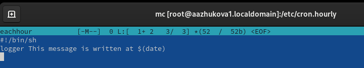{#fig:007 width=70%}

8. Я делаю файл сценария eachhour исполняемым, выполнив команду: `chmod +x eachhour`. Теперь я перехожу в каталог /etc/crond.d и создаю в нём файл с расписанием eachhour (рис. [-@fig:008]).

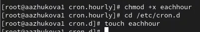{#fig:008 width=70%}

9. Я открываю этот файл для редактирования и помещаю в него следующее содержимое: `11 * * * * root logger This message is written from /etc/cron.d` (рис. [-@fig:009]).

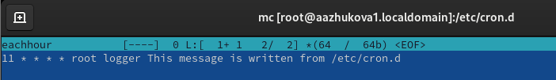{#fig:009 width=70%}

Запись 11 * * * * root logger This message is written from /etc/cron.d тоже разбивается на пять полей, после которых следует имя пользователя, от имени которого будет выполняться задача:

11 — в 11 минут.
* — каждый час.
* — каждый день месяца.
* — каждый месяц.
* — каждый день недели.
root — выполнение от имени пользователя root.

10. Не выключая систему, через некоторое время (2–3 часа) я просматриваю журнал системных событий, выполнив команду: `grep written /var/log/messages` (рис. [-@fig:010]).

{#fig:010 width=70%}

## Планирование заданий с помощью at

1. Я проверяю, что служба atd загружена и включена, выполнив команду: `systemctl status atd` (рис. [-@fig:011]).

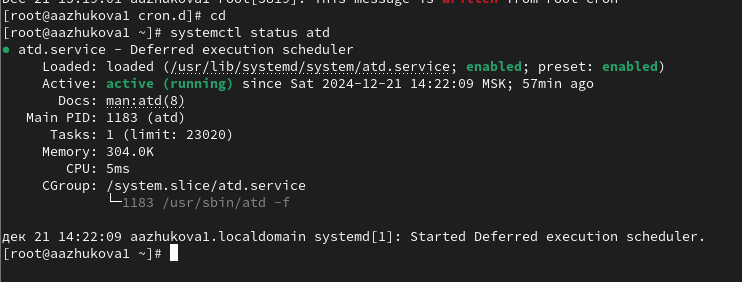{#fig:011 width=70%}

2. Я задаю выполнение команды logger message from at в 9:30 (или заменяю на любое другое время, когда работаю над этим упражнением) (рис. [-@fig:012]).

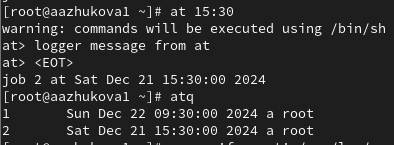{#fig:012 width=70%}

3. Я убеждаюсь, что задание действительно запланировано, выполнив команду: `atq` (рис. [-@fig:013]).

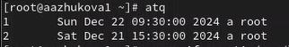{#fig:013 width=70%}

4. Проверяю, появилось ли соответствующее сообщение в лог-файле в указанное мной время (рис. [-@fig:014]).

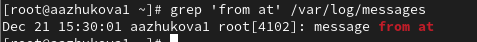{#fig:014 width=70%}


# Выводы

В ходе выполнения лабораторной работы мною были получены навыки работы с планировщиками событий cron и at.

# Список литературы{.unnumbered}

1. UNIX Power Tools / M. Loukides, T. O’Reilly, J. Peek, S. Powers. — O’Reilly Media, 2009.
2. Робачевский А., Немнюгин С., Стесик О. Операционная система UNIX. — 2-е изд. —
БХВ-Петербург, 2010.
3. Колисниченко Д. Н. Самоучитель системного администратора Linux. — СПб. : БХВПетербург, 2011. — (Системный администратор).
4. Таненбаум Э., Бос Х. Современные операционные системы. — 4-е изд. — СПб. : Питер,
2015. — (Классика Computer Science).
5. Neil N. J. Learning CentOS: A Beginners Guide to Learning Linux. — CreateSpace Independent Publishing Platform, 2016.
6. Goyal S. K. Precise Guide to Centos 7: Beginners guide and quick reference. — Independently published, 2017.
7. Unix и Linux: руководство системного администратора / Э. Немет, Г. Снайдер, Т.
Хейн, Б. Уэйли, Д. Макни. — 5-е изд. — СПб. : ООО «Диалектика», 2020

::: {#refs}
:::
