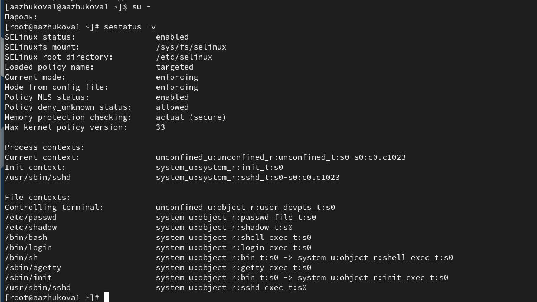
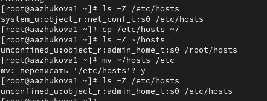
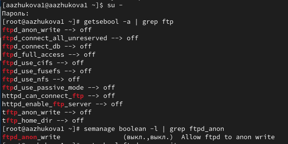

---
## Front matter
lang: ru-RU
title: Лабораторная работа №9.
subtitle: Управление SELinux
author:
  - Жукова А.А
institute:
  - Российский университет дружбы народов, Москва, Россия
date: 31 октября 2024

## i18n babel
babel-lang: russian
babel-otherlangs: english

## Formatting pdf
toc: false
toc-title: Содержание
slide_level: 2
aspectratio: 169
section-titles: true
theme: metropolis
header-includes:
 - \metroset{progressbar=frametitle,sectionpage=progressbar,numbering=fraction}
---

# Информация

## Докладчик

:::::::::::::: {.columns align=center}
::: {.column width="70%"}

  * Жукова Арина Александровна
  * Студент бакалавриата, 2 курс
  * группа: НПИбд-03-23
  * Российский университет дружбы народов
  * [1132239120@rudn.ru](mailto:1132239120@rudn.ru)

:::
::: {.column width="30%"}

:::
::::::::::::::

# Вводная часть

## Цель работы

Лабораторная работа направлена на получение навыков работы с контекстом безопасности и политиками SELinux.

## Задание

1. Продемонстрируйте навыки по управлению режимами SELinux.
2. Продемонстрируйте навыки по восстановлению контекста безопасности SELinux.
3. Настройте контекст безопасности для нестандартного расположения файлов вебслужбы.
4. Продемонстрируйте навыки работы с переключателями SELinux.

# Результаты и анализ лабораторной работы

## Управление режимами SELinux 

1. Для просмотра текущей информации о состоянии SELinux используем `sestatus -v`
   

## Управление режимами SELinux 

2. Изменение режима работы SELinux на разрешающий (Permissive)

## Управление режимами SELinux 

3. Попробовали переключить режим работы SELinux: `setenforce 1`. Не могла переключаться между отключённым и принудительным режимом без перезагрузки системы.

## Использование restorecon для восстановления контекста безопасности 

1. Просмотр контекста безопасности файла /etc/hosts: `ls -Z /etc/hosts`. 

## Использование restorecon для восстановления контекста безопасности 

2. Исправление контекста безопасности `restorecon -v /etc/hosts`. Опция -v показала процесс изменения. Убедилась, что тип контекста изменился. Для массового исправления контекста безопасности на файловой системе используем `touch /.autorelabel`.

## Настройка контекста безопасности для нестандартного расположения файлов веб-сервера 

1. Запуск веб-сервера и службы httpd.

## Настройка контекста безопасности для нестандартного расположения файлов веб-сервера 

2. В терминале под учётной записью своего пользователя обращаемся к веб-серверу в текстовом браузере lynx: `lynx http://localhost`.

## Настройка контекста безопасности для нестандартного расположения файлов веб-сервера 

3. В терминале с полномочиями администратора применяем новую метку контекста к /web: `semanage fcontext -a -t httpd_sys_content_t "/web(/.*)?"`. Восстановливаем контекст безопасности.

## Работа с переключателями SELinux 

1. Вывод списка переключателей SELinux для службы ftp: `getsebool -a | grep ftp`. 

## Работа с переключателями SELinux 

2. Изменение текущего значения переключателя для службы ftpd_anon_write с off на on.

## Работа с переключателями SELinux 

3. Изменение постоянного значение переключателя для службы ftpd_anon_write с off на on: `setsebool -P ftpd_anon_write on`.

# Выводы

В ходе выполнения лабораторной работы были получены навыки работы с контекстом безопасности и политиками SELinux.

