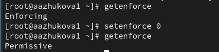

---
## Front matter
title: "Отчёт по лабораторной работе №9. Управление SELinux"
subtitle: "Дисциплина: Основы администрирование операционных систем"
author: "Жукова Арина Александровна"

## Generic otions
lang: ru-RU
toc-title: "Содержание"

## Bibliography
bibliography: bib/cite.bib
csl: pandoc/csl/gost-r-7-0-5-2008-numeric.csl

## Pdf output format
toc: true # Table of contents
toc-depth: 2
lof: true # List of figures
lot: true # List of tables
fontsize: 12pt
linestretch: 1.5
papersize: a4
documentclass: scrreprt
## I18n polyglossia
polyglossia-lang:
  name: russian
  options:
	- spelling=modern
	- babelshorthands=true
polyglossia-otherlangs:
  name: english
## I18n babel
babel-lang: russian
babel-otherlangs: english
## Fonts
mainfont: IBM Plex Serif
romanfont: IBM Plex Serif
sansfont: IBM Plex Sans
monofont: IBM Plex Mono
mathfont: STIX Two Math
mainfontoptions: Ligatures=Common,Ligatures=TeX,Scale=0.94
romanfontoptions: Ligatures=Common,Ligatures=TeX,Scale=0.94
sansfontoptions: Ligatures=Common,Ligatures=TeX,Scale=MatchLowercase,Scale=0.94
monofontoptions: Scale=MatchLowercase,Scale=0.94,FakeStretch=0.9
mathfontoptions:
## Biblatex
biblatex: true
biblio-style: "gost-numeric"
biblatexoptions:
  - parentracker=true
  - backend=biber
  - hyperref=auto
  - language=auto
  - autolang=other*
  - citestyle=gost-numeric
## Pandoc-crossref LaTeX customization
figureTitle: "Рис."
tableTitle: "Таблица"
listingTitle: "Листинг"
lofTitle: "Список иллюстраций"
lotTitle: "Список таблиц"
lolTitle: "Листинги"
## Misc options
indent: true
header-includes:
  - \usepackage{indentfirst}
  - \usepackage{float} # keep figures where there are in the text
  - \floatplacement{figure}{H} # keep figures where there are in the text
---

# Цель работы

Получить навыки работы с контекстом безопасности и политиками SELinux.
# Задание

1. Продемонстрируйте навыки по управлению режимами SELinux (см. раздел 9.4.1).
2. Продемонстрируйте навыки по восстановлению контекста безопасности SELinux (см. раздел 9.4.2).
3. Настройте контекст безопасности для нестандартного расположения файлов вебслужбы (см. раздел 9.4.3).
4. Продемонстрируйте навыки работы с переключателями SELinux (см. раздел 9.4.4).

# Выполнение лабораторной работы

## Управление режимами SELinux 

1. Запустила терминал и получила полномочия администратора. Просмотрела текущую информацию о состоянии SELinux: `sestatus -v` (рис.[-@fig:002]).

{#fig:002 width=70%}

2. Посмотрела, в каком режиме работает SELinux: `getenforce`. По умолчанию SELinux находился в режиме принудительного исполнения (Enforcing). Изменила режим работы SELinux на разрешающий (Permissive) (рис. [-@fig:005]).

{#fig:005 width=70%}

3. В файле /etc/sysconfig/selinux с помощью редактора установила: `SELINUX=disabled`. Перезагрузила систему. После перезагрузки запустила терминал и получила полномочия администратора. Посмотрела статус SELinux. Попробовала переключить режим работы SELinux: `setenforce 1` (рис. [-@fig:009]).

{#fig:009 width=70%}

Не могла переключаться между отключённым и принудительным режимом без перезагрузки системы.

4. Открыла файл /etc/sysconfig/selinux с помощью редактора и установила: `SELINUX=enforcing`. Перезагрузила систему. После перезагрузки в терминале с полномочиями администратора просмотрела текущую информацию о состоянии SELinux:  `sestatus -v`. Убедилась, что система работает в принудительном режиме (enforcing) использования SELinux (рис. [-@fig:011]).

{#fig:011 width=70%}

## Использование restorecon для восстановления контекста безопасности 

1. Запустила терминал и получила полномочия администратора. Посмотрела контекст безопасности файла /etc/hosts: `ls -Z /etc/hosts`. Увидела, что у файла есть метка контекста net_conf_t. Скопировала файл /etc/hosts в домашний каталог Проверила контекст файла ~/hosts. Поскольку копирование считается созданием нового файла, то параметр контекста в файле ~/hosts, расположенном в домашнем каталоге, стал admin_home_t. Попыталась перезаписать существующий файл hosts из домашнего каталога в каталог /etc. Убедилась, что тип контекста по-прежнему установлен на admin_home_t (рис. [-@fig:014]).

{#fig:014 width=70%}

2. Исправила контекст безопасности `restorecon -v /etc/hosts`. Опция -v показала процесс изменения. Убедилась, что тип контекста изменился. Для массового исправления контекста безопасности на файловой системе ввела:  `touch /.autorelabel` (рис. [-@fig:019]).

{#fig:019 width=70%}

и перезагрузила систему. Во время перезапуска не забыла нажать клавишу Esc на клавиатуре, чтобы видела загрузочные сообщения. Увидела, что файловая система автоматически перемаркирована.

## Настройка контекста безопасности для нестандартного расположения файлов веб-сервера 

1. Запустила терминал и получила полномочия администратора. Установила необходимое программное обеспечение: `httpd` и `lynx` (рис. [-@fig:024]).

{#fig:024 width=70%}

2. Создала новое хранилище для файлов веб-сервера. Создала файл index.html в каталоге с контентом веб-сервера (рис. [-@fig:027]).

{#fig:027 width=70%}

3. Поместила в файл следующий текст `Welcome to my web-server` (рис. [-@fig:028]).

{#fig:028 width=70%}

4. Внесла изменеия в файле /etc/httpd/conf/httpd.conf (рис. [-@fig:029]).

{#fig:029 width=70%}

5. Запустила веб-сервер и службу httpd (рис. [-@fig:032]).

{#fig:032 width=70%}

6. В терминале под учётной записью своего пользователя при обращении к веб-серверу в текстовом браузере lynx: `lynx http://localhost` увидела веб-страницу Red Hat по умолчанию, а не содержимое только что созданного файла index.html (рис. [-@fig:033]).

{#fig:033 width=70%}

7. В терминале с полномочиями администратора применила новую метку контекста к /web: `semanage fcontext -a -t httpd_sys_content_t "/web(/.*)?"`. Восстановила контекст безопасности (рис. [-@fig:034]).

{#fig:034 width=70%}

8. В терминале под учётной записью своего пользователя снова обратилась к веб-серверу (рис. [-@fig:036]).

{#fig:036 width=70%}

## Работа с переключателями SELinux 

1. Запустила терминал и получила полномочия администратора. Посмотрела список переключателей SELinux для службы ftp: `getsebool -a | grep ftp`. Для службы ftpd_anon посмотрела список переключателей с пояснением, за что отвечает каждый переключатель, включён он или выключен (рис. [-@fig:038]).

{#fig:038 width=70%}

2. Изменила текущее значение переключателя для службы ftpd_anon_write с off на on. Повторно посмотрела список переключателей SELinux для службы ftpd_anon_write. Посмотрела список переключателей с пояснением (рис. [-@fig:042]).

{#fig:042 width=70%}

Обратила внимание, что настройка времени выполнения включена, но постоянная настройка по-прежнему отключена.

3. Изменила постоянное значение переключателя для службы ftpd_anon_write с off на on: `setsebool -P ftpd_anon_write on`. Посмотрела список переключателей (рис. [-@fig:043]).

{#fig:043 width=70%}

# Ответы на контрольные вопросы

1. setenforce 0
2. getenforce 
3. audit-libs-devel
4. chcon -t httpd_sys_content_t /web
5. /etc/selinux/config 
6. /var/log/audit/audit.log 
7. semanage fcontext -l | grep ftp
8. Проверить журнал аудита SELinux: ausearch -m avc

# Выводы

Во время выполнения лабораторной работы я получила навыки работы с контекстом безопасности и политиками SELinux.

# Список литературы{.unnumbered}

1. Mayer F., MacMillan K., Caplan D. SELinux by example: using Security Enhanced Linux. —
Prentice Hall, 2006.
2. Vermeulen S. SELinux Cookbook. — Packt Publishing Ltd, 2014.
3. Vermeulen S. SELinux System Administration. — 2nd Edition. — Packt Publishing Ltd,
2016.
4. Vugt S. van. Red Hat RHCSA/RHCE 7 cert guide : Red Hat Enterprise Linux 7 (EX200 and
EX300). — Pearson IT Certification, 2016. — (Certification Guide).
5. Security-Enhanced Linux. Linux с улучшенной безопасностью: руководство пользователя / M. McAllister, S. Radvan, D. Walsh, D. Grift, E. Paris, J. Morris. — URL: https:
/ / docs - old . fedoraproject . org / ru - RU / Fedora / 13 / html / Security -
Enhanced_Linux/index.html.

::: {#refs}
:::
