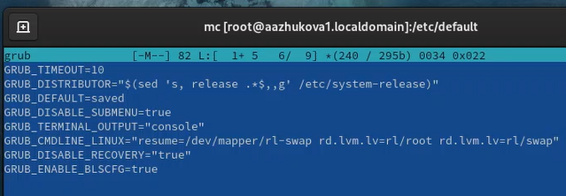
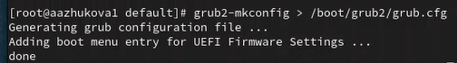
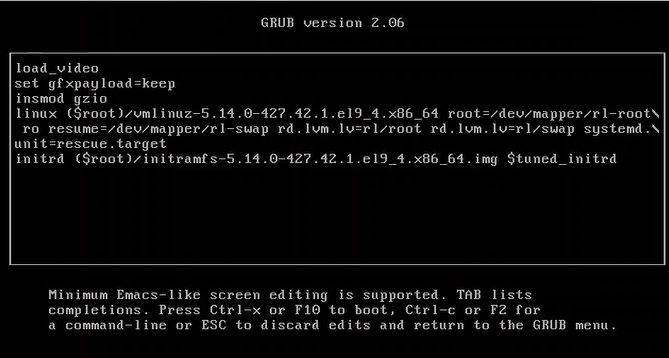
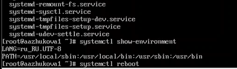
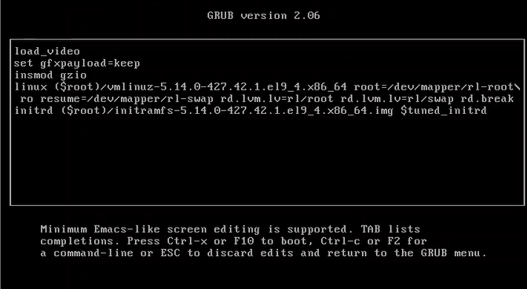
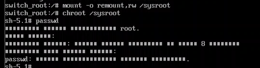
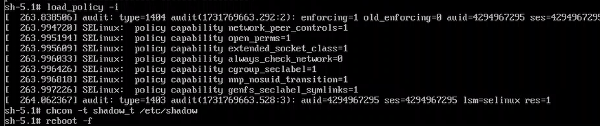

---
## Front matter
lang: ru-RU
title: Лабораторная работа №11.
subtitle: Управление загрузкой системы
author:
  - Жукова А.А
institute:
  - Российский университет дружбы народов, Москва, Россия
date: 16 ноября 2024

## i18n babel
babel-lang: russian
babel-otherlangs: english

## Formatting pdf
toc: false
toc-title: Содержание
slide_level: 2
aspectratio: 169
section-titles: true
theme: metropolis
header-includes:
 - \metroset{progressbar=frametitle,sectionpage=progressbar,numbering=fraction}
---

# Информация

## Докладчик

:::::::::::::: {.columns align=center}
::: {.column width="70%"}

  * Жукова Арина Александровна
  * Студент бакалавриата, 2 курс
  * группа: НПИбд-03-23
  * Российский университет дружбы народов
  * [1132239120@rudn.ru](mailto:1132239120@rudn.ru)

:::
::: {.column width="30%"}

:::
::::::::::::::

# Вводная часть

## Цель работы

Лабораторная работа направлена на получение навыков работы с загрузчиком системы GRUB2.

## Задание

1. Продемонстрируйте навыки по изменению параметров GRUB и записи изменений в файл конфигурации.
2. Продемонстрируйте навыки устранения неполадок при работе с GRUB.
3. Продемонстрируйте навыки работы с GRUB без использования root.

# Результаты и анализ лабораторной работы

## Модификация параметров GRUB2

1. Установка параметра отображения меню загрузки в течение 10 секунд: GRUB_TIMEOUT=10. Удаление из строки указания параметров запуска ядра системы GRUB_CMDLINE_LINUX параметры rhgb и quiet, которые отвечают за показ графической заставки при запуске системы.

## Модификация параметров GRUB2

2. Запись изменения в GRUB2.

## Устранения неполадок

1. В конце строки загружающей ядро добавляем systemd.unit=rescue.target для запуска режима восстановления.

## Устранения неполадок

2. Просмотр списка всех файлов модулей, которые загружены в настоящее время: systemctl list-units. Просмотр задействованных переменных среды оболочки: systemctl show-environment.

## Сброс пароля root

1. rd.break - в конце строки загружающей ядро, останавливает процедуру загрузки на этапе initramfs (этот параметр полезен, если у вас нет пароля root)

## Сброс пароля root

2. mount -o remount,rw /sysroot - получение доступа к системному образу для чтения и записи. chroot /sysroot - установка нового корневого каталога. passwd - команда задания пароля.

## Сброс пароля root

3. load_policy -i - загрузка политики SELinux. chcon -t shadow_t /etc/shadow - ручная установка правильного типа контекста для /etc/shadow.

# Выводы

Во время выполнения лабораторной работы я получила навыки работы с загрузчиком системы GRUB2.

