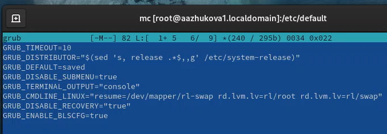
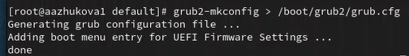
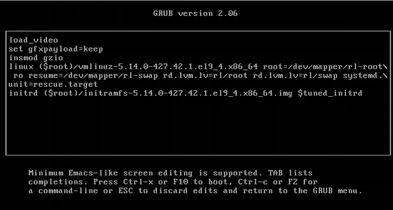
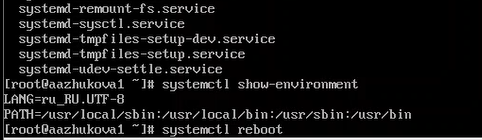
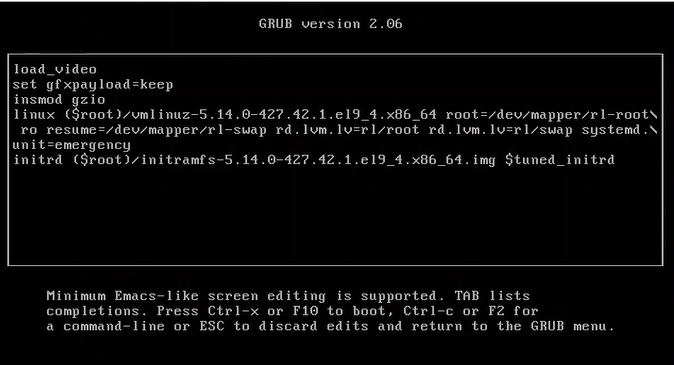
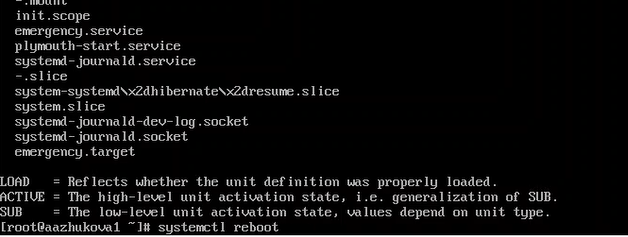
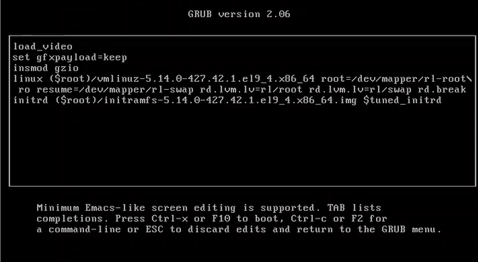
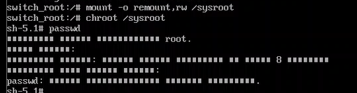
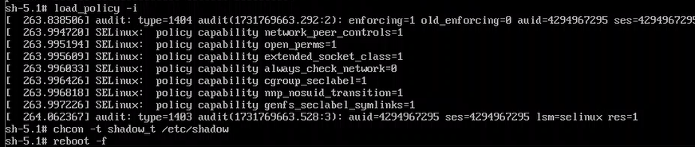

---
## Front matter
title: "Отчёт по лабораторной работе №11. Управление загрузкой системы"
subtitle: "Дисциплина: Основы администрирование операционных систем"
author: "Жукова Арина Александровна"

## Generic otions
lang: ru-RU
toc-title: "Содержание"

## Bibliography
bibliography: bib/cite.bib
csl: pandoc/csl/gost-r-7-0-5-2008-numeric.csl

## Pdf output format
toc: true # Table of contents
toc-depth: 2
lof: true # List of figures
lot: true # List of tables
fontsize: 12pt
linestretch: 1.5
papersize: a4
documentclass: scrreprt
## I18n polyglossia
polyglossia-lang:
  name: russian
  options:
	- spelling=modern
	- babelshorthands=true
polyglossia-otherlangs:
  name: english
## I18n babel
babel-lang: russian
babel-otherlangs: english
## Fonts
mainfont: IBM Plex Serif
romanfont: IBM Plex Serif
sansfont: IBM Plex Sans
monofont: IBM Plex Mono
mathfont: STIX Two Math
mainfontoptions: Ligatures=Common,Ligatures=TeX,Scale=0.94
romanfontoptions: Ligatures=Common,Ligatures=TeX,Scale=0.94
sansfontoptions: Ligatures=Common,Ligatures=TeX,Scale=MatchLowercase,Scale=0.94
monofontoptions: Scale=MatchLowercase,Scale=0.94,FakeStretch=0.9
mathfontoptions:
## Biblatex
biblatex: true
biblio-style: "gost-numeric"
biblatexoptions:
  - parentracker=true
  - backend=biber
  - hyperref=auto
  - language=auto
  - autolang=other*
  - citestyle=gost-numeric
## Pandoc-crossref LaTeX customization
figureTitle: "Рис."
tableTitle: "Таблица"
listingTitle: "Листинг"
lofTitle: "Список иллюстраций"
lotTitle: "Список таблиц"
lolTitle: "Листинги"
## Misc options
indent: true
header-includes:
  - \usepackage{indentfirst}
  - \usepackage{float} # keep figures where there are in the text
  - \floatplacement{figure}{H} # keep figures where there are in the text
---

# Цель работы

Получить навыки работы с загрузчиком системы GRUB2.

# Задание

1. Продемонстрируйте навыки по изменению параметров GRUB и записи изменений в файл конфигурации (см. раздел 11.4.1).
2. Продемонстрируйте навыки устранения неполадок при работе с GRUB (см. раздел 11.4.2).
3. Продемонстрируйте навыки работы с GRUB без использования root (см. раздел 11.4.3).

# Выполнение лабораторной работы

## Модификация параметров GRUB2

1. Запустила терминал и получила полномочия администратора. В файле /etc/default/grub установила параметр отображения меню загрузки в течение 10 секунд: GRUB_TIMEOUT=10. После перезагрузки системы при загрузке не было прокрутки загрузочных сообщений. В файле /etc/default/grub удалила из строки указания параметров запуска ядра системы GRUB_CMDLINE_LINUX параметры rhgb и quiet, которые отвечают за показ графической заставки при запуске системы (для дистрибутивов, основанных на Red Hat), скрывая процесс загрузки от пользователя. Сохранила изменения в файле и закрыла редактор (рис. [-@fig:011]).

{#fig:011 width=70%}

2. Записала изменения в GRUB2, введя в командной строке: grub2-mkconfig > /boot/grub2/grub.cfg (рис. [-@fig:012]).

{#fig:012 width=70%}

## Устранения неполадок

1. Перезагрузила систему. Как только появилось меню GRUB, выбрала строку с текущей версией ядра в меню и нажала e для редактирования. Прокрутила вниз до строки, начинающейся с linux ($root)/vmlinuz-. В конце этой строки ввела systemd.unit=rescue.target и удалила опции rhgb и quit из этой строки, если они там есть (рис. [-@fig:021]).

{#fig:021 width=70%}

2. Нажала Ctrl + x для продолжения процесса загрузки. Ввела пароль пользователя root при появлении запроса. Посмотрела список всех файлов модулей, которые загружены в настоящее время: systemctl list-units. Посмотрела задействованные переменные среды оболочки: systemctl show-environment. Перезагрузила систему, используя команду systemctl reboot (рис. [-@fig:022]).

{#fig:022 width=70%}

3. Как только отобразится меню GRUB, ещё раз нажала e на строке с текущей версией ядра, чтобы войти в режим редактора. В конце строки, загружающей ядро, ввела systemd.unit=emergency.target и удалила опции rhgb и quit из этой строки (рис. [-@fig:023]).

{#fig:023 width=70%}

4. После успешного входа в систему посмотрела список всех загруженных файлов модулей: systemctl list-units. Перезагрузила систему, используя команду (рис. [-@fig:024]).

{#fig:024 width=70%}

## Сброс пароля root

1. Перезагрузила компьютер. В конце строки, загружающей ядро, ввела rd.break и удалила опции rhgb и quit из этой строки (рис. [-@fig:031]).

{#fig:031 width=70%}

2. Этап загрузки системы остановится в момент загрузки initramfs, непосредственно перед монтированием корневой файловой системы в каталоге /. Чтобы получить доступ к системному образу для чтения и записи, набрала mount -o remount,rw /sysroot. Сделала содержимое каталога /sysimage новым корневым каталогом, набрав chroot /sysroot. Теперь я могу ввести команду задания пароля:  passwd и установила новый пароль для пользователя root (рис. [-@fig:032]).

{#fig:032 width=70%}

3. Загружаем политику SELinux с помощью команды load_policy -i. Теперь я могу вручную установить правильный тип контекста для /etc/shadow. Для этого ввела chcon -t shadow_t /etc/shadow. Перезагрузила систему с помощью команды reboot -f (рис. [-@fig:033]).

{#fig:033 width=70%}

# Ответы на контрольные вопросы

1. Для применения общих изменений в GRUB2 следует изменить файл конфигурации /etc/default/grub. Этот файл содержит глобальные параметры для GRUB2, которые применяются ко всем ядрам и системам, указанным в меню загрузки.

2. Конфигурационный файл GRUB2, в котором непосредственно определяются пункты меню загрузки и их параметры, называется /boot/grub2/grub.cfg. Однако, не рекомендуется напрямую редактировать этот файл. Он генерируется автоматически на основе /etc/default/grub и других конфигурационных файлов. Изменения в /etc/default/grub приведут к обновлению /boot/grub2/grub.cfg после выполнения команды обновления GRUB.

3. После внесения изменений в /etc/default/grub, для сохранения изменений и их применения при загрузке системы, необходимо выполнить команду sudo update-grub (или sudo update-grub2 на некоторых системах). Эта команда перегенерирует /boot/grub2/grub.cfg с учетом новых настроек.

# Выводы

Во время выполнения лабораторной работы я получила навыки работы с загрузчиком системы GRUB2.

# Список литературы{.unnumbered}

1. Колисниченко Д. Н. Самоучитель системного администратора Linux. — СПб. : БХВПетербург, 2011. — (Системный администратор).
2. Neil N. J. Learning CentOS: A Beginners Guide to Learning Linux. — CreateSpace Independent Publishing Platform, 2016.
3. Unix и Linux: руководство системного администратора / Э. Немет, Г. Снайдер, Т.
Хейн, Б. Уэйли, Д. Макни. — 5-е изд. — СПб. : ООО «Диалектика», 2020.

::: {#refs}
:::
