---
## Front matter
title: "Лабораторная работа № 13. Фильтр пакетов"
subtitle: "Дисциплина: Основы администрирования операционных систем"
author: "Жукова Арина Александровна"

## Generic otions
lang: ru-RU
toc-title: "Содержание"

## Bibliography
bibliography: bib/cite.bib
csl: pandoc/csl/gost-r-7-0-5-2008-numeric.csl

## Pdf output format
toc: true # Table of contents
toc-depth: 2
lof: true # List of figures
lot: true # List of tables
fontsize: 12pt
linestretch: 1.5
papersize: a4
documentclass: scrreprt
## I18n polyglossia
polyglossia-lang:
  name: russian
  options:
	- spelling=modern
	- babelshorthands=true
polyglossia-otherlangs:
  name: english
## I18n babel
babel-lang: russian
babel-otherlangs: english
## Fonts
mainfont: IBM Plex Serif
romanfont: IBM Plex Serif
sansfont: IBM Plex Sans
monofont: IBM Plex Mono
mathfont: STIX Two Math
mainfontoptions: Ligatures=Common,Ligatures=TeX,Scale=0.94
romanfontoptions: Ligatures=Common,Ligatures=TeX,Scale=0.94
sansfontoptions: Ligatures=Common,Ligatures=TeX,Scale=MatchLowercase,Scale=0.94
monofontoptions: Scale=MatchLowercase,Scale=0.94,FakeStretch=0.9
mathfontoptions:
## Biblatex
biblatex: true
biblio-style: "gost-numeric"
biblatexoptions:
  - parentracker=true
  - backend=biber
  - hyperref=auto
  - language=auto
  - autolang=other*
  - citestyle=gost-numeric
## Pandoc-crossref LaTeX customization
figureTitle: "Рис."
tableTitle: "Таблица"
listingTitle: "Листинг"
lofTitle: "Список иллюстраций"
lotTitle: "Список таблиц"
lolTitle: "Листинги"
## Misc options
indent: true
header-includes:
  - \usepackage{indentfirst}
  - \usepackage{float} # keep figures where there are in the text
  - \floatplacement{figure}{H} # keep figures where there are in the text
---

# Цель работы

Получить навыки настройки пакетного фильтра в Linux.

# Задание

1. Используя firewall-cmd:
– определить текущую зону по умолчанию;
– определить доступные для настройки зоны;
– определить службы, включённые в текущую зону;
– добавить сервер VNC в конфигурацию брандмауэра.

2. Используя firewall-config:
– добавьте службы http и ssh в зону public;
– добавьте порт 2022 протокола UDP в зону public;
– добавьте службу ftp.

3. Выполните задание для самостоятельной работы (раздел 13.5).

# Выполнение лабораторной работы

## Управление брандмауэром с помощью firewall-cmd

1. Определила текущую зону по умолчанию, используя `firewall-cmd --get-default-zone`. Определила доступные зоны `firewall-cmd --get-zones`. Посмотрела службы, доступные на моём компьютере, используя `firewall-cmd --get-services`. Определила доступные службы в текущей зоне `firewall-cmd --list-services` (рис. [-@fig:011]).

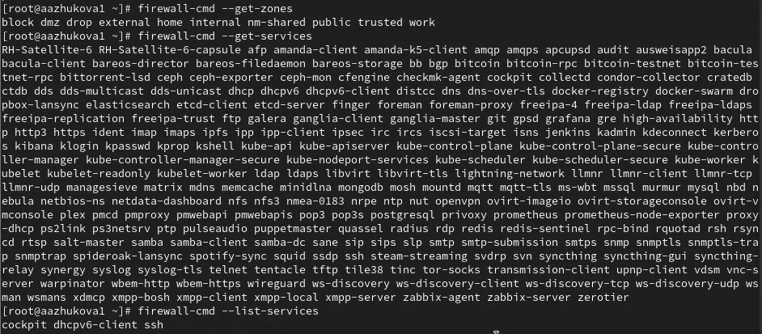{#fig:011 width=70%}

2. Сравнила результаты вывода информации при использовании команды `firewall-cmd --list-all` и `firewall-cmd --list-all --zone=public` (рис. [-@fig:012]).

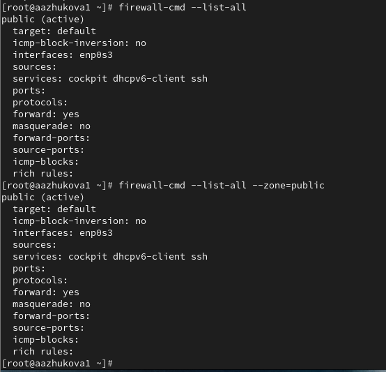{#fig:012 width=70%}

3. Добавила сервер VNC в конфигурацию брандмауэра `firewall-cmd --add-service=vnc-server`. Проверила, добавился ли vnc-server в конфигурацию (рис. [-@fig:013]).

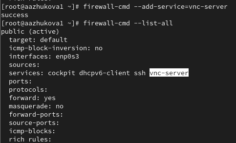{#fig:013 width=70%}

4. Перезапустила службу firewalld. Проверила, есть ли vnc-server в конфигурации. (рис. [-@fig:014]).

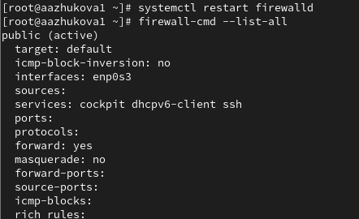{#fig:014 width=70%}

Служба vnc-server больше не указана, так как была не постоянной.

5. Добавила службу vnc-server ещё раз, но на этот раз сделала её постоянной, проверила наличие vnc-server в конфигурации (рис. [-@fig:015]).

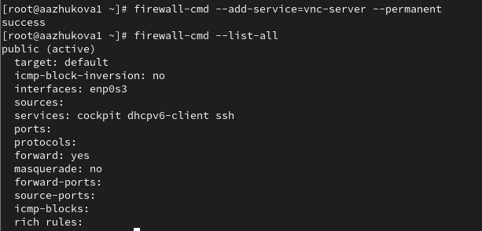{#fig:015 width=70%}

Я увидела, что VNC-сервер не указан. Службы, которые были добавлены в конфигурацию на диске, автоматически не добавляются в конфигурацию времени выполнения.

6. Перезагрузила конфигурацию firewalld и просмотрела конфигурацию времени выполнения (рис. [-@fig:016]).

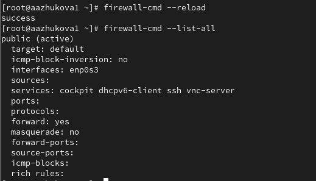{#fig:016 width=70%}

7. Добавила в конфигурацию межсетевого экрана порт 2022 протокола TCP, затем перезагрузила конфигурацию firewalld `firewall-cmd --reload`, проверила, что порт добавлен в конфигурацию (рис. [-@fig:017]).

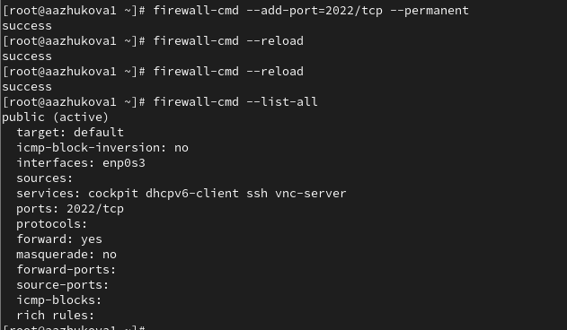{#fig:017 width=70%}

## Управление брандмауэром с помощью firewall-config

1. Открыла терминал и под учётной записью своего пользователя запустила интерфейс GUI firewall-config. Нажала выпадающее меню рядом с параметром Configuration. Открыла раскрывающийся список и выбрала Permanent. Выбрала зону public и отметила службы http, https и ftp, чтобы включить их (рис. [-@fig:021]).

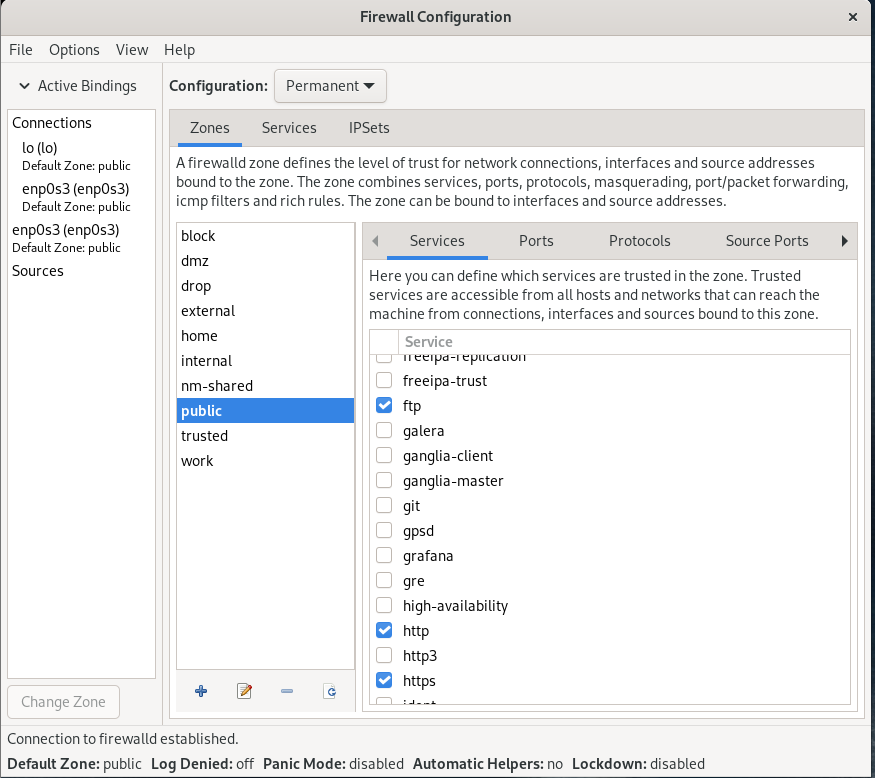{#fig:021 width=70%}

2. Выбрала вкладку Ports и на этой вкладке нажала Add. Ввела порт 2022 и протокол udp, нажала ОК, чтобы добавить их в список (рис. [-@fig:022]).

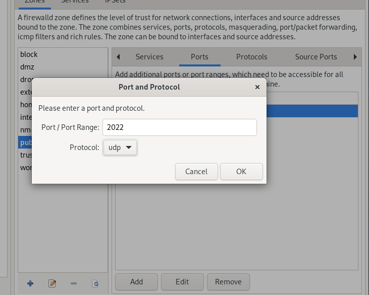{#fig:022 width=70%}

Закрыла утилиту firewall-config.

3.   Просмотрела список доступных серверов, перезагрузила конфигурацию firewall-cmd и снова просмотрела список доступных сервисов (рис. [-@fig:023]).

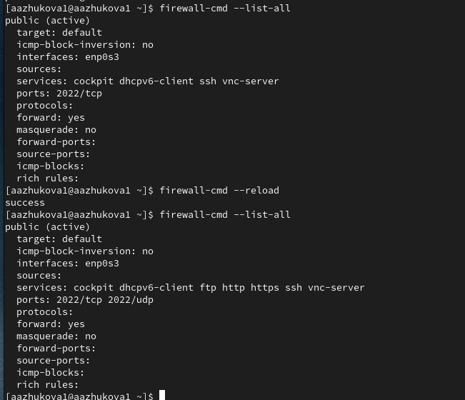{#fig:023 width=70%}

## Самостоятельная работа

1. Добавление службы telnet в конфигурацию через терминал. (рис. [-@fig:031]).

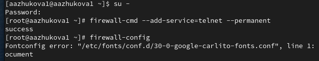{#fig:031 width=70%}

2. Создала конфигурацию межсетевого экрана, которая позволяет получить доступ к imap, pop3, smtp в графическом интерфейсе (рис. [-@fig:032]).

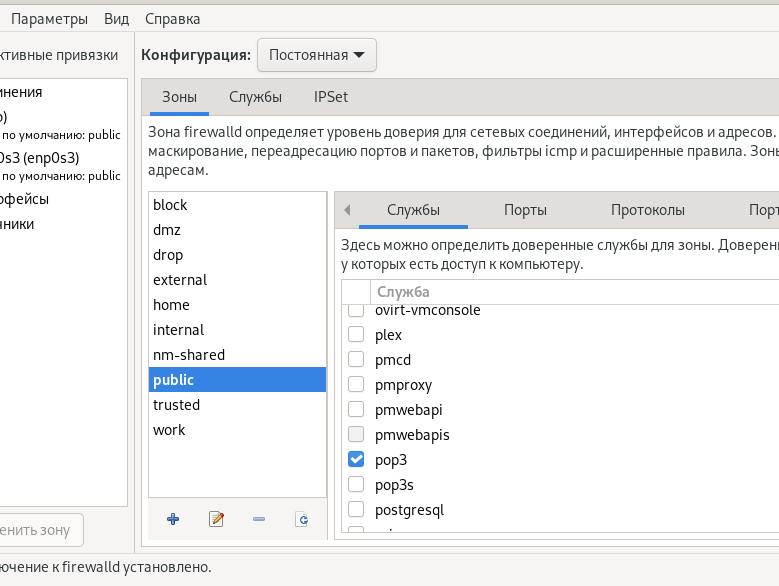{#fig:032 width=70%}

3. Убедилась, что конфигурация является постоянной и будет активирована после перезагрузки компьютера (рис. [-@fig:033]).

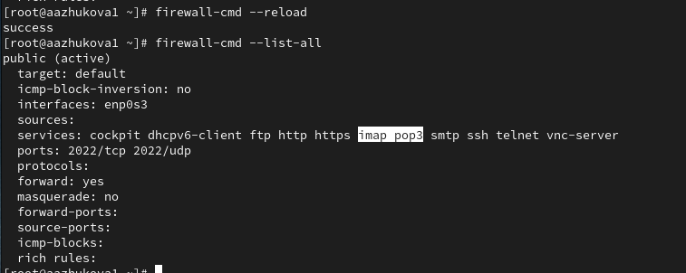{#fig:033 width=70%}

# Выводы

В ходе выполнения лабораторной работы получила навыки настройки пакетного фильтра в Linux.

# Список литературы{.unnumbered}

1. Purdy G. N. Linux iptables Pocket Reference. — O’Reilly Media, 2004. — (Pocket Reference).
2. Колисниченко Д. Н. Самоучитель системного администратора Linux. — СПб. : БХВПетербург, 2011. — (Системный администратор).
3. Vugt S. van. Red Hat RHCSA/RHCE 7 cert guide : Red Hat Enterprise Linux 7 (EX200 and
EX300). — Pearson IT Certification, 2016. — (Certification Guide).
4. Динамический брандмауэр с использованием FirewallD. — URL: https : / /
fedoraproject.org/wiki/FirewallD/ru.

::: {#refs}
:::
