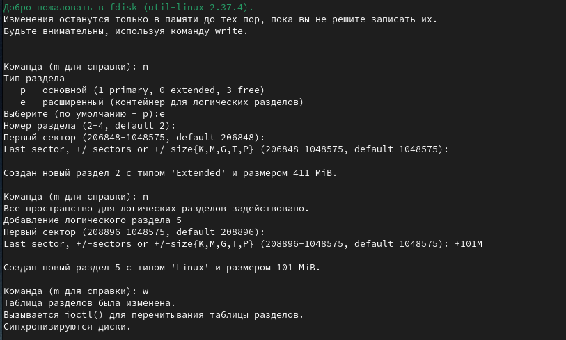
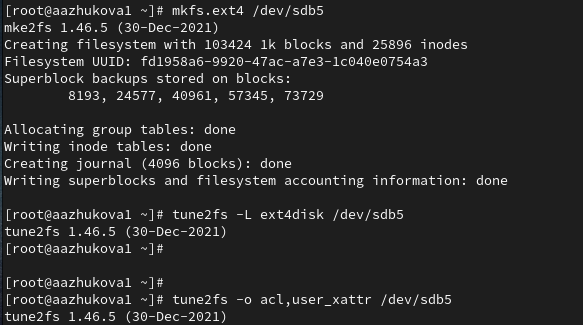

---
## Front matter
title: "Лабораторная работа №14"
subtitle: ""
author: "Жукова Арина Александровна"

## Generic otions
lang: ru-RU
toc-title: "Содержание"

## Bibliography
bibliography: bib/cite.bib
csl: pandoc/csl/gost-r-7-0-5-2008-numeric.csl

## Pdf output format
toc: true # Table of contents
toc-depth: 2
lof: true # List of figures
lot: true # List of tables
fontsize: 12pt
linestretch: 1.5
papersize: a4
documentclass: scrreprt
## I18n polyglossia
polyglossia-lang:
  name: russian
  options:
	- spelling=modern
	- babelshorthands=true
polyglossia-otherlangs:
  name: english
## I18n babel
babel-lang: russian
babel-otherlangs: english
## Fonts
mainfont: IBM Plex Serif
romanfont: IBM Plex Serif
sansfont: IBM Plex Sans
monofont: IBM Plex Mono
mathfont: STIX Two Math
mainfontoptions: Ligatures=Common,Ligatures=TeX,Scale=0.94
romanfontoptions: Ligatures=Common,Ligatures=TeX,Scale=0.94
sansfontoptions: Ligatures=Common,Ligatures=TeX,Scale=MatchLowercase,Scale=0.94
monofontoptions: Scale=MatchLowercase,Scale=0.94,FakeStretch=0.9
mathfontoptions:
## Biblatex
biblatex: true
biblio-style: "gost-numeric"
biblatexoptions:
  - parentracker=true
  - backend=biber
  - hyperref=auto
  - language=auto
  - autolang=other*
  - citestyle=gost-numeric
## Pandoc-crossref LaTeX customization
figureTitle: "Рис."
tableTitle: "Таблица"
listingTitle: "Листинг"
lofTitle: "Список иллюстраций"
lotTitle: "Список таблиц"
lolTitle: "Листинги"
## Misc options
indent: true
header-includes:
  - \usepackage{indentfirst}
  - \usepackage{float} # keep figures where there are in the text
  - \floatplacement{figure}{H} # keep figures where there are in the text
---

# Цель работы

Получить навыки создания разделов на диске и файловых систем. Получить навыки
монтирования файловых систем.

# Выполнение лабораторной работы

## Создание виртуальных носителей

Добавляем к виртуальной машине два диска размером 512 МБ (рис. [-@fig:001]).

{#fig:001 width=70%}

## Создание разделов MBR с помощью fdisk

1. В командной строке с полномочиями администратора с помощью fdisk просматриваю перечень разделов на всех имеющихся в системе устройствах жёстких дисков (рис. [-@fig:011]).

{#fig:011 width=70%}

2. Необходимо сделать разметку диска /dev/sdb с помощью утилиты fdisk. Ввожу m, чтобы получить справку по командам (рис. [-@fig:012]).

{#fig:012 width=70%}

3. Нажимаем p, чтобы просмотреть текущее распределение пространства диска. Вводим n, чтобы добавить новый раздел. Выбираем p, чтобы создать основной раздел. Указываем первый сектор на диске, с которого начнётся новый раздел. По умолчанию предлагается первый доступный сектор, нажимаем Enter для подтверждения выбора. Вводим +100M, чтобы создать раздел на 100 MiB (рис. [-@fig:013]).

{#fig:013 width=70%}

4. Нажимаем w, чтобы записать изменения на диск и выйти из fdisk (рис. [-@fig:014]).

{#fig:014 width=70%}

5. Таблица разделов находится только в памяти ядра. Сравниваем вывод команды fdisk -l /dev/sdb с выводом команды cat /proc/partitions. Записываем изменения в таблицу разделов ядра (рис. [-@fig:015]).

{#fig:015 width=70%}

## Создание логических разделов

1. Добавляем новый раздел. Вводим e , чтобы создать расширенный раздел. Нажимаем Enter , чтобы принять первый сектор по умолчанию и снова нажимаем Enter , когда fdisk запросит последний сектор. Создаём в нём логический раздел. Нажимаем n. Свободных первичных разделов нет, добавляем логический раздел с номером 5. Нажимаем Enter, чтобы принять выбор первого сектора в качестве сектора по умолчанию. На вопрос о последнем секторе вводим +101M. После создания логического раздела записываем изменения на диск (рис. [-@fig:021]).

{#fig:021 width=70%}

2. Обновляем таблицу разделов, просматриваем информацию о добавленных разделах (рис. [-@fig:022]).

{#fig:022 width=70%}

## Создание раздела подкачки

1. Добавляем новый раздел. По умолчанию добавляем логический раздел под номером 6. Нажимаем Enter, чтобы принять первый сектор по умолчанию. На вопрос о последнем секторе вводим +100M. Далее меняем тип раздела. Для этого нажимаем t, вводим номер раздела и тип раздела (в данном случае 82 — раздел подкачки). Записываем изменения (рис. [-@fig:031]).

{#fig:031 width=70%}

2. Чтобы завершить процедуру и обновляем таблицу разделов ядра, просматриваем информацию о добавленных разделах (рис. [-@fig:032]).

{#fig:032 width=70%}

3. Формартируем раздел подкачки. Для включения вновь выделенного пространства подкачки используем `swapon /dev/sdb6`. Просматриваем размер пространства подкачки, которое выделено в настоящее время (рис. [-@fig:033]).

{#fig:033 width=70%}

## Создание разделов GPT с помощью gdisk

1. В терминале с полномочиями администратора с помощью gdisk просматриваем таблицы разделов и разделы на втором добавленном диске /dev/sdc (рис. [-@fig:041]).

{#fig:041 width=70%}

2. Создаём раздел с помощью gdisk. Вводим n , чтобы добавить новый раздел. Применяем номер раздела по умолчанию, который предлагается. Нажимаем Enter, чтобы принять предлагаемый по умолчанию первый сектор. При запросе последнего сектора вводим +100M. Теперь предлагается установить тип раздела. Нажимаем Enter, чтобы принять тип раздела 8300 по умолчанию. Нажимаем p, чтобы отобразить разбиение диска. Записываем изменение диска (рис. [-@fig:042]).

{#fig:042 width=70%}

3. Обновляем таблицу раздела ядра и просматриваем информацию о добавленных разделах (рис. [-@fig:043]).

{#fig:043 width=70%}

## Форматирование файловой системы XFS

(рис. [-@fig:02]).

{#fig:02 width=70%}

1. В терминале с полномочиями администратора для диска dev/sdb1 создаём файловую систему XFS, устанавливаем метки файловой системы в xfsdisk  (рис. [-@fig:051]).

{#fig:051 width=70%}

## Форматирование файловой системы EXT4 

1. В терминале с полномочиями администратора для диска dev/sdb5 создаём файловую систему EXT4. Устанавливаем метки файловой системы в ext4disk, параметры монтирования по умолчанию для файловой системы (рис. [-@fig:061]).

{#fig:061 width=70%}

## Ответы на контрольные вопросы

1. Какой инструмент используется для создания разделов GUID?  Для создания разделов GUID (GUID Partition Table - GPT) обычно используется gdisk (GNU Parted) или подобные инструменты, такие как fdisk с опцией создания GPT таблицы разделов.  Выбор инструмента зависит от операционной системы и предпочтений.

2. Какой инструмент применяется для создания разделов MBR?  Для создания разделов MBR (Master Boot Record) чаще всего используется fdisk.  Также можно использовать parted, но fdisk более традиционный и распространённый инструмент для работы с MBR.

3. Какой файл используется для автоматического монтирования разделов во время загрузки? Файл /etc/fstab (на системах типа Linux/Unix) содержит информацию о файловых системах, которые должны быть автоматически смонтированы при загрузке.

4. Какой вариант монтирования целесообразно выбрать, если необходимо, чтобы файловая система не была автоматически примонтирована во время загрузки?  В файле /etc/fstab  необходимо опустить поле или указать noauto в опциях монтирования для данной строки.

5. Какая команда позволяет форматировать раздел с типом 82 с соответствующей файловой системой?  Тип 82 обычно ассоциируется с разделами Linux Swap.  Для форматирования swap-раздела используется команда mkswap.  После создания swap-раздела его необходимо активировать командой swapon.

6. Вы только что добавили несколько разделов для автоматического монтирования при загрузке. Как можно безопасно проверить, будет ли это работать без реальной перезагрузки?  Можно использовать команду sudo mount -a.  Эта команда попытается смонтировать все файловые системы, указанные в /etc/fstab.  Однако это не полностью имитирует загрузку системы, так как некоторые сервисы могут быть недоступны.

7. Какая файловая система создаётся, если вы используете команду mkfs без какой-либо спецификации файловой системы?  Команда mkfs сама по себе не создает файловую систему без указания типа. Вам необходимо указать тип файловой системы (например, mkfs.ext4, mkfs.vfat).

8. Как форматировать раздел EXT4?  Для форматирования раздела EXT4 используется команда mkfs.ext4 /dev/<устройство>.  Замените /dev/<устройство> на путь к вашему устройству (например, /dev/sda1).

9. Как найти UUID для всех устройств на компьютере?  Команда blkid отобразит UUID для всех доступных блочных устройств.

# Выводы

Получила навыки создания разделов на диске и файловых систем. Получила навыки монтирования файловых систем.

# Список литературы{.unnumbered}

::: {#refs}
:::
