---
## Front matter
lang: ru-RU
title: Лабораторная работа №16.
subtitle: Программный RAID
author:
  - Жукова А.А
institute:
  - Российский университет дружбы народов, Москва, Россия
date: 21 декабря 2024

## i18n babel
babel-lang: russian
babel-otherlangs: english

## Formatting pdf
toc: false
toc-title: Содержание
slide_level: 2
aspectratio: 169
section-titles: true
theme: metropolis
header-includes:
 - \metroset{progressbar=frametitle,sectionpage=progressbar,numbering=fraction}
---

# Информация

## Докладчик

:::::::::::::: {.columns align=center}
::: {.column width="70%"}

  * Жукова Арина Александровна
  * Студент бакалавриата, 2 курс
  * группа: НПИбд-03-23
  * Российский университет дружбы народов
  * [1132239120@rudn.ru](mailto:1132239120@rudn.ru)

:::
::: {.column width="30%"}

:::
::::::::::::::

# Вводная часть

## Цель работы

Лабораторная работа направлена на освоение работы с RAID-массивами при помощи утилиты mdadm.

## Задание

1. Прочитайте руководство по работе с утилитами fdisk, sfdisk и mdadm.
2. Добавить три диска на виртуальную машину (объёмом от 512 MiB каждый). При помощи sfdisk создать на каждом из дисков по одной партиции, задав тип раздела для RAID.
3. Создать массив RAID 1 из двух дисков, смонтировать его. Эмитировать сбой одного из дисков массива, удалить искусственно выведенный из строя диск, добавить в массив работающий диск.
4. Создать массив RAID 1 из двух дисков, смонтировать его. Добавить к массиву третий диск. Эмитировать сбой одного из дисков массива. Проанализировать состояние массива, указать различия по сравнению с предыдущим случаем.
5. Создать массив RAID 1 из двух дисков, смонтировать его. Добавить к массиву третий диск. Изменить тип массива с RAID1 на RAID5, изменить число дисков в массиве с 2 на 3. Проанализировать состояние массива, указать различия по сравнению с предыдущим случаем.

# Результаты и анализ лабораторной работы

## Создание RAID-диска

Проверка дисков: С помощью fdisk -l | grep /dev/sd проверяю наличие созданных дисков. Если диски добавлены корректно, они будут отображаться как /dev/sdd, /dev/sde, /dev/sdf.

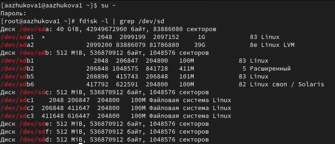

## Создание RAID-диска

Создание разделов: Используя утилиту sfdisk, я создаю на каждом из дисков разделы. Команды sfdisk /dev/sdX <<EOF; EOF>> создают пустой раздел на каждом из трех дисков.

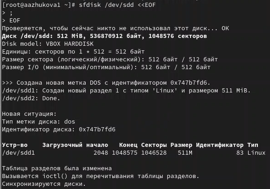

## Создание RAID-диска

Проверка типов разделов: Я проверяю текущий тип созданных разделов с помощью команды sfdisk --print-id /dev/sdX 1.

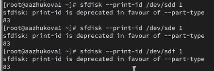

## Создание RAID-диска

Просмотр типов партиций для RAID: Я использую sfdisk -T | grep -i raid, чтобы узнать, какие типы партиций, относящиеся к RAID, доступны для установки.

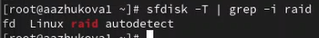

## Создание RAID-диска

Установка типов разделов: Настраиваю тип разделов в "Linux raid autodetect" с помощью команд sfdisk --change-id /dev/sdX 1 fd.

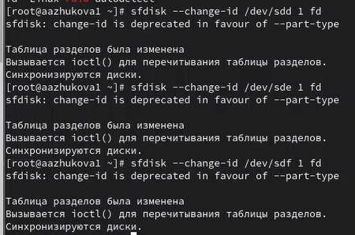

## Создание RAID-диска

Просмотр состояния дисков: Запускаю sfdisk -l /dev/sdX, чтобы просмотреть текущее состояние дисков, и описываю его в отчёте. Это поможет понять, какая информация хранится на дисках.

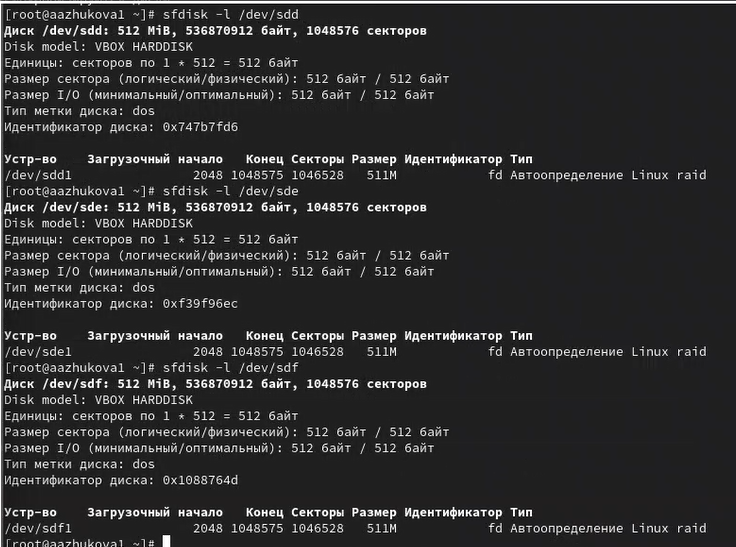

## Создание RAID-диска

Создание массива RAID 1: Использую команды mdadm --create --verbose /dev/md0 --level=1 --raid-devices=2 /dev/sdd1 /dev/sde1 для создания массива RAID 1, который будет хранить резервные копии данных на двух дисках.

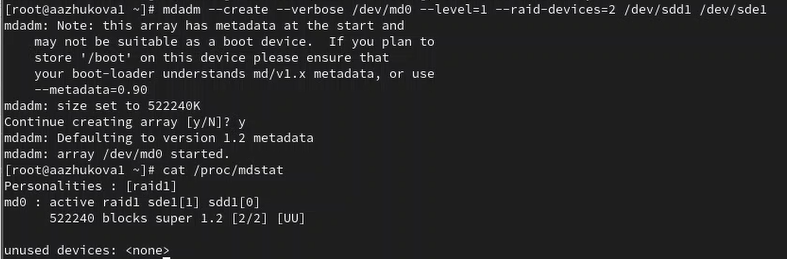

## Создание RAID-диска

Проверка состояния массива: Использую команды cat /proc/mdstat, mdadm --query /dev/md0 и mdadm --detail /dev/md0, чтобы увидеть состояние массива и поддерживаемую информацию о нём, включая статус доступных устройств и состояние.

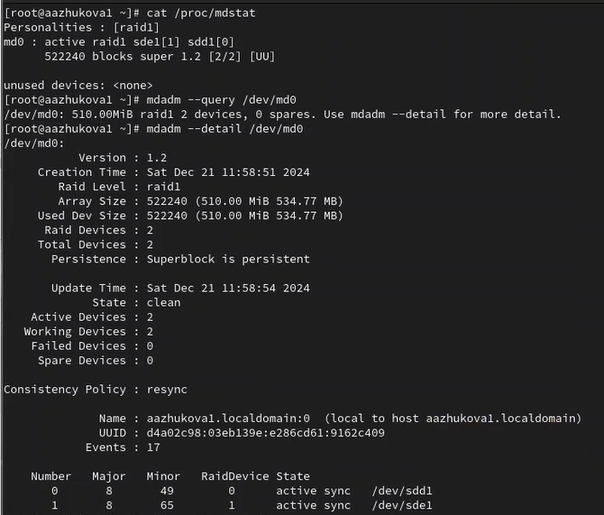

## Создание RAID-диска

Симуляция сбоя диска: Я имитирую сбой одного из дисков с помощью команды mdadm /dev/md0 --fail /dev/sde1.
Удаление сбойного диска: Удаляю неработающий диск из массива с помощью mdadm /dev/md0 --remove /dev/sde1.
Замена диска: Использую mdadm /dev/md0 --add /dev/sdf1, чтобы добавить новый диск в массив.

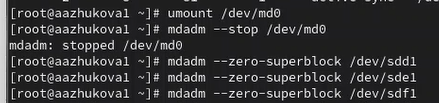

## RAID-массив с горячим резервом (hotspare)

Добавление третьего диска: С помощью mdadm --add /dev/md0 /dev/sdf1 добавляю третий диск в массив как горячий резерв.

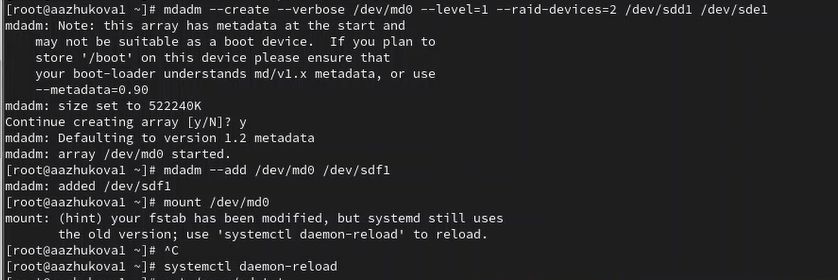

## Преобразование массива RAID 1 в RAID 5

Изменение типа массива на RAID 5: Увеличиваю уровень массива с помощью команды mdadm --grow /dev/md0 --level=5.
Проверка состояния массива: Вводя mdadm --detail /dev/md0, я проверяю состояние массива и описываю его в отчете.

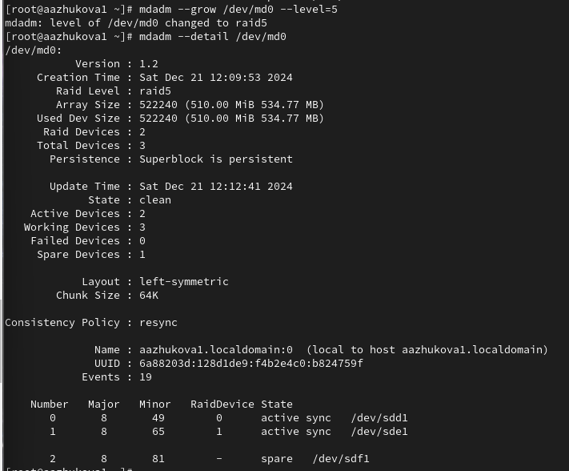

## Преобразование массива RAID 1 в RAID 5

Изменение количества дисков в массиве RAID 5: Указываю команду mdadm --grow /dev/md0 --raid-devices 3, чтобы увеличить количество дисков в массиве.

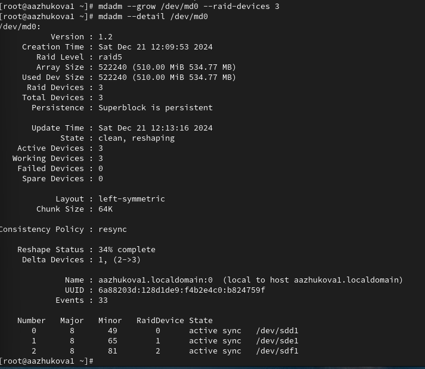

## Преобразование массива RAID 1 в RAID 5

Закомментирование записи в /etc/fstab: Удаляю автоматическую загрузку массива добавлением комментария в файл.

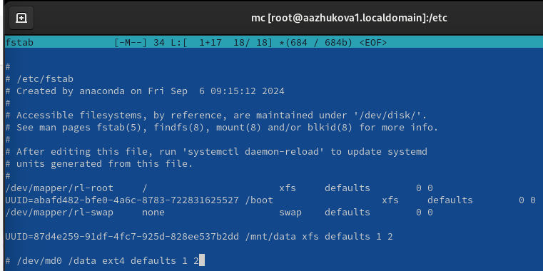

# Выводы

Весь процесс демонстрирует последовательность действий по созданию массивов RAID, их настройке, мониторингу статуса, симуляции сбоев и выполнению различных операций с массивами. Применение mdadm позволяет гибко управлять массивами, обеспечивать их надежность и производительность в зависимости от требований пользователя. Описания состояний массивов на различных этапах работы подтверждают правильность операций и функционирование системы хранения данных.
