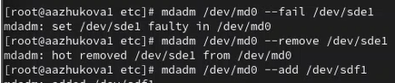

---
## Front matter
title: "Лабораторная работа № 16"
subtitle: "Программный RAID"
author: "Жукова Арина Александровна"

## Generic otions
lang: ru-RU
toc-title: "Содержание"

## Bibliography
bibliography: bib/cite.bib
csl: pandoc/csl/gost-r-7-0-5-2008-numeric.csl

## Pdf output format
toc: true # Table of contents
toc-depth: 2
lof: true # List of figures
lot: true # List of tables
fontsize: 12pt
linestretch: 1.5
papersize: a4
documentclass: scrreprt
## I18n polyglossia
polyglossia-lang:
  name: russian
  options:
	- spelling=modern
	- babelshorthands=true
polyglossia-otherlangs:
  name: english
## I18n babel
babel-lang: russian
babel-otherlangs: english
## Fonts
mainfont: IBM Plex Serif
romanfont: IBM Plex Serif
sansfont: IBM Plex Sans
monofont: IBM Plex Mono
mathfont: STIX Two Math
mainfontoptions: Ligatures=Common,Ligatures=TeX,Scale=0.94
romanfontoptions: Ligatures=Common,Ligatures=TeX,Scale=0.94
sansfontoptions: Ligatures=Common,Ligatures=TeX,Scale=MatchLowercase,Scale=0.94
monofontoptions: Scale=MatchLowercase,Scale=0.94,FakeStretch=0.9
mathfontoptions:
## Biblatex
biblatex: true
biblio-style: "gost-numeric"
biblatexoptions:
  - parentracker=true
  - backend=biber
  - hyperref=auto
  - language=auto
  - autolang=other*
  - citestyle=gost-numeric
## Pandoc-crossref LaTeX customization
figureTitle: "Рис."
tableTitle: "Таблица"
listingTitle: "Листинг"
lofTitle: "Список иллюстраций"
lotTitle: "Список таблиц"
lolTitle: "Листинги"
## Misc options
indent: true
header-includes:
  - \usepackage{indentfirst}
  - \usepackage{float} # keep figures where there are in the text
  - \floatplacement{figure}{H} # keep figures where there are in the text
---

# Цель работы

Освоить работу с RAID-массивами при помощи утилиты mdadm.

# Задание

Здесь приводится описание задания в соответствии с рекомендациями
методического пособия и выданным вариантом.

# Выполнение лабораторной работы

Описываются проведённые действия, в качестве иллюстрации даётся ссылка на иллюстрацию 

## Создание виртуальных носителей

Я добавила к своей виртуальной машине три диска размером 512 MiB к контроллеру SATA (рис. [-@fig:001]).

{#fig:001 width=70%}

## Создание RAID-диска

1. Проверила наличие созданных дисков, введя команду: `fdisk -l | grep /dev/sd` Если предыдущая работа по LVM была выполнена успешно, то в системе я увидела добавленные диски, отображающиеся как /dev/sdd, /dev/sde, /dev/sdf (рис. [-@fig:011]).

{#fig:011 width=70%}

2. Я создала раздел на каждом из дисков (рис. [-@fig:012] - [-@fig:014]).

{#fig:012 width=70%}

{#fig:013 width=70%}

{#fig:014 width=70%}

3. Я проверила текущий тип созданных разделов с помощью команд: `sfdisk --print-id /dev/sdd 1 sfdisk --print-id /dev/sde 1 sfdisk --print-id /dev/sdf 1` Все созданные мной разделы имеют тип Linux (рис. [-@fig:015]).

{#fig:015 width=70%}

4. Я просматривала, какие типы партиций, относящиеся к RAID, можно задать, использовав команду: `sfdisk -T | grep -i raid` (рис. [-@fig:016]).

{#fig:016 width=70%}

5. Затем я установила тип разделов в Linux raid autodetect следующими командами: `sfdisk --change-id /dev/sdd 1 fd sfdisk --change-id /dev/sde 1 fd sfdisk --change-id /dev/sdf 1 fd` (рис. [-@fig:017]).

{#fig:017 width=70%}

6. Я проверила состояние дисков с помощью команд: `sfdisk -l /dev/sdd sfdisk -l /dev/sde sfdisk -l /dev/sdf` (рис. [-@fig:018]).

{#fig:018 width=70%}

7. Используя утилиту mdadm, я создала массив RAID 1 из двух дисков с помощью команды: `mdadm --create --verbose /dev/md0 --level=1 --raid-devices=2 /dev/sdd1 /dev/sde1` (рис. [-@fig:019]).

{#fig:019 width=70%}

8. Я проверила состояние массива RAID, используя следующие команды: `cat /proc/mdstat`, `mdadm --query /dev/md0`, `mdadm --detail /dev/md0` (рис. [-@fig:0120]).

{#fig:0120 width=70%}

9. Я создала файловую систему на RAID с помощью команды: `mkfs.ext4 /dev/md0` (рис. [-@fig:0121]).

{#fig:0121 width=70%}

10. Я подмонтировала RAID, создав каталог: `mkdir /data`, `mount /dev/md0 /data` (рис. [-@fig:0122]).

{#fig:0122 width=70%}

11. Для автомонтирования я добавила запись в файл /etc/fstab:`/dev/md0 /data ext4 defaults 1 2`. Затем я смоделировала сбой одного из дисков. Удаляя сбойный диск. Я заменила диск в массиве на новый (рис. [-@fig:0123]).

{#fig:0123 width=70%}

12. После этого я удалила массив и очистила метаданные (рис. [-@fig:0124]).

{#fig:0124 width=70%}

## RAID-массив с горячим резервом (hotspare)

1. Я создала массив RAID 1 из двух дисков, добавила третий диск в массив: `mdadm --add /dev/md0 /dev/sdf1`, подмонтировала /dev/md0  (рис. [-@fig:021]).

{#fig:021 width=70%}

2. Я проверила состояние массива (рис. [-@fig:022]).

{#fig:022 width=70%}

3. Я снова смоделировала сбой одного из дисков. Затем я проверила состояние массива (рис. [-@fig:023] - [-@fig:024]).

{#fig:023 width=70%}

{#fig:024 width=70%}

4. Я удалила массив и очистила метаданные (рис. [-@fig:025]).

{#fig:025 width=70%}

## Преобразование массива RAID 1 в RAID 5

1. Я снова создала массив RAID 1 из двух дисков. Я добавила третий диск в массив (рис. [-@fig:031]).

{#fig:031 width=70%}

2. Я проверила состояние массива (рис. [-@fig:032]).

{#fig:032 width=70%}

3. Я изменила тип массива RAID на RAID 5. Проверила состояние массива (рис. [-@fig:033]).

{#fig:033 width=70%}

4. Изменила количество дисков в массиве RAID 5, проверила состояние массива (рис. [-@fig:034]).

{#fig:034 width=70%}

5. Удалила массив и очистила метаданные с помощью команд (рис. [-@fig:035]).

{#fig:035 width=70%}

6. В конце я закомментировала запись в файле /etc/fstab: 
```
/dev/md0 /data ext4 defaults 1 2
```
(рис. [-@fig:036]).

{#fig:036 width=70%}

# Ответы на контрольные вопросы

1. RAID (Redundant Array of Independent Disks) – это технология, которая позволяет объединять несколько физических дисков в одну логическую единицу для повышения производительности, надежности и/или резервирования данных. RAID позволяет распределять данные между дисками, что обеспечивает защиту от потери данных при отказе одного или нескольких дисков, а также может увеличить скорость чтения и записи.

2. Типы RAID-массивов
Существует несколько уровней RAID, каждый из которых обеспечивает свои особенности в области производительности, резервирования данных и структуры. Основные типы RAID-массивов:

RAID 0
RAID 1
RAID 5
RAID 6
RAID 10 (1+0)
RAID 2
RAID 3
RAID 4
RAID 50 (сочетание RAID 5 и RAID 0)
RAID 60 (сочетание RAID 6 и RAID 0)

3. Описание уровня RAID

RAID 0

Алгоритм работы

Данные разбиваются на блоки и параллельно распределяются по всем дискам в массиве. Это обеспечит высокую скорость записи и чтения.
Назначение

RAID 0 обеспечивает максимальную производительность, но не содержит резервирования данных. В случае отказа одного из дисков все данные теряются.

Примеры применения

RAID 0 чаще всего используется в системах, требующих высокой скорости обработки данных, например в игровой индустрии, видеоредакторах и других приложениях, где важна высокая производительность.

RAID 1

Алгоритм работы

Данные дублируются на каждом диске в массиве. Если массив состоит из двух дисков, данные записываются одновременно на оба, создавая полную копию.

Назначение

RAID 1 предоставляет высокий уровень защиты данных. Если один из дисков выйдет из строя, данные будут доступны на другом диске.

Примеры применения

RAID 1 часто используется для систем, требующих высокой надежности, таких как файловые серверы и системы резервного копирования.

RAID 5

Алгоритм работы

Данные и контрольные суммы (паритетные данные) распределяются по всем дискам в массиве. Для восстановления данных при отказе диска используется информация о паритете, что позволяет обеспечивать резервирование без полного дублирования данных.

Назначение

RAID 5 обеспечивает хороший баланс между производительностью и уровнем защиты данных. Выдерживает отказ одного диска без потери данных.

Примеры применения

RAID 5 подходит для использования в серверах, приложениях с большими объемами данных и системах, где важны как производительность, так и резервирование (например, базы данных).

RAID 6

Алгоритм работы

Подобно RAID 5, но с дополнительным уровнем защиты. RAID 6 использует две контрольные суммы (двойной паритет), что позволяет ему выдерживать отказ двух дисков одновременно.

Назначение

RAID 6 обеспечивает высокий уровень защиты данных и подходит для систем, где критически важна надежность.

Примеры применения

RAID 6 часто используется в крупных системах хранения данных, где риск потери данных неприемлем, например, в облачных хранилищах, центрах обработки данных и серверных кластерах.


# Выводы

Этот процесс позволил мне получить практику в работе с RAID-массивами и утилитами для его управления, а также познакомиться с основами настройки и восстановления массивов.

# Список литературы{.unnumbered}

1. Vadala D. Managing RAID on Linux. — O’Reilly, 2004.
2. UNIX Power Tools / M. Loukides, T. O’Reilly, J. Peek, S. Powers. — O’Reilly Media, 2009.
3. Колисниченко Д. Н. Самоучитель системного администратора Linux. — СПб. : БХВПетербург, 2011. — (Системный администратор).

::: {#refs}
:::
