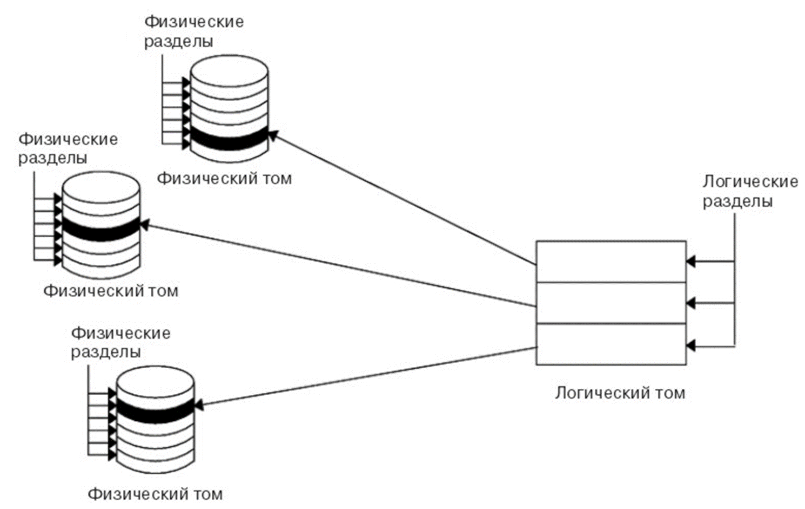
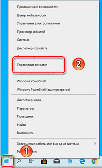
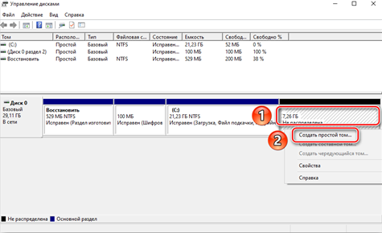

---
## Front matter
lang: ru-RU
title: Логические тома MS Windows.
subtitle: 
author:
  - Жукова А.А.
institute:
  - Российский университет дружбы народов, Москва, Россия
date: 14 декабря 2024

## i18n babel
babel-lang: russian
babel-otherlangs: english

## Formatting pdf
toc: false
toc-title: Содержание
slide_level: 2
aspectratio: 169
section-titles: true
theme: metropolis
header-includes:
 - \metroset{progressbar=frametitle,sectionpage=progressbar,numbering=fraction}
---

# Информация

## Докладчик

:::::::::::::: {.columns align=center}
::: {.column width="70%"}

  * Жукова Арина Александровна
  * Студент бакалавриата, 2 курс
  * группа: НПИбд-03-23
  * Российский университет дружбы народов
  * [1132239120@rudn.ru](mailto:1132239120@rudn.ru)

:::
::: {.column width="30%"}

:::
::::::::::::::

# Вводная часть

## Актуальность

Недостаточная осведомленность пользователей о возможностях и преимуществах использования логических томов в MS Windows.

## Объект и предмет исследования

**Объект исследования:** Логические тома в операционной системе MS Windows

**Предмет исследования:** Структура и функции логических томов в MS Windows

## Цели и задачи

- Цель: изучить и систематизировать информацию о логических томах в операционной системе MS Windows.
- Задачи: 
1) Изучить основные принципы работы логических томов в MS Windows; 
2) Сравнить различные методы создания и управления логическими томами; 
3) Оценить практическую ценность использования логических томов для хранения данных.

## Материалы и методы

- Анализ документации; 
- Эксперименты на практике;
- Сравнительный анализ.

## Введение

Логические тома в MS Windows — это способ объединения нескольких физических дисков в одно логическое пространство хранения данных. Они позволяют увеличить объем хранилища, обеспечить отказоустойчивость и повысить производительность. Изучение и использование логических томов важно для специалистов по IT и системных администраторов.

# Основные понятия

## Отличие логических томов от физических томов, преимущества использования логических томов

1. Отличия томов:
* Гибкость. 
* Дублирование данных. 

2. Преимущества использования логических томов:
* Повышенная абстракция и высокий контроль;
* Возможность присваивать описательные и понятные имена;
* Возможность динамического изменения.
* Гибкость в управлении данными.
* Повышение производительности через оптимизацию распределения данных.
* Упрощение резервного копирования и восстановления.
* Возможность создания множества томов на одном физическом диске.

# Структура логических томов

## Типы логических томов

*	**Простой том.** 
*	**Зеркальный том.** 
*	**Чередующийся том.** 
*	**Расширенный том.** 
*	**Том RAID.** 

## Свойства и параметры логических томов

*	По умолчанию максимальный размер логического тома составляет 128 логических разделов.
*	Логические тома можно копировать, просматривать, удалять, а также уменьшать и увеличивать число копий.
*	При реорганизации группы томов можно изменять расположение логических томов.
*	Для каждого логического тома можно создать отдельную файловую систему.

# Создание и управление

Для создания логических томов, управления томами и разделами в Windows можно использовать утилиту «Управление дисками».

## Создание логических томов

# Применение в практике

## Хранение данных на логических томах

Логические тома в MS Windows позволяют удобно организовать хранение данных с использованием различных файловых систем, таких как NTFS или FAT32. NTFS поддерживает шифрование, сжатие и управление правами доступа, что делает его отличным для конфиденциальной информации и больших объемов данных.

При планировании важно учитывать назначение томов. Разделение на тома для медиа, документов, программ и системных файлов улучшает организацию и производительность системы, так как часто используемые данные хранятся на быстрых томах.

## Защита данных и резервное копирование

Защита данных при работе с логическими томами важна. В Windows есть встроенные утилиты («Резервное копирование и восстановление») и сторонние программы для резервного копирования, включая создание образов дисков и восстановление системы. Шифрование томов, например, с помощью BitLocker, обеспечивает дополнительный уровень защиты данных.

## Оптимизация работы с данными

Оптимизация работы с данными на логических томах улучшает производительность системы. В Windows дефрагментация и управление свободным пространством ускоряют доступ к файлам и приложениям. Дефрагментация переупорядочивает файлы на диске, упрощая доступ. Управление правами доступа в многопользовательской среде предотвращает случайные изменения и удаление данных.

# Заключение

Логические тома в Windows — мощный инструмент для организации данных, обеспечивающий целостность, доступность и производительность. Понимание их работы важно для эффективного использования современных ОС.

